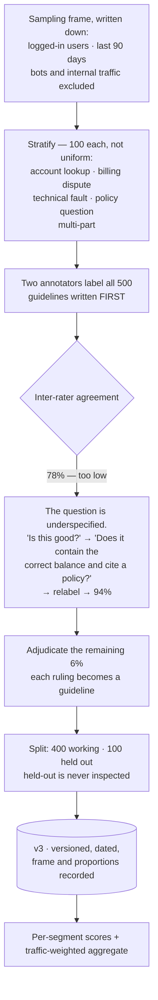

## The model

A [[golden set]] is the set of cases your system is measured against, each with a known correct
answer. It is the eval — the scoring code is arithmetic, and the dataset is where all the
judgement lives.

Two decisions determine whether it measures anything useful. **Which cases are in it**, since a
set drawn from convenience measures convenience. And **who decided the right answers**, since a
label produced by one person in a hurry is an opinion rather than ground truth.

## When to use it

You are about to build one, or about to trust one someone else built.

1. **What decision will this set inform?** "Ship or don't ship" needs cases that resemble
   production. "Is this class of failure fixed" needs cases concentrated on that failure. The
   same set cannot do both well.
2. **Where do the cases come from?** Real traffic, written by hand, or generated — each carries
   a different bias, and mixing them without saying so makes the score uninterpretable.
3. **Who can label these, and do they agree?** If two qualified people disagree on 30% of cases,
   your ceiling is 70% and no model can beat it.

## Speedrun

**What** — a versioned collection of `(input, correct output, metadata)`, sampled from a defined
**sampling frame** and labelled by people following written **label guidelines**.

**How to build one**

1. **Write the sampling frame down.** "Queries from logged-in users in the last 90 days,
   excluding bots" is a frame. "Queries we had handy" is not, and only the first lets anyone
   interpret the score.
2. **Stratify.** Sample deliberately across the segments that matter — query type, language,
   difficulty, customer tier — rather than uniformly, because uniform sampling buries the hard
   cases you actually care about.
3. **Write the guidelines before labelling.** Every ambiguity you resolve in your head must
   become a written rule, or two labellers will resolve it differently.
4. **Label with at least two people on an overlapping subset**, measure agreement, and
   **adjudicate** disagreements rather than averaging them.
5. **Size it by the difference you need to detect**, not by what feels thorough. Detecting a
   large regression needs far fewer cases than distinguishing a 2% improvement.
6. **Split off a [[held-out set]]** at the start, and do not look at it. It stops measuring
   generalisation the moment you start iterating against it.

**Why it works** — a score is only meaningful relative to a population. Defining the frame makes
the score a claim about something; stratifying makes it a claim about the parts that matter;
adjudicating makes the labels something other than one person's opinion.

**The failure that invalidates everything** — building the set from cases your system already
handles. That measures nothing, improves forever, and is the single most common way an eval
becomes decorative.

## Going deeper

### The sampling frame, and what a score is a claim about

A score without a frame is uninterpretable. "87%" answers nothing until you can say 87% of
*what population*.

The **sampling frame** is that population, written down: which users, which time window, which
filters applied. Writing it makes two things possible. Someone else can tell whether your score
transfers to their situation. And you can notice when the frame has drifted away from
production, which happens continuously and silently.

The three sources each carry a distinct bias, and the honest move is to name which you used.

**Sampled from real traffic** is the most representative and it inherits your current system's
distribution. Queries nobody asks because the product handles them badly are absent, so the set
under-represents exactly your weaknesses.

**Written by hand** covers cases you know matter, including ones traffic does not yet contain.
It reflects what the author imagined, which is a narrower space than reality.

**Generated** is cheap and scales, and it measures your generator as much as your system. Useful
for stress-testing a specific behaviour, dangerous as a primary set.

Most good sets are a deliberate mixture, with the proportions recorded.

### Stratification, and why uniform sampling lies

Uniform random sampling from traffic gives you a set dominated by whatever is most common — and
what is most common is usually what is easiest.

Say 80% of queries are simple lookups and 20% are complex multi-part questions. A uniform
sample of 500 gives you 400 easy cases and 100 hard ones.

The headline number is then mostly a measurement of the easy path, and a change that badly
damages complex queries moves it by four points.

**Stratification** samples each segment deliberately — 100 cases from each of five difficulty
bands, say — and reports per-segment scores alongside the aggregate. That makes regressions
visible where they happen rather than diluted into an average.

The segments worth stratifying on are the ones where you would act differently on a bad result:
difficulty, language, customer tier, query intent, content type. And a per-segment score is what
turns "we got worse" into "we got worse on multi-part questions in Spanish", which is the
difference between a number and a bug report.

The aggregate then needs care: if you sampled 100 from each of five strata but production is 80%
one stratum, the unweighted mean is not the production score. Report both — the per-segment
detail for diagnosis, and a traffic-weighted aggregate for the headline.

### Labels, agreement, and the ceiling nobody mentions

A **gold label** is only as good as the process that produced it, and the standard failure is
one person labelling quickly with rules they never wrote down.

The discipline that fixes it is unglamorous:

1. Write **label guidelines** first, covering the ambiguities you can anticipate.
2. Have two people label an overlapping subset.
3. Measure their **inter-rater agreement**.
4. Where they disagree, **adjudicate** — a third person decides, and the reason becomes a new
   guideline.

Agreement is the number that matters most and is reported least. If two qualified
[[annotators]] agree on only 70% of cases, then 70% is your measurement ceiling: no system can
be scored more accurately than the labels allow, and a model scoring 75% is inside the noise.

Low agreement is usually a signal about the *task* rather than the people. It means the question
is underspecified — "is this answer good?" has no stable answer, while "does this answer contain
the account balance, and is it correct?" does. Rewriting the question until agreement rises is
how you build a set worth measuring against, and it is far more valuable than adding cases.

### Size, freshness, and the decay

Size should come from the difference you need to detect. Detecting whether a change broke
something badly needs perhaps 100 cases. Distinguishing a 2% improvement from noise needs
thousands, and the [[back-of-envelope]] rule from the eval page applies: with N disagreements,
a lead under `2√N` is not evidence.

Stratification changes the arithmetic, because you need enough cases *per segment* to say
anything about that segment. Five segments needing 100 each is 500, and a set of 500 sampled
uniformly would give you almost no signal on the smallest one.

Then decay, which is the part people are unprepared for. Every iteration where someone looks at
failures and adjusts the system leaks a little information from the set into the system, so
after enough cycles the score measures fit to the dataset. And the world moves: a set sampled a
year ago no longer resembles current traffic, and the score stays flat while relevance falls.

The countermeasures are a [[held-out set]] evaluated rarely and never inspected, a scheduled
refresh from current traffic, and versioning so old results remain interpretable. And the
[[Goodhart's Law]] warning applies with full force — the moment a team is measured on this
number, the number will improve faster than the system does.

## See it work

A support assistant, measured before a model upgrade.

The frame is written before anything is sampled, because it is what makes the eventual score a
claim about something. Ninety days of logged-in traffic with bots excluded is a population
somebody else can evaluate; "queries we collected" is not.

Stratifying at 100 per category rather than sampling uniformly is what keeps the hard segments
visible. Multi-part questions are maybe 4% of traffic, so a uniform sample of 500 would contain
twenty of them — too few to detect a regression that destroys them.

The agreement check is where this example earns its place. Seventy-eight percent agreement means
the labels are unreliable, and the instinct is to blame the annotators or add more cases. The
right move is to notice the *question* is ambiguous: "is this answer good" has no stable answer,
and replacing it with a specific, checkable question raises agreement to 94%.

That rewrite is worth more than any amount of extra data. A set of 500 with 94% agreement
supports much sharper conclusions than 5,000 with 78%, because the ceiling moved.

The held-out hundred is split off immediately and never inspected, so months of iteration
against the working set leave one honest measurement intact. And the whole thing is versioned
with its frame and proportions, so a score from v3 remains interpretable after v4 exists.

## Next

Task metrics turns a labelled set into a number, and LLM-as-judge is what to do when the correct
answer cannot be written down in advance.
