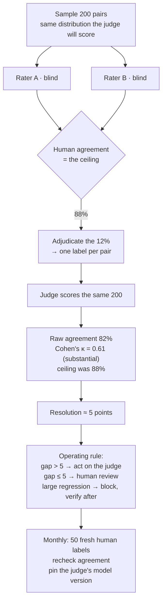

## The model

A [[LLM-as-judge|judge]] produces a number. **Calibration** is the measurement of how much that
number can be trusted, done by scoring the same sample with humans and comparing.

Without it you have a metric with no known relationship to quality — it might track human
judgement closely or barely at all, and nothing in the score distinguishes those cases. With it,
you can say what size of difference the judge can resolve, which turns "B scored higher" into a
claim with a stated precision.

## When to use it

You have a judge and are deciding whether to act on what it says.

1. **What decision rests on this?** Blocking a deploy needs a judge you trust on large
   regressions. Choosing between two close candidates needs far more, and probably needs humans.
2. **Do your humans agree with each other?** Their agreement is the ceiling. Calibrating against
   labels that are themselves 70% consistent tells you very little.
3. **When did you last check?** A judge calibrated six months ago against a model version you no
   longer run is an uncalibrated judge with a reassuring history.

## Speedrun

**What** — score a sample both ways, compute the **agreement rate**, and report the judge's
number alongside it. That pairing is the deliverable.

**How to calibrate**

1. **Sample from the same distribution the judge will score.** Calibrating on easy cases
   produces an agreement number that does not hold where it matters.
2. **Have humans label it blind**, without seeing the judge's verdict, or you are measuring
   anchoring rather than agreement.
3. **Measure human-to-human agreement first.** That is the **human ceiling**, and the judge
   cannot meaningfully exceed it.
4. **Compute agreement against the adjudicated human label**, and report [[Cohen's kappa]]
   alongside raw agreement, because raw agreement is inflated by chance.
5. **State the resolution.** Convert the agreement into "this judge can detect a difference of
   at least X" and quote that whenever you quote a score.
6. **Recalibrate on a schedule** and whenever the judge model, the rubric, or the task changes.

**Why it works** — agreement makes the judge's error rate visible, and an instrument with a
known error rate can be used for the claims it supports and refused for the ones it does not.
That is the entire difference between a measurement and a number.

**The sentence to be able to say** — *"the judge agrees with our raters 82% of the time, so we
use it to gate large regressions and escalate anything inside five points to human review."*

## Going deeper

### The human ceiling

The first number to compute is not judge-versus-human but human-versus-human, and skipping it is
the most common mistake in this process.

If two qualified raters agree on 70% of cases, the "correct" label is unstable on 30% of them.
A judge scored against those labels cannot exceed 70% agreement no matter how good it is,
because on the disputed cases there is no fact to be right about.

So a judge at 68% agreement against a 70% ceiling is performing essentially as well as a human,
which is a completely different conclusion from "68% is poor". Reporting judge agreement without
the ceiling makes good judges look broken and bad ones look adequate.

Low human agreement is a signal about the task, and the fix is the one from
[[gold label|the golden set page]]: rewrite the question until it is checkable. Every
point of human agreement you gain raises the ceiling for everything downstream.

### Agreement, and why the raw number lies

Raw **agreement rate** — the fraction of cases where judge and human gave the same verdict — is
inflated by chance, and badly so on unbalanced tasks.

If 90% of outputs are acceptable, a judge that says "acceptable" every time agrees with humans
90% of the time while containing no information at all. That is the [[accuracy paradox]] in
different clothing, and it makes raw agreement a poor headline.

**Cohen's kappa** corrects for it by measuring agreement above what chance would produce:

$$
\kappa = \frac{p_o - p_e}{1 - p_e}
$$

where $p_o$ is observed agreement and $p_e$ is the agreement expected by chance given each
rater's distribution. A kappa of 0 means "no better than guessing at these rates"; 1 means
perfect. The always-acceptable judge above scores a raw 90% and a kappa of 0, which is the
correct verdict.

Rough interpretation: below 0.2 is negligible, 0.4–0.6 is moderate, 0.6–0.8 is substantial,
above 0.8 is strong. Those bands are conventions rather than laws, and quoting kappa alongside
raw agreement is what stops a chance-inflated number being read as quality.

For [[pairwise comparison]] judges there is a cleaner framing: what fraction of pairs does the
judge order the same way as humans, excluding pairs the humans called a tie? Ties carry no
information and including them dilutes the measurement.

### Resolution, which is the output you actually use

The number worth carrying out of calibration is not agreement — it is **resolution**: the
smallest difference the judge can reliably detect.

Derive it from the agreement rate. A judge that disagrees with humans 20% of the time introduces
noise of roughly that scale into any comparison, so a 3-point difference between two systems is
inside the noise and a 15-point one is not. The `2√N` rule from [[eval|the eval page]] applies
to the judge's own verdicts: with N disagreements between two candidates, a lead below `2√N` is
not evidence.

That converts calibration into an operating rule rather than a report:

- Differences **above** the resolution → act on the judge alone.
- Differences **inside** it → escalate to human review or an online experiment.
- Anything the judge flags as a large regression → block, and verify afterwards.

Being able to state that rule is the point of the whole exercise. It is also what makes a
noisy judge useful — you are not pretending it is precise, you are using it where its precision
suffices and spending human attention where it does not.

### Drift, and re-calibration

Calibration expires, and it does so silently.

The judge model changes — providers update models continuously, and a version bump can shift
scoring behaviour without any announcement. The rubric changes, which invalidates comparison
with everything before it. The task distribution moves as users do new things. And the systems
being judged improve, so the differences you care about get smaller while the judge's noise
stays the same.

That last one is the subtle one. A judge with a resolution of 5 points is adequate while
candidates differ by 15 and useless once the system matures and candidates differ by 3. The
instrument did not degrade; the thing it measures got finer.

So a **drift check** belongs on a schedule: a small human-labelled sample, monthly, scored
against the current judge. Cheap, and it catches all four causes at once. Pinning the judge to a
specific model version is the other half, so that at least the instrument is not changing
underneath you.

Then the [[Goodhart's Law]] warning, which lands with particular force here. Once teams are
measured on a judge score, the judge becomes the target — and a judge is far easier to game than
a human, because its biases are known. Padding for [[verbosity bias]], phrasing for the rubric's
vocabulary, structuring answers to match the judge's expectations. Calibration is the defence,
because a gamed judge diverges from human agreement, and a scheduled drift check is what
notices.

## See it work

Calibrating a summarisation judge before using it to gate deploys.

Human agreement is computed first, and at 88% it sets the ceiling. The judge's 82% is then not
"18% wrong" — it is six points below a ceiling that no instrument could exceed, which is a
substantially better result than the raw number suggests.

Kappa is reported alongside because raw agreement is chance-inflated. At 0.61 it is substantial
rather than excellent, and quoting both is what stops someone reading 82% as precision.

The resolution is the output that gets used. Five points is the threshold below which the judge
cannot distinguish two candidates, and it converts directly into the operating rule — which is
the artefact the team actually runs on. Without it, every close result becomes an argument about
whether the number is real.

The monthly drift check is fifty labels, which is a couple of hours of someone's time. That is
the cost of knowing the instrument still works, against the alternative of discovering six
months later that a model update quietly changed what the score meant.

Pinning the judge's model version is the other half and is easy to forget. A provider updating
their model under you changes your measuring instrument without changing a line of your code,
and every historical score becomes incomparable with no signal that it happened.

## Next

Eval-driven development is what this whole group is for: using these measurements to decide what
to build and what to ship, rather than to report on it afterwards.
