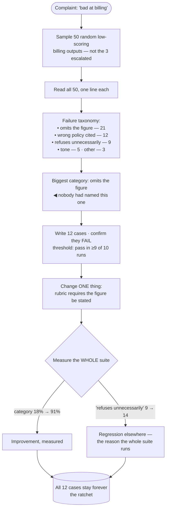

## The model

The default workflow with a model is: try a prompt, read a few outputs, feel that it improved,
ship. That loop has no memory and no arithmetic — the same failure recurs three weeks later and
nobody notices it had been fixed.

**Eval-driven development** inverts it. You look at failures systematically, group them into
categories, write cases into the [[golden set]] that capture each category, and only then change
anything. The eval exists before the fix, so improvement is a number rather than an impression,
and the case stays in the suite forever as a **ratchet** against regression.

## When to use it

You are about to change a prompt, a model, a retrieval strategy, or anything else that affects
output quality.

1. **Can you state what is wrong, specifically?** "It's not great" is not actionable. **Error
   analysis** turns a vague dissatisfaction into "it omits the figure in 30% of multi-part
   questions", which is a target.
2. **Would you notice if this regressed?** If the answer is no, the change is unmeasured and its
   effect is unknown regardless of how confident anyone feels.
3. **Is the failure worth a permanent test?** Not everything is. A one-off oddity is not a
   category, and a suite full of noise stops being read.

## Speedrun

**What** — a loop: sample failures, categorise them, write eval cases, change one thing, measure,
keep the cases forever.

**How to run it**

1. **Sample failures rather than browsing them.** Take 50 random low-scoring outputs, not the
   three someone complained about, or you will fix the loudest problem instead of the largest.
2. **Build a [[failure taxonomy]].** Read the 50 and group them into categories, then count.
   Usually two or three categories cover most of the volume.
3. **Write eval cases for the biggest category** and check they fail. A case that already passes
   is not capturing the failure you saw.
4. **Change one thing.** Prompt, retrieval, model, chunking — one at a time, or you will not know
   which one worked.
5. **Measure against the whole suite**, not just the new cases. The regression you cause
   elsewhere is the reason the suite exists.
6. **Keep every case.** The suite only ratchets if nothing is ever removed for being
   inconvenient.

**Why it works** — it converts a subjective loop into a measured one, and it accumulates. Each
cycle adds cases, so the suite becomes a record of every failure the system has ever had and a
guarantee that none of them silently return.

**The step people skip** — writing the case *before* the fix. Written afterwards, a case is
constructed to pass, which measures nothing and provides false confidence in exactly the place
you were worried about.

## Going deeper

### Error analysis, which is the part that pays

The instinct on hearing "the assistant is bad at billing questions" is to open the prompt and
start editing. **Error analysis** is the discipline of looking first, and it is consistently
the highest-return activity in this whole workflow.

The procedure is unglamorous:

1. Sample fifty failures at random from a defined population.
2. Read all fifty — actually read them, not skim.
3. Write one line per failure describing what went wrong.
4. Group those lines into categories, and count.

What comes out is almost always surprising. The failure everybody was discussing turns out to be
8% of cases, and a category nobody had named is 40%. Two or three categories usually cover most
of the volume, which means most of the improvement available is concentrated somewhere nobody
was looking.

Sampling rather than browsing is what makes this work. The failures that reach you are selected
by who complained loudest, which correlates with customer seniority rather than frequency.
A random sample from a defined frame is the only way to learn what is actually common — the same
argument as the [[sampling frame]] on the golden set page, applied to failures.

The output is a **failure taxonomy**: named categories with counts. That artefact is what turns
"make it better" into a prioritised list, and it is worth keeping and re-running quarterly,
because the distribution shifts as you fix things.

### Writing the case before the fix

This is the discipline that gives the practice its name, and it is the one people abandon first.

A case written before the fix is a genuine test: it fails now, it should pass later, and the
transition is evidence. A case written after the fix is constructed — consciously or not — to
exercise the path that now works, and it passes on the first run, which tells you nothing.

The parallel with test-driven development is exact, including the reason it is uncomfortable.
Writing a failing case first feels like a detour when you can see the fix. The value shows up
weeks later, when someone changes a prompt for an unrelated reason and the case catches the
regression.

There is one genuine difference from TDD. Model outputs are not deterministic, so a case does
not simply pass or fail — it passes at some rate, and the threshold is part of the case. "This
should succeed in at least 9 of 10 runs" is the shape, and it means flakiness is a measured
property rather than a mystery.

That non-determinism also means a single case is weak evidence. Categories need several cases
each, and the unit of measurement is the category's pass rate rather than any individual case.

### The ratchet, and why nothing gets deleted

The suite's value is cumulative, and it comes entirely from cases never being removed.

Each cycle adds cases for a failure category. Six months later the suite is a record of every
class of failure the system has had, and any change is checked against all of them. That is the
**ratchet**: quality can be pushed forward and cannot silently slide back.

The pressure to delete is real and always sounds reasonable: a case is flaky, a case tests
behaviour we deliberately changed, a case is slow.

Some of those are legitimate — behaviour that was deliberately changed should have its case
*updated*, with the change recorded. "This case is inconvenient" is not one of them.

The practice that keeps it honest is treating a removal like a schema migration: it requires a
reason, written down, and someone else agreeing. A suite that quietly loses its awkward cases
converges on a suite that only tests what already works.

Run cost is the real constraint rather than discipline. A thousand cases against a paid model is
real money per run, which argues for tiers: a fast subset on every change, the full suite
nightly, the expensive human-reviewed sample weekly. Same shape as a test pyramid, same reason.

### Where it stops working

Eval-driven development is a strong default and it has limits worth naming, because pretending
otherwise is how it becomes ceremony.

**Novel capability.** You cannot write cases for behaviour nobody has specified yet. Early
exploration is genuinely a vibes phase, and the honest move is to say so and switch to measured
work once the shape is known.

**The metric becomes the product.** [[Goodhart's Law]] applies with force. A team optimising a
suite will eventually produce a system excellent at the suite and no better in production —
prompts tuned to the eval's phrasing, retrieval tuned to its documents. The defences are the
familiar ones: a [[held-out set]] nobody optimises against, refreshing cases from current
traffic, and a human review sample regardless of what the numbers say.

**Offline is not online.** The suite predicts production imperfectly, and how imperfectly is
itself measurable — the [[offline-online agreement]] from the eval platform. A team that has
never checked that agreement does not know what their suite is worth.

**Not everything worth improving is measurable.** Tone, judgement about when to refuse, the
feeling of a good interaction. Some of it can be turned into rubric criteria; some genuinely
cannot, and a suite that only measures the measurable will quietly optimise away the rest.

## See it work

A support assistant that "isn't great at billing questions".

Sampling fifty at random rather than reading the three that were escalated is the step that
changes the answer. The escalated three were about the wrong policy being cited; the largest
category turned out to be omitting the figure entirely, which nobody had named because those
users just gave up rather than complaining.

The taxonomy converts a complaint into a prioritised list with counts. Twenty-one of fifty is
where the improvement is, and knowing that before touching anything is what stops a week being
spent on the 12.

Writing twelve cases and confirming they fail is what makes the subsequent number mean something.
The pass threshold — nine of ten runs — exists because the output is non-deterministic, so
flakiness is stated rather than discovered.

Then one change, and the whole suite measured. The target category goes from 18% to 91%, which
is the result everyone wanted. The unnecessary-refusal category goes from 9 to 14, which is the
result nobody wanted and would not have been visible without the full suite — and that
regression is the entire argument for running everything rather than only the new cases.

The twelve cases stay permanently. Six months from now, someone rewriting the prompt for an
unrelated reason will find out immediately if they reintroduce this, which is the ratchet doing
the only job it has.

## Next

That is the Evaluation group. Retrieval covers embeddings, indexes and RAG as subjects in their
own right, and Online covers what changes once real users are involved.
