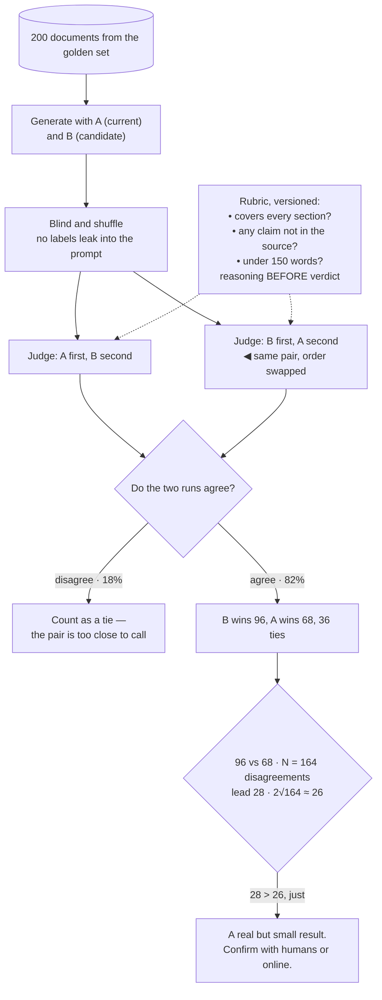

## The model

When output is free text, there is no label to compare against. "Summarise this document" has no
single correct answer, so a [[confusion matrix]] has nothing to count.

**LLM-as-judge** uses a model to score outputs against a **rubric**. It is fast, cheap and
scales, which is why it is now standard. It is also biased in specific documented ways, and — the
part people skip — its score is meaningful only to the extent it agrees with human judgement.
An uncalibrated judge is a number with no known relationship to quality.

## When to use it

You have outputs that cannot be scored by comparison and are deciding how to measure them.

1. **Can the property be checked programmatically?** "Is it valid JSON", "does it cite a real
   document", "is it under 200 words" — check those with code. A judge for something a regex can
   verify is expensive and less reliable.
2. **How large a difference must you detect?** A judge reliably catches large regressions and
   cannot distinguish a 2% improvement. Match the claim to the instrument.
3. **Have you measured agreement with humans?** If not, you have a number and no idea what it
   means. That measurement is not optional, and it is the subject of the next page.

## Speedrun

**What** — a prompt containing the input, the output, and a rubric, asking for a score or a
comparison. Two shapes, and one is much more reliable than the other.

| | Absolute scoring | Pairwise comparison |
|---|---|---|
| Asks | "rate this 1–5" | "is A better than B?" |
| Consistency | poor — the scale drifts | good |
| Comparing runs | hard, scores are not stable | natural |
| Cost | one call per output | one call per pair |

**How to build one**

1. **Prefer [[pairwise comparison]].** "Which is better" is a question both models and humans
   answer far more consistently than "rate this out of five".
2. **Write a rubric with concrete criteria**, not adjectives. "Contains the account balance and
   cites the policy section" beats "is helpful and accurate".
3. **Swap the order and run twice.** Judges favour whichever answer comes first, so a
   position-swapped pair with disagreement counted as a tie removes most of that bias.
4. **Ask for the reasoning before the verdict**, so the judgement is conditioned on stated
   criteria rather than produced first and justified after.
5. **Control for length.** Judges prefer longer answers, so either constrain length or include
   it as an explicit criterion rather than letting it leak in.
6. **Calibrate against humans and report the agreement**, always. The judge's score means
   nothing on its own.

**Why it works** — evaluating is easier than generating. A model can reliably tell that an
answer omits the requested figure even when it could not have produced a better answer itself,
which is why a judge can be useful without being smarter than the system it grades.

**The rule that keeps it honest** — a judge is an instrument with a known error rate. Report
the score *and* the agreement, the way you would report a measurement and its precision.

## Going deeper

### The biases, which are documented and specific

These are not vague concerns. They are measured, reproducible effects, and knowing them by name
is what separates using a judge from trusting one.

**[[position bias|Position bias]].** Presented with two answers, judges favour the one shown
first, sometimes by a large margin — the same effect as in a ranked feed, one level up.

The fix is mechanical: evaluate each pair twice with the order swapped, and count a
disagreement between the two runs as a tie. That also gives a free consistency signal, since a
judge that flips on order alone is telling you the pair is too close to call.

**Verbosity bias.** Longer answers score higher, largely independent of content. A model
optimised against an uncontrolled judge will learn to pad, which is [[Goodhart's Law]] with a
very short feedback loop. Either normalise for length or make concision an explicit rubric
criterion.

**Self-preference.** Judges score outputs from their own model family more highly. Using
GPT-family models to judge GPT-family outputs measures something other than quality, and the
mitigation is a judge from a different family, or an ensemble.

**Score compression.** On a 1–5 scale, judges cluster around 3 and 4 and rarely use the ends, so
most of the scale is unused and real differences compress into a narrow band. This is the
strongest practical argument for pairwise comparison — a binary better-or-worse question has no
scale to compress.

**Sycophancy.** A judge told "this is the improved version" tends to agree. Prompts must not
leak which output came from which system, and blinding is as necessary here as in a clinical
trial.

### Rubrics, and why adjectives fail

A **rubric** is the criteria the judge scores against, and it is where nearly all the quality
lives. The difference between a useful judge and a random number generator is usually the rubric
rather than the model.

Adjective rubrics — "rate helpfulness, accuracy and clarity from 1 to 5" — produce inconsistent
scores because the terms mean different things on different inputs, and the judge has nothing
stable to anchor on.

Concrete rubrics ask checkable questions:

- Does the answer state the account balance?
- Is the figure correct according to the provided context?
- Does it cite a policy section?
- Does it avoid claiming anything not in the context?

Each is close to binary, and the aggregate is a count rather than an impression.

That reframing has a second benefit worth noticing: a rubric of checkable questions is exactly
what makes [[inter-rater agreement]] high among humans too. The same underspecification that
makes two people disagree makes a judge inconsistent, so improving the rubric improves both —
and if humans cannot agree on your rubric, no judge will be stable against it.

The rubric should also be versioned, because changing it invalidates comparison with every
previous run. It is an eval artefact with the same discipline as the dataset.

### What a judge cannot do

Being clear about the limits is what makes the tool usable, and most disappointment with judges
comes from expecting the wrong thing.

**Fine distinctions.** A judge agreeing with humans 75% of the time cannot resolve a 2%
difference between two systems — the measurement noise exceeds the effect. Use it for large
regressions and directional signal, and use humans or an online experiment for close calls.

**Factual verification against the world.** A judge can check whether an answer is supported by
provided context. It cannot check whether the answer is true, unless truth is in the context —
and asking it to try produces confident agreement with confident errors.

**Anything a program could check.** Format validity, presence of required fields, length, whether
a cited document exists. Code is cheaper, deterministic and correct; a judge is none of those.

**Its own family's output.** Self-preference makes this a measurement of similarity rather than
of quality.

The honest framing is that a judge is a cheap, noisy instrument that scales. That combination is
genuinely valuable — it means you can score ten thousand outputs nightly rather than a hundred
weekly — and it is only valuable if the noise is quantified rather than ignored.

## See it work

Evaluating a summarisation feature after a prompt change.

Every pair is judged twice with the order swapped, and the 18% where the two runs disagree
become ties. That is not lost data — it is the judge telling you those pairs are within its
resolution, and forcing a verdict on them would be manufacturing signal.

The rubric asks three checkable questions rather than requesting a helpfulness score. Each is
close to binary, which is what makes the judge consistent, and it is versioned because changing
it invalidates comparison with earlier runs.

Asking for reasoning before the verdict matters more than it looks. A model that states its
judgement first will justify it afterwards regardless; conditioning the verdict on stated
criteria is what makes the rubric actually bind.

The statistics at the end are the part usually skipped. Ninety-six against sixty-eight looks
decisive until you apply the `2√N` rule from [[eval|the eval page]] — with 164
disagreements the bar is about 26, and a lead of 28 clears it barely. That is a real result and
a weak one, and reporting it as "B is clearly better" would be overclaiming.

Which is why the flow ends by escalating rather than concluding. A judge is the instrument for
catching large regressions cheaply; a near-tie is exactly where you spend human attention.

## Next

Calibrating a judge against humans is what turns that score into something you can quote, and
it is the step that decides how much any of this is worth.
