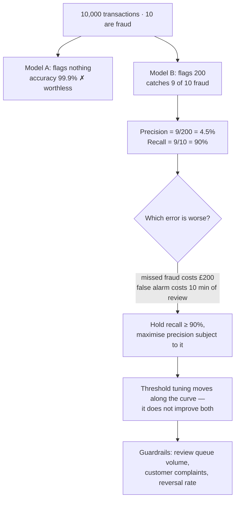

## The model

Once you have a labelled set, scoring it is arithmetic. The decision is *which* arithmetic, and
that choice is not neutral — every metric encodes an opinion about which mistake is worse.

**Precision** asks: of the things I flagged, how many were right? **Recall** asks: of the things
I should have flagged, how many did I find? They trade against each other, and choosing between
them is a statement about whether a false positive or a false negative costs more. Accuracy —
the obvious choice — hides both.

## When to use it

You have a labelled set and are choosing what to report.

1. **Is the answer right or wrong, or ranked?** A classification is precision and recall. A
   ranked list of results needs **nDCG** or **mean reciprocal rank**, because position matters
   and a binary hit-or-miss discards that.
2. **Which error hurts more?** A missed fraud alert costs money; a false one costs a customer's
   afternoon. Say which you are optimising for before choosing a metric that assumes it.
3. **How imbalanced are the classes?** If 1% of cases are positive, accuracy is 99% for a system
   that always says no — the **accuracy paradox**, and the reason accuracy is rarely reported by
   people who know what they are doing.

## Speedrun

**What** — the **confusion matrix** is the source of everything:

| | Predicted positive | Predicted negative |
|---|---|---|
| **Actually positive** | true positive (TP) | false negative (FN) |
| **Actually negative** | false positive (FP) | true negative (TN) |

$$
\text{precision} = \frac{TP}{TP + FP} \qquad
\text{recall} = \frac{TP}{TP + FN} \qquad
F_1 = \frac{2 \cdot P \cdot R}{P + R}
$$

**How to choose one**

1. **State which error is worse**, in the product's terms, before looking at any numbers.
2. **Use precision when false positives are expensive** — auto-blocking accounts, sending
   alerts, taking irreversible action.
3. **Use recall when false negatives are expensive** — screening for disease, security threats,
   anything where a miss is unrecoverable.
4. **Use F1 only when they are genuinely comparable**, and know it is a compromise that hides
   which side you are losing on.
5. **For ranked output use nDCG**, which rewards putting the best result first rather than
   merely including it.
6. **Report the pair, never one number.** Precision without recall is trivially gamed by
   flagging almost nothing.

**Why it works** — the confusion matrix separates the two ways to be wrong, and every useful
metric is a different way of weighting them. Collapsing to one number always discards that
distinction, so the question is which distinction you can afford to lose.

**The trap** — reporting accuracy on imbalanced data. At 1% positives, "always say no" scores
99% and is worthless, and that number will look excellent in a status update.

## Going deeper

### Precision and recall, and the trade you cannot escape

The two move against each other, and the mechanism is worth being able to state rather than
assert.

Almost every classifier produces a score, and a threshold turns it into a decision. Lower the
threshold and you flag more things: recall rises because you catch more of the true positives,
and precision falls because you also catch more false ones. Raise it and the reverse happens.
There is no threshold that improves both.

So a system does not have *a* precision and recall — it has a curve, and picking a threshold is
picking a point on it. That reframing matters, because "improve precision" is usually
achievable in ten seconds by raising the threshold, at a cost to recall nobody mentioned.

Which is why they are reported together, always. Precision at 99% sounds excellent until you
learn recall is 3%, meaning the system flags almost nothing and is right when it does.

**F1** is the harmonic mean, and the harmonic part matters: it punishes imbalance, so 99% and
3% gives an F1 of about 6% rather than the 51% an arithmetic mean would give. It is a
reasonable single number when the two errors cost about the same, and it is a way of hiding the
tradeoff when they do not.

The version worth knowing for real products is **precision at fixed recall** — "what precision
do we get while catching 90% of fraud" — because it states the requirement and measures against
it, rather than optimising a compromise nobody asked for.

### The accuracy paradox

Accuracy is `(TP + TN) / everything`, and on imbalanced data it is dominated by the majority
class.

Fraud is perhaps 0.1% of transactions. A model that predicts "not fraud" for every transaction
scores 99.9% accuracy, catches nothing, and would pass a review where accuracy was the metric.
That is the **accuracy paradox**, and it is not a subtle statistical point — it is the single
most common way an ML result is misreported.

The defences are all forms of not aggregating over the imbalance. Report precision and recall
on the positive class. Report per-class scores rather than an overall. Or use balanced accuracy,
which averages the per-class recalls so the rare class counts equally.

The general form is worth carrying beyond classification: **any average over an imbalanced
population is dominated by the majority**, which is the same reason [[stratification]] matters
when building the set in the first place.

### Ranked output, where position is the point

For search, recommendations or retrieval, "did it return the right thing" is the wrong question.
Returning it at position 1 and at position 50 are very different outcomes, and a binary metric
scores them identically.

**Mean reciprocal rank** scores each query by `1/rank` of the first correct result — 1.0 at
position one, 0.5 at position two, 0.1 at position ten — then averages. Simple, and it only
looks at the first hit, which fits "find me the answer" and not "find me everything relevant".

**nDCG** — normalised discounted cumulative gain — handles the general case. Each result
contributes its relevance discounted by a log of its position, and the total is normalised
against the best possible ordering so scores compare across queries with different numbers of
relevant results.

The two properties that make nDCG the standard: it supports **graded** relevance rather than
binary, so "perfect" and "acceptable" are distinguishable; and the log discount means moving a
result from position 10 to 9 matters far less than from 2 to 1, which is how attention actually
works.

For [[retrieval-augmented generation]], the metric that matters is usually **recall at k** —
did the correct passage appear in the top k we send to the model — because everything beyond
position k is invisible to the system regardless of its rank.

### Choosing, and then not trusting it

The choice of metric is a product decision expressed as arithmetic, and it should be made in
words first: *"a missed fraud costs us £200 on average; a false alarm costs a customer ten
minutes and some trust. We will hold recall at 90% and maximise precision subject to that."*
Every number after that sentence is implementation.

Then the [[Goodhart's Law]] problem, which arrives on schedule. Once a team is measured on
recall, recall improves — by lowering the threshold, which floods the review queue with false
positives that show up nowhere in the metric. Once measured on precision, precision improves by
flagging less, and the misses are invisible by construction.

The pairing is the defence, and it is the razor's actual advice: report both sides, plus a
**guardrail** that moves the wrong way under gaming. Review queue volume, customer complaints,
downstream reversal rate. A metric with no counterweight will be optimised, and the optimisation
will be real.

## See it work

A fraud detection system, 0.1% positive rate, measured before launch.

Model A is the accuracy paradox in one line. It scores 99.9% by predicting "not fraud" every
time, and a review that asked for accuracy would have approved it. That is not a hypothetical —
it is what happens whenever the metric is chosen before the class balance is looked at.

Model B catches nine of ten frauds at a precision of 4.5%, which sounds terrible and may be
exactly right. Two hundred flagged transactions is a manageable review queue, and missing one
fraud in ten is the business outcome being bought.

Whether 4.5% precision is acceptable is not a modelling question. It depends on what a review
costs and what a missed fraud costs, and that comparison has to be made in words before any
number is chosen — which is why the decision node in the diagram carries currency rather than
percentages.

Threshold tuning moves along the curve; it does not escape it. Anyone promising both higher
precision and higher recall from a threshold change is describing a different model, not a
different setting.

The guardrails are the part that survives contact with incentives. Recall alone gets optimised
by lowering the threshold until the review team drowns, and review queue volume is the number
that notices — which is the razor's pairing, applied to the metric you actually report.

## Next

LLM-as-judge is what to do when there is no label to compute a confusion matrix from, and
calibrating a judge is how you find out whether to believe it.
