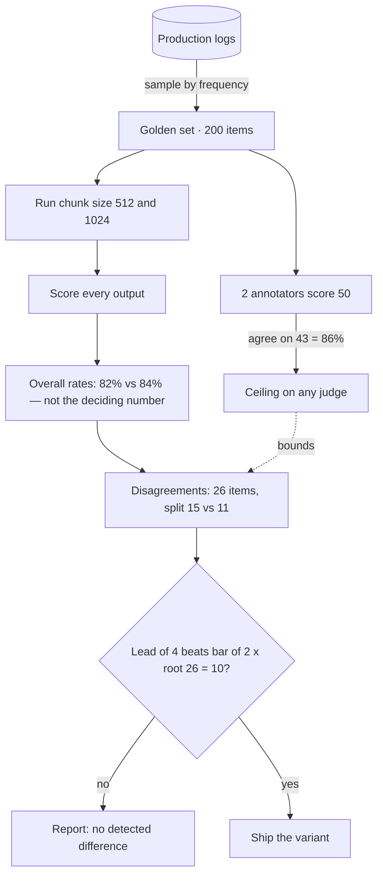

## The model

An eval measures how well a system does a task: you run it over a set of example
inputs and score the outputs. The result is a rate over that set — 82% of answers cited
the right document — not a pass or fail on any one case.

That makes it an estimate, not a fact. Measure the same system on a different 200
examples and the number moves. Everything else about evals follows from that one
property.

## When to use it

You are choosing between four things: eyeballing a few outputs, a deterministic test,
online monitoring, and a real offline eval.

1. **How many times will you change this system?** Once — spot-check a dozen outputs
   and ship. Repeatedly — build the eval, because its cost is paid once and saved on
   every later change.
2. **Is the output right-or-wrong, or better-or-worse?** A fixed correct answer is a
   test, and a test is cheaper. Only better-or-worse needs a rate over a sample.
3. **Would a bad output show up in production, and can you afford to let it?** Visible
   in metrics and cheap to roll back — monitor online instead. Invisible in aggregate,
   or expensive once shipped — catch it before release.

## Speedrun

**What** — a scored run of a system over a fixed set of examples, reported as a rate.

**How to build one**

1. **Sample 100–300 real inputs** from production logs, weighted by how often each kind
   actually occurs. This fixed set is your **golden set** — the same questions every
   future version will be asked.
2. **Define one outcome a person can score in ten seconds.** Narrow beats rich.
3. **Have two people score the same 50 items.** Those two people are your
   **annotators**, and how often they agree is the ceiling on every score that follows,
   automated or not.
4. **Score the full set.** That rate is your baseline, not your target.
5. **Re-run on the same set after each change**, so you have an old score and a new
   score for every item. Most items score the same both times — ignore those. Count
   only the items where one version got it right and the other got it wrong: call that
   count $N$, with $b$ of them won by the new version and $c$ by the old. Ship only if
   $|b - c| > 2\sqrt{N}$.

**Why it works** — you tweak a prompt to fix one bad answer. That same tweak silently
changed the other 199 answers too, and nothing tells you which way. A rate over a fixed
set is what catches a fix that broke more than it repaired.

**Numbers that govern** — comparing the two overall percentages is the wrong move. What
decides it is how many individual items changed hands: if the versions differ on 30
items, 18 going to the new one and 12 to the old, the lead is 6 against a bar of
$2\sqrt{30} \approx 11$, so it is not a win. Separately, two annotators who agree 85% of
the time cap every downstream score at 85%.

**The one failure everyone hits** — the golden set gets built from examples that were
easy to collect, so it skews toward what somebody already thought of. The system then
gets tuned against a distribution nobody actually sends.

## Going deeper

The same five beats, with room to breathe.

### What it is, precisely

An eval is an estimate with error bars, even when nobody draws them. Run the same
system on a different sample and the number moves, which is why a percentage reported
without a sample size is close to meaningless.

That is also the difference from a test. A test asserts a fixed correct answer and
fails when it is absent. An eval estimates a rate over a population, so it carries
sampling error by construction rather than by accident.

### Building it: the judgment inside each step

**Sampling by frequency** means the set is dominated by common inputs, which is usually
right — you are optimizing for the traffic you actually have. If rare-but-expensive
cases matter too, hold a second small set for them rather than distorting the main one.

**The outcome** has to be cheap to score. "Did the answer come from the right document"
takes seconds. "Was the answer good" does not, and a rubric costing two minutes an item
means the eval is run once and then quietly abandoned.

**Agreement** that comes back low usually means the rubric is underspecified, not that
the annotators were careless. Fix the rubric and re-measure before blaming anyone or
reaching for a model judge.

**The baseline** is a starting point, not a target. Teams that pick a goal before
measuring end up designing an eval that hits the goal.

**Re-running on the same set** matters more than it sounds. Paired comparison removes
most of the sampling noise, because you only care about items where the two variants
disagree — a much smaller and steadier quantity than the two rates.

### Why a rate and not an example

Ordinary code is local. Fix a bug in the date parser and the JSON serializer is
unaffected, which is exactly what makes a handful of unit tests enough — each one covers
a piece, and the pieces do not move when you touch a different one.

A prompt has no locality. Add "cite your source" to fix one unsourced answer and every
other answer changes as well: some improve, some get longer and worse, some start citing
a plausible but wrong document. The change is global by construction.

That is why a single example is worthless as evidence here. It tells you what happened
to one input and nothing about the 199 others your change also touched.

The rate is the smallest thing that says something about all of them at once. And
because both versions answer the same questions, any difference between them is the
change itself rather than the luck of which questions got asked.

### Knowing your noise floor

Score both versions on the same items and each item lands in one of four buckets: both
right, both wrong, only the old one right, only the new one right. The first two
buckets are silent — nothing there distinguishes the versions — so only the last two
carry any information.

Call those two buckets the disagreements: $N$ items in total, $b$ won by the new
version and $c = N - b$ by the old. If the versions are genuinely equally good, each
disagreement is a coin flip:

$$
b \sim \text{Binomial}\left(N, \tfrac{1}{2}\right)
$$

The lead is $L = |b - c| = |2b - N|$. A binomial with $p = \tfrac{1}{2}$ has
$\text{SD}(b) = \tfrac{\sqrt{N}}{2}$, and the doubling inside the absolute value
doubles the spread:

$$
\text{SD}(L) = 2 \cdot \frac{\sqrt{N}}{2} = \sqrt{N}
$$

For $N$ above roughly 20 the binomial is close enough to normal, and about 95% of a
normal distribution sits within two standard deviations. So when the versions really
are equal, a lead beyond $2\sqrt{N}$ turns up less than 5% of the time. That is the bar.

This is McNemar's test. Knowing the name is worth as much as the formula, because it
lets the argument be about the method rather than about your arithmetic.

Below about ten disagreements the normal approximation stops holding. Use an exact
binomial test, or accept that you do not have enough signal yet and go get more items.

Comparing on the same set is what makes any of this work. Score two variants on two
different samples and you inherit the sampling error of both, which takes a far larger
set to see through.

For a single rate rather than a comparison, use the interval instead: 200 items at
around 80% has a 95% interval of roughly ±5.5 points. Report it, and never report a
winner without saying how many items separated them.

### How the golden set goes bad

An unrepresentative sample does not leave you ignorant. It leaves you confident and
wrong, which is strictly worse — with no number at all you would have been more careful.

The second way it goes bad is [[Goodhart's Law]]: when a measure becomes a target, it
stops being a good measure. That applies here with unusual force, because optimising
against a fixed set of items is not a risk of this work — it is a literal description
of it.

In practice: after a month of tuning, the score on those 200 items is genuinely higher
and the system is no better for anyone outside the sample. You have learned the answer
key.

The defence is a second sample you never look at while tuning — a **held-out set** —
scored only occasionally, and rotated once it starts to feel familiar.

## See it work

A support assistant that looks up help-centre articles and writes its answer from them —
*retrieval-augmented*, in the jargon — tuned roughly weekly. Run the three questions: it
changes often, its answers are better-or-worse rather than right-or-wrong, and a
wrong-but-plausible answer looks fine in production metrics. All three point the same
way, so build the eval.

Sampling: 200 questions pulled from logs by frequency, so common questions appear about
as often as they truly do. Outcome: did the answer come from the right article — a
yes-or-no a person scores in ten seconds.

Two annotators score the same 50 items first. They agree on 43, so 86% is the ceiling;
a judge scoring above that is not more accurate, it is reproducing one annotator's
bias.

Now the eval answers the question it was built for. Before storing them, the system
cuts each help-centre article into pieces, and someone wants to know how big those
pieces should be — 512 words or 1024. The rates come back 82% and 84%, which looks like
a win for 1024 and is not the number that decides it.

The deciding number is neither percentage. Both versions are scored on the same 200
items, and 174 of them land the same way — both right or both wrong — so those say
nothing. The two differ on 26 items: 15 go to 1024 and 11 to 512.

That is a lead of 4 against a bar of $2\sqrt{26} \approx 10$. So the honest report is
"no detected difference," and chunk size gets decided on cost instead. "1024 wins"
would have been true of this sample and false of the system.

## Next

Building a golden set, LLM-as-judge, and calibrating a judge against humans are the
three pages that expand this one — the first on sampling, the second on automating the
score, the third on knowing when to believe it.
