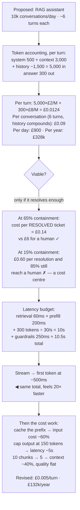

## The model

Two numbers decide whether an AI feature is viable, and both can be estimated on paper before
anything is built: what one request costs, and how long a user waits.

Teams skip this and discover in production that a feature costs more per user than the user pays,
or that a two-second answer feels broken. Neither discovery needs code — **token accounting** is
multiplication, and a [[latency budget]] is addition.

## When to use it

Before building anything a model powers, and again whenever the design changes shape.

1. **What does one request cost?** Input tokens × input price + output tokens × output price. If
   you cannot state that number, you cannot have the viability conversation.
2. **What does the user wait for?** Not the model's total time — the time until something useful
   appears, which streaming changes dramatically.
3. **What is the cost per *outcome*?** Cost per request is not the business number. Cost per
   resolved ticket, per accepted suggestion, per completed task is.

## Speedrun

**What** — an arithmetic model with four inputs: tokens in, tokens out, price per token, and
requests per period.

**How to do the accounting**

1. **Count tokens, not requests.** Roughly 0.75 words per token. A 3,000-word retrieved context is
   about 4,000 tokens.
2. **Price input and output separately.** Output typically costs 3–5× input per token, which
   inverts the intuition that a long prompt is the expensive part.
3. **Multiply by volume, then by retries and multi-step calls.** An agent doing five tool calls
   costs five requests, and each carries the accumulated history — so cost grows quadratically
   with conversation length, not linearly.
4. **Compute the cost per resolved task.** If 60% of conversations resolve and each costs £0.04
   across six turns, resolution costs £0.40 — the number to compare against a human handling it.
5. **Budget latency in parts**: retrieval + prefill + generation + guardrails. Generation
   dominates and scales with *output* length.
6. **Measure p95, not the mean.** Users experience the tail, and [[the tail at scale]] means a
   multi-call request inherits the worst of every call it makes.

**Why it works** — the model's cost and latency are both close to linear in token counts, so a
back-of-envelope estimate is usually within a factor of two. That is more than enough to kill a
non-viable design before it is built.

**The number that surprises people** — output tokens. A 200-token answer costs more than a
2,000-token prompt at typical pricing, and it is also nearly all of the latency.

## Going deeper

### The per-request arithmetic

Work a real one. A support assistant with a 500-token system prompt, 3,000 tokens of retrieved
context, 1,500 tokens of history, and a 300-token answer.

At a representative £2 per million input tokens and £8 per million output:

- Input: 5,000 tokens × £2/M = £0.010
- Output: 300 tokens × £8/M = £0.0024
- **Total: about £0.0124 per turn**

Ten thousand conversations a day at six turns each is 60,000 turns, or roughly £745 a day —
£272,000 a year. That is a number someone has to approve, and it is available before any code
exists.

The part that catches people is how history compounds. Turn one sends 5,000 tokens; turn six sends
the original context plus five turns of accumulated exchange, perhaps 9,000. **Conversation cost is
quadratic in turns**, because every turn re-sends everything before it. A conversation twice as
long costs roughly four times as much.

That single fact drives more architecture than any other. Trimming history, summarising it, and
caching the stable prefix are not optimisations — they are what makes multi-turn affordable at all.

### Unit economics, which is the real question

**Cost per request** is an engineering number. **Cost per resolved task** is the business one, and
they can point in opposite directions.

A cheaper model that costs half as much per request but resolves 40% of tickets instead of 65% is
more expensive per resolution *and* generates more escalations, each of which costs a human. The
per-request saving is real and irrelevant.

The comparison that matters is against the alternative. If a human handles a ticket for £6 and the
assistant resolves 65% at £0.40 per resolution, the arithmetic is overwhelming. If it resolves 15%,
it is a cost centre with a demo.

Three numbers make this concrete and they should be tracked together: cost per request,
[[containment rate]], and cost per resolved task. Any one alone can be improved in ways that make
the system worse.

### Latency, and what the user actually experiences

Total time is the wrong metric. What a user experiences is time until something useful appears, and
those diverge enormously once output is streamed.

The parts of a typical request:

| Stage | Typical | Scales with |
|---|---|---|
| Retrieval | 20–100 ms | index size, k |
| Prefill | 50–300 ms | input tokens |
| First token | — | prefill + queueing |
| Generation | 10–50 tokens/s | **output** tokens |
| Output guardrails | 0–300 ms | which checks run |

A 300-token answer at 30 tokens/second is 10 seconds of generation. Streaming turns that into
roughly 400 ms before the first word appears and a readable stream after — the same total, a
completely different product.

[[Little's Law]] applies to the serving side and settles capacity questions the same way it settles
them for a [[review queue]]: concurrent requests equals arrival rate times time in system. A hundred
requests a second at two seconds each means 200 concurrent requests in flight, and that is what has
to be provisioned.

The tail is where multi-step designs suffer. A request making five sequential model calls has a p95
governed by the worst of five draws, not the typical one — which is [[the tail at scale]] operating on
your own architecture rather than someone else's fleet.

### Reducing both, in order of return

The moves that actually work, roughly in order of return per unit of effort:

1. **Cache the stable prefix.** System prompt and retrieved context repeat across turns, and
   provider-side prompt caching cuts input cost on the repeated part by most of it.
2. **Shorten output.** It is the dominant term in both cost and latency, and "answer in under 100
   words" is a one-line change with a measurable effect.
3. **Send less context.** Twenty retrieved chunks is usually five chunks of signal and fifteen of
   cost — and quality often *rises* when you cut it.
4. **Route by difficulty.** A small model handling the easy 70% with a large model behind it beats
   one large model on everything, on both axes.
5. **Stream.** It changes no cost and transforms perceived latency.
6. **Parallelise independent calls.** Three sequential calls at 800 ms each is 2.4 seconds; run
   concurrently it is 800 ms plus coordination.

The thing not on this list is picking a cheaper model, which is where teams start. It is usually a
quality decision wearing a cost decision's clothes, and the unit economics above are how you tell
whether it actually saved anything.

## See it work

Estimating a support assistant before building it.

The estimate takes ten minutes and is the most valuable ten minutes in the project. Three hundred
and twenty-eight thousand pounds a year is a number that changes who needs to approve the feature,
and it exists before anyone writes a line.

Containment is what decides viability, not the per-request cost. The same £900 a day is either
fourteen pence per resolved ticket against a six-pound human — an obvious yes — or a system that
still sends 85% of tickets to a person while adding a bill. The engineering cost number cannot
distinguish those.

The latency number is worse than it looks and better than it sounds. Ten and a half seconds is
unusable as a blocking wait; streamed, the first words appear in half a second and the experience
is fine. Nothing about the total changed.

The optimisation order matters. Prefix caching, output caps and fewer chunks are three changes with
no quality cost that together cut the bill by 60% — and none of them is "use a cheaper model",
which is where the conversation usually starts and where the quality risk actually lives.

## Next

The prompt as a contract covers what goes into those input tokens, and why treating it as an
interface rather than a message changes how it is built.
