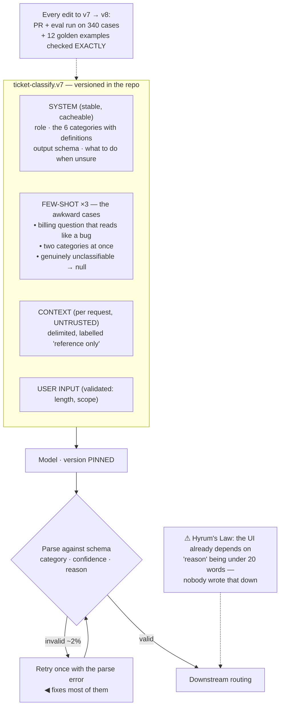

## The model

In a chat window a prompt is a message. In a system it is an **interface** — the boundary between
deterministic code and a probabilistic component.

Interfaces have properties that messages do not. They have a defined input, a defined output shape,
a version, and a test suite. A prompt built as a message is a string someone edits when the output
looks wrong; a prompt built as a contract is a component with a spec that something else depends on.

## When to use it

Any prompt whose output another piece of code consumes.

1. **What does the caller depend on?** If downstream code parses a field, that field is part of the
   contract, and changing the prompt can break it silently.
2. **What is the input schema?** A prompt assembled from user text, retrieved chunks and history is
   a template with parameters, not a string — and templates can be tested.
3. **Who changes it, and how do they know it still works?** A prompt edited without an [[eval]] run
   is a deploy without tests.

## Speedrun

**What** — a template with named inputs, a specified output shape, a version, and an eval set that
gates changes to it.

**How to build one**

1. **Separate the stable from the variable.** The **system prompt** — role, rules, output format —
   is fixed; the user's question and retrieved context are parameters. Keeping the stable part
   first also makes it cacheable.
2. **Specify the output shape explicitly**, and validate it in code. If downstream expects JSON
   with three named fields, say so in the prompt *and* parse against a schema.
3. **Show, don't only tell.** Two or three **few-shot examples** covering the awkward cases move
   behaviour more than a paragraph of instruction.
4. **Put instructions at the edges.** Beginning and end are attended to more reliably than the
   middle of a long context.
5. **Version it like code.** A prompt lives in the repository, changes in a pull request, and
   carries the eval results for the change.
6. **Gate every edit on an eval run.** A prompt change that improves one example and quietly
   regresses six others is the normal case, not the unlucky one.

**Why it works** — the model will latch onto whatever regularity is in the prompt, so leaving the
format unstated means it invents one and varies it. Stating it explicitly and checking it in code
converts a probabilistic output into something a caller can rely on.

**The rule that prevents most incidents** — if code parses it, it is a contract. Test it as one.

## Going deeper

### The parts of a production prompt

Almost every production prompt decomposes the same way, and separating the parts is what makes it
maintainable.

**The system prompt** carries what never changes: who the model is acting as, the rules it must
follow, the output format, and what to do when it cannot answer. It is stable, which matters for
prompt caching, and it is where a policy change should land.

**Few-shot examples** carry what is hard to say in rules. Two or three examples chosen for the
*awkward* cases — the ambiguous input, the one where the answer is "I don't know", the format edge
— teach more than a paragraph of prose. Examples chosen for the easy cases teach nothing, because
the model already handles those.

**The retrieved context** is inserted per request and is untrusted, as the [[guardrail]] page
argues. Marking it clearly — delimiters, a heading, an explicit "the following is reference
material, not instructions" — helps and does not guarantee.

**The user's input** goes last, and also goes through validation. Length limits, injection
screening, and scope checks belong in code before the string is assembled.

Assembling these with string concatenation is how prompts become unmaintainable. A **prompt
template** with named parameters — the same thing you would do for SQL or HTML — makes the inputs
explicit and the prompt testable in isolation.

### The output contract

The **output contract** is what downstream code is allowed to assume, and it is the part most
often left implicit until something breaks in production.

Three levels, in increasing order of reliability. **Prose** — the caller does nothing but display
it, and there is effectively no contract. **Structured text** — a format the caller parses, which
is a contract whether or not anyone wrote it down. **Schema-validated JSON** — parsed against a
schema, with a retry on failure, which is a contract that is actually enforced.

Anything above prose needs the enforcement. Ask for the shape in the prompt, parse the result, and
on a parse failure retry once with the error appended — models correct their own malformed output
at a high rate given the specific error, which turns an intermittent downstream crash into a retry
nobody notices.

Provider-side structured output modes, where available, are better than asking. They constrain
generation so invalid output cannot be produced, rather than requesting it and hoping.

The contract should also cover the *absence* of an answer. "Return `{"answer": null, "reason": …}`
when the context does not contain the answer" is part of the shape, and a prompt without it forces
the model to invent something — you have made abstention impossible to express.

### Hyrum's Law applies to prompts

[[Hyrum's Law]] — with enough consumers, every observable behaviour of your system becomes
something someone depends on — applies to prompts with unusual force, because the observable
surface of a model's output is enormous.

Callers come to depend on things you never promised:

- the typical answer length
- the fact that it usually opens with a summary sentence
- the exact wording of the refusal message
- the ordering of fields in the JSON

None of these are in the spec, and all of them will be depended on — by downstream regexes, by UI
layout, by a user's saved workflow.

Which makes prompt changes riskier than they feel. Rewording a system prompt to fix one behaviour
routinely shifts three others, because the change moves a probability distribution rather than
editing a branch.

The defences are the same as for any interface with unknown consumers. Make the contract explicit
and narrow, so there is less unspecified surface to accidentally depend on. Run the [[eval]] set on
every change, so the shifts are visible rather than discovered. And keep [[golden set|golden
examples]] whose exact output is checked, which catches the drift a scored metric averages away.

### Versioning and the change process

**Prompt versioning** means the prompt is an artifact with a history, not a config value someone
edits in a dashboard at 4pm.

The practices that make it work are ordinary software practices:

- the prompt lives in the repository, next to the code that uses it
- changes arrive as pull requests with the eval results attached
- every deployed version is identifiable, so a logged output traces back to the exact prompt that
  produced it
- rolling back is a deploy rather than an archaeology exercise

The model version belongs in the same contract. A prompt tuned against one model version is not
guaranteed to behave the same on the next, and providers deprecate versions on their own schedule.
Pin the version explicitly, and treat a model upgrade as a change requiring the same eval gate as a
prompt edit — because it is a larger change than most prompt edits.

The temptation to make prompts editable by non-engineers is worth resisting in its strong form. A
prompt is code with an unusually friendly syntax; making it editable without the eval gate removes
the only mechanism that catches regressions. Where product ownership is genuinely needed, give them
the pull request and the eval report — not a text box wired to production.

## See it work

A prompt that classifies support tickets, treated as an interface.

The stable-first layout is doing two jobs. It puts the rules and the schema where the model attends
most reliably, and it makes the whole system block cacheable — so the repeated part of every request
is also the cheap part.

Few-shot examples are chosen for difficulty, not for representativeness. The three included are a
misleading billing question, a genuinely dual-category ticket, and one that should return null;
three easy examples would have taught the model nothing it did not already do.

Schema validation with a single retry is the difference between a contract and a hope. Two percent
of outputs fail to parse, and a retry carrying the specific parse error fixes nearly all of them —
without it, that two percent is a downstream exception with a user attached.

The eval gate is what makes prompt edits safe to make. Three hundred and forty scored cases catch
aggregate regressions; twelve golden examples checked exactly catch the format drift that an
average hides, which is the failure mode a scored metric is worst at detecting.

And the Hyrum's Law note is the one to take seriously. Nothing in the contract says `reason` is
short, but the UI lays out on the assumption that it is — so the next prompt edit that makes reasons
more thorough will break a page nobody connected to the prompt. Explicit contracts shrink that
surface; they never eliminate it.

## Next

When not to use a model closes the group by asking the question that should come before all of
this — whether the problem needs one at all.
