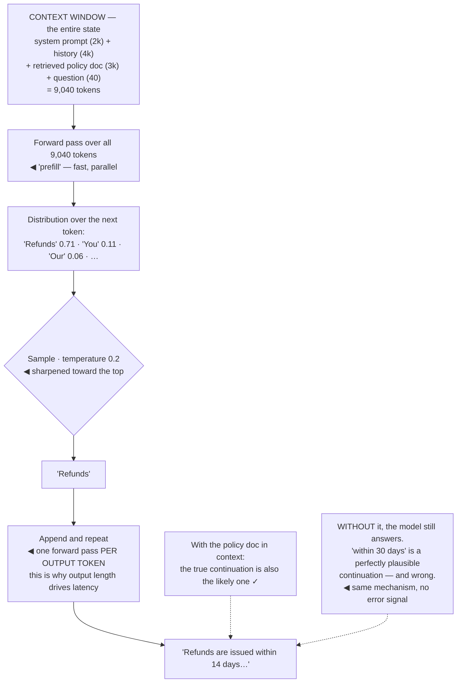

## The model

A language model takes a sequence of **tokens** and predicts a probability distribution over the
next one. Sample one, append it, repeat. That is the whole mechanic.

Everything that feels mysterious falls out of it. The model has no memory between calls because
each call is a fresh sequence. It invents plausible citations because a plausible-looking citation
is a high-probability continuation. It is confidently wrong because confidence and correctness are
different properties, and only one of them is being optimised.

## When to use it

You are reasoning about why a model behaved a particular way.

1. **Is this a knowledge problem or a generation problem?** The model does not know your data
   unless it is in the context. If the answer requires facts it never saw, no prompt fixes it —
   that is a [[retrieval-shaped question]].
2. **Is the behaviour random or systematic?** Sampling makes identical inputs produce different
   outputs. Run it five times before concluding anything from one run.
3. **How much context is this consuming?** The **context window** is a hard limit and everything
   competes for it — instructions, history, retrieved documents, the output itself.

## Speedrun

**What** — **next-token prediction**, run in a loop. An **autoregressive** predictor takes tokens
in and returns a probability distribution over the next token out, one token at a time.

**How to reason about it**

1. **Tokens, not words.** Roughly 0.75 words per token in English, worse for code, much worse for
   other languages. Cost, context limits and latency are all counted in tokens.
2. **The context window is everything the model knows** for this call. There is no other state.
3. **Sampling introduces variance.** **Temperature** scales how much the distribution is
   flattened before sampling — 0 is near-deterministic, 1 is the raw distribution.
4. **Output is generated one token at a time**, so output length drives latency almost linearly
   while input length mostly does not.
5. **The model optimises plausibility, not truth.** A **hallucination** is not a malfunction; it
   is the mechanism working correctly on a question where the plausible answer is wrong.
6. **Position matters.** Instructions at the very start and very end of a long context are
   attended to more reliably than instructions buried in the middle.

**Why it works** — training on an enormous corpus makes "the most likely next token" a
surprisingly good proxy for "the correct next token", across a startling range of tasks. It is a
proxy, and the gap is where every failure lives.

**The reframe that fixes most confusion** — the model is not answering your question. It is
continuing your text in the way the training data suggests text like that gets continued.

## Going deeper

### Tokens, and why the unit matters

A token is a sub-word fragment produced by the tokeniser — common words are one token, rarer ones
split into several, and `unbelievable` might be three.

The practical consequences are all economic. Pricing is per token, the context limit is in tokens,
and generation speed is tokens per second. So "how long is this document" is the wrong question;
"how many tokens is this document" is the one that has a cost attached.

Some things tokenise badly and it is worth knowing which. Code has more tokens per character than
prose. Non-English text can cost two to three times more tokens for the same meaning. Long numbers
split into fragments, which is part of why models are unreliable at arithmetic — `1,234,567` is
not one thing to a model, it is several.

The tokeniser also explains a class of puzzling failures. A model struggling to count letters in a
word is not being stupid; it never sees the letters. It sees a token, and the spelling is
something it has to have memorised rather than something it can inspect.

### The context window, which is the entire state

Every call is stateless. The **context window** — system prompt, conversation history, retrieved
documents, the current question — is all the model has, and when the call ends it is gone.

That single fact explains most architectural decisions in an AI feature. Conversation memory is
you re-sending the history. "The model remembers our earlier discussion" means your application
put that discussion back in the window. Retrieval exists because private data has to be inserted
into the window before it can be used.

Everything competes for the same budget. A 128k window sounds enormous until a system prompt takes
2k, twenty retrieved chunks take 20k, the history takes 30k, and the output needs room too. Filling
it is also not free — cost scales with what you put in, and quality frequently *falls* as the
window fills.

The **lost in the middle** effect is the reason. Models attend most reliably to the beginning and
end of a long context, so a critical instruction placed halfway through a 60k-token window is
measurably more likely to be missed than the same instruction at the top. Put instructions at the
edges, and treat a longer context as a cost rather than a feature.

### Sampling, and why the same input gives different answers

The model outputs a distribution — perhaps `Paris` at 0.94, `paris` at 0.03, `France` at 0.01.
Something has to choose, and that choice is sampling.

**Temperature** controls the shape. Below 1 sharpens the distribution toward the most likely token;
above 1 flattens it. At 0 the model takes the argmax every time, which is *nearly* deterministic —
"nearly", because batching and floating-point non-associativity on GPUs mean even temperature 0 is
not a guarantee.

Two other knobs appear in every API. **Top-k** limits sampling to the k most likely tokens;
**top-p** (nucleus sampling) limits it to the smallest set whose cumulative probability exceeds p.
Both prevent the long tail of nonsense that pure sampling occasionally produces.

The engineering consequence is the one to internalise: **a single run tells you very little.**
Evaluating a prompt change on one example, or debugging from one bad output, is measuring noise.
Run it several times, or evaluate on a set — which is what an [[eval]] is for.

### Hallucination, as a property rather than a bug

A **hallucination** is fluent, confident output that is false. It is not the model failing to work
— it is the model working exactly as designed on a question where plausible and true diverge.

Consider what the mechanism does when asked for a citation it does not have. Papers have titles
that look a certain way, authors that look a certain way, years and journals. All of that is highly
predictable, and the model produces a perfect-looking citation for a paper that does not exist,
because that is the most probable continuation of "the reference is".

The pattern generalises. The model is most dangerous where the *form* of the answer is highly
learnable and the *content* is not: citations, statistics, API method names, legal sections, dates.
Each has a shape the model knows and a substance it does not.

There is also no reliable internal signal for it. The model does not represent "I do not know"
distinctly from "I know" — a confident tone is a property of the text, not evidence about the
facts. This is why [[confidence calibration]] has to be measured externally rather than asked for.

What actually reduces it: putting the facts in the context ([[grounding]]), requiring citations
that a checker verifies, and giving the model an explicit path to decline. What does not: asking
it to be accurate.

## See it work

Asking an assistant for a customer's refund policy, one token at a time.

The context window is the whole state, and nine thousand tokens of it are being re-read on every
call. Nothing carries over from the previous conversation except what the application put back in,
which is why "memory" is an application feature rather than a model one.

Prefill and generation cost differently and this shapes everything downstream. The 9,040 input
tokens are processed in one parallel pass; each output token needs its own forward pass. Doubling
the input barely moves latency, doubling the output roughly doubles it.

Temperature 0.2 sharpens the distribution rather than eliminating variance. The same question asked
five times will mostly produce the same answer and occasionally will not — so a prompt evaluated
on a single run has been evaluated on a coin flip.

The contrast at the bottom is the entire argument for retrieval. With the policy document in
context, the plausible continuation and the true one coincide. Without it, the model produces
"within 30 days" with identical fluency and identical confidence, because nothing in the mechanism
distinguishes a remembered fact from a well-shaped guess.

## Next

The cost and latency model turns these mechanics into numbers you can put in a budget, which is
the conversation every AI feature eventually has.
