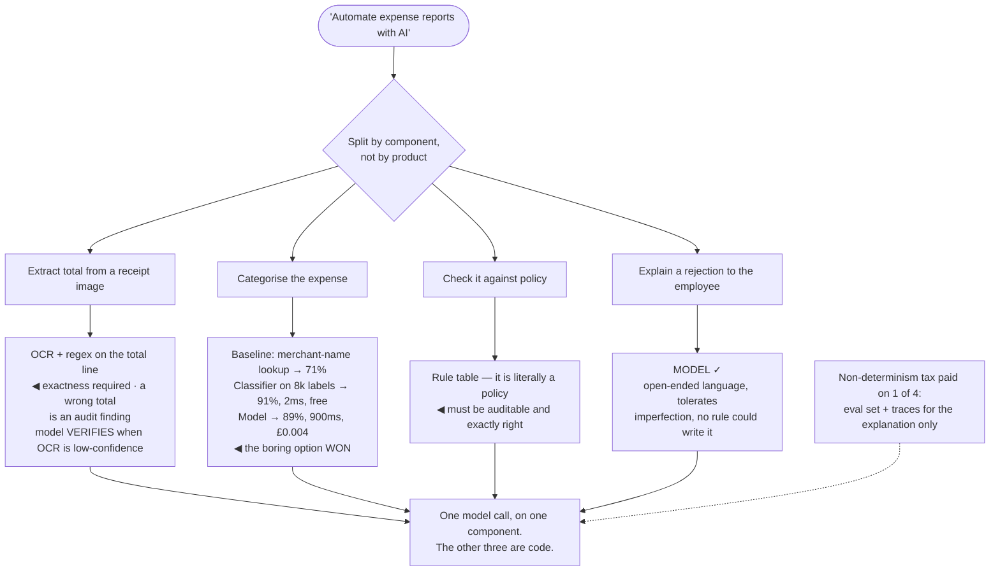

## The model

A language model is expensive, slow, non-deterministic and occasionally wrong in ways it cannot
report. You accept all four because for some problems there is no alternative that works at all.

The question worth asking first is whether this is one of those problems. A **model-shaped
problem** involves open-ended natural language, tolerates imperfection, and has no rule you could
write. Everything else has a **deterministic baseline** that is cheaper, faster, testable, and
right every time.

## When to use it

At the start of any feature where someone has proposed a model.

1. **Could a rule do this?** If the logic can be written as conditions on structured data, write
   the conditions. A regex that extracts an order number is right 100% of the time for free.
2. **Does the output need to be exactly right?** Arithmetic, totals, permissions, anything a
   regulator reads. Models are unreliable at exactness and cannot tell you when they were.
3. **What is the baseline?** Not "what could a model do" — what does the simplest non-model
   approach achieve? Measure it before you have anything to compare against.

## Speedrun

**What** — a decision, made before building: model, rule, classical machine learning, or a
combination where the model handles only the part that needs it.

**How to decide**

1. **Build the deterministic baseline first**, even a crude one. It takes an afternoon and it is
   what every later number is measured against.
2. **Ask what the model uniquely provides.** Open-ended language understanding, generation, and
   generalisation to inputs nobody enumerated. If none of those is required, stop.
3. **Check the exactness requirement.** Anything that must be correct rather than usually correct
   needs code, or a model whose output code verifies.
4. **Price the [[non-determinism tax]]** — you cannot unit-test the output, reproduce a bug
   reliably, or promise the same answer twice. That is a permanent cost, not a launch cost.
5. **Consider the hybrid**, which is usually the right answer. Let the model do the one hard part
   and let code do everything around it.
6. **Prefer [[boring technology]] where it fits.** That is not conservatism here; a
   classifier trained on 5,000 labelled examples is often more accurate, a hundred times cheaper,
   and testable.

**Why it works** — a model's advantages are specific and its costs are general. Matching the tool
to the part of the problem that actually needs it gets the advantages without paying the costs on
everything else.

**The question that settles most arguments** — "what would we do if we could not use a model?" If
the answer takes ten minutes to describe, build that first.

## Going deeper

### What a model is uniquely good at

Three things, and it is worth being precise because everything else is a preference rather than a
requirement.

**Open-ended language.** Understanding text nobody could enumerate the shapes of — a support
message, a document, a half-formed question. No rule set covers the space, and no classifier
handles inputs it was never trained on.

**Generation.** Producing fluent, contextually appropriate text: a summary, a draft, an
explanation. There is no non-model approach that is even close.

**Generalisation without labels.** Handling a category nobody trained for, an unusual phrasing, a
task described only in the prompt. A classifier needs examples of everything it will see; a model
frequently does not.

Notice what is not on the list. Arithmetic, exact lookup, sorting, permissions, deduplication,
validation, and anything with a correct answer that code can compute. Models can do these and do
them worse, slower and more expensively than a function.

The corollary is the design principle: **use the model for the language part and code for
everything else.** Extracting an intent from a message is language; deciding what happens next
given that intent is a rule table.

### The deterministic baseline, which people skip

The **deterministic baseline** is the simplest approach that does not involve a model: rules, a
lookup, a regex, a keyword match, a small trained classifier.

Building it is not a formality. It takes hours rather than weeks, and it produces the number every
subsequent decision needs — because "the model gets 82%" means nothing until you know whether the
baseline gets 40% or 79%.

The results are frequently uncomfortable. Keyword routing that gets 78% where the model gets 84%
is a genuine question about whether six points is worth the cost, latency and non-determinism.
Sometimes it is; the point is that it becomes a decision rather than an assumption.

The baseline also stays useful after the model ships. It is the fallback when the provider is down,
the sanity check when outputs look wrong, and the thing you compare against when someone proposes
a more expensive model.

And there is a middle option people forget entirely. A logistic regression or gradient-boosted tree
on labelled data is often more accurate than a language model at classification, runs in
microseconds, costs nothing per call, and is fully testable. If you have — or can get — a few
thousand labels, that is frequently the correct answer.

### The non-determinism tax

The **non-determinism tax** is everything that gets harder once part of your system is
probabilistic, and it is paid forever rather than at launch.

**Testing changes shape.** You cannot assert an output equals a value. Testing becomes evaluation
over a set with a threshold, which is a whole discipline — see [[eval-driven development]] — rather
than an assertion.

**Debugging loses reproducibility.** A user reports a bad answer and the same input produces a
different one. Traces, logged inputs and captured outputs become mandatory infrastructure rather
than nice-to-have.

**Behaviour changes underneath you.** Provider model updates shift outputs without any change on
your side, which no deterministic dependency does.

**Guarantees become statistical.** "It always redacts card numbers" becomes "it redacts card
numbers 99.4% of the time", and the remaining 0.6% needs a [[guardrail]] in code. If the guarantee
was the requirement, the model was never sufficient alone.

None of this argues against models. It argues for scoping them, because every one of these costs
applies to the whole system that contains a model, not only the model-shaped part.

### The hybrid, which is usually the answer

The framing "model or not" is a false binary, and most good designs are neither.

The pattern that recurs: **code narrows, model interprets, code decides.** A support system might
use rules to detect the 30% of messages matching a known template, a model to interpret the rest,
and a rule table to decide what actually happens given the interpretation. The model does the one
thing only it can do.

**Verification** is the other half of the pattern. Where the model produces something checkable —
a SQL query, a JSON payload, a calculation — run it, check it, and reject on failure. A model that
proposes and code that verifies is far more reliable than either alone, and it is why
[[text-to-SQL]] works at all.

**Cascades** apply the same logic to cost. Cheap or deterministic handling for the easy majority, a
model for the rest. That is the [[review queue]] routing argument applied to machines instead of
people, and it works for the same reason: most items do not need the expensive treatment.

The one thing to avoid is the reverse hybrid — a model wrapped in so many rules and repairs that
the rules *are* the system and the model is an expensive source of suggestions nobody trusts. When
the repair logic exceeds the model logic, the baseline was the answer.

## See it work

An expense-report system, decided component by component.

Splitting by component is the move that makes the decision tractable. "Automate expense reports
with AI" has no answer; four separate questions each have an obvious one, and only one of the four
comes out as a model.

The extraction case shows exactness deciding it. A total that is wrong 3% of the time is an audit
finding, so OCR plus a regex on a known line format is correct — with the model used as a
verifier when OCR confidence is low, which is the propose-and-check pattern rather than a
replacement.

Categorisation is where the baseline earns its keep. Building it took an afternoon and revealed
that a classifier on existing labels beats the model on accuracy while being four hundred times
faster and effectively free. Without measuring, that comparison never happens and the expensive
option ships by default.

Policy checking is not a judgement call at all — it is a policy, and policies need to be auditable
and exactly right. A model asked to apply rules will apply them almost always, and "almost" is the
word that makes it the wrong tool.

Explaining a rejection is the genuinely model-shaped one. It is open-ended language, it tolerates
imperfection, and no rule could write a clear explanation for an arbitrary combination of policy
violations. That is what the model is for.

The tax line is the payoff. Because only one component is probabilistic, only one needs an eval
set, traces and a guardrail — the other three are ordinary code with ordinary tests, and the
system as a whole stays debuggable.

## Next

The Evaluation group takes the model-shaped part and makes it measurable, which is the first thing
to build once you have decided a model belongs.
