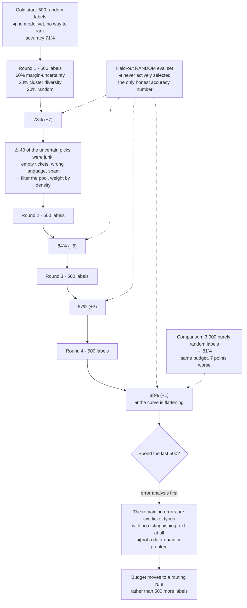

## The model

You can afford to label a thousand items and have a million unlabelled. **Active learning** is
choosing the thousand.

Random sampling is the default and it is wasteful, because most items look like items the model
already handles. The gain comes from labelling where the model is uncertain or where the data is
unlike anything it has seen — and the difference between a well-chosen thousand and a random
thousand is routinely several points of accuracy for the same money.

## When to use it

Labelling is your bottleneck and you have far more unlabelled data than budget.

1. **Is labelling actually the constraint?** If you have plenty of labels and the model is still
   poor, the problem is elsewhere and selection will not help.
2. **Do you have a usable uncertainty signal?** Selection needs something to rank on, and a model
   too weak to produce one sends you back to random sampling first.
3. **Can you afford a bit of pipeline?** Active learning is a loop — select, label, retrain,
   reselect — and a loop nobody runs is worse than a good one-off sample.

## Speedrun

**What** — a selection policy over unlabelled data, run in rounds rather than once.

**How to run it**

1. **Start with a random seed set.** You need a model before you can measure uncertainty, and
   random is the only unbiased way to get the first few hundred labels.
2. **Rank the unlabelled pool by uncertainty** — lowest margin between top predictions, highest
   entropy, or disagreement between two models.
3. **Add [[diversity sampling]]** so the batch is not fifty near-duplicates of the same hard case.
   Cluster and pick across clusters.
4. **Label a batch, retrain, and reselect.** Rounds of a few hundred beat one large batch, because
   each round's selection is informed by the last.
5. **Always keep a random slice** — 10–20% of every batch — so your evaluation set stays unbiased
   and you can still detect what the model does not know it does not know.
6. **Stop when the curve flattens.** Plot accuracy against labels; when a round buys nothing,
   spend the budget elsewhere.

**Why it works** — items the model already handles confidently carry almost no information, so
labelling them changes nothing. The boundary cases are where the decision surface is still wrong,
and moving it there is what accuracy is made of.

**The trap** — pure uncertainty sampling selects outliers and mislabelled junk, because those are
maximally uncertain and also worthless. Diversity is not a refinement; it is what keeps the method
from degenerating.

## Going deeper

### Uncertainty, and its failure mode

**Uncertainty sampling** ranks unlabelled items by how unsure the model is, and labels the top of
that list. Three common measures: **least confidence** (lowest top-class probability), **margin**
(smallest gap between the top two classes), and **entropy** (most spread across all classes).
Margin is usually the best default, because it targets the specific boundary a label would move.

The failure mode is worth understanding, because it bites everyone once. The most uncertain items
in a real pool are frequently garbage — corrupted inputs, unlabelable edge cases, text in a
language the product does not support, items whose correct answer nobody can determine. The model
is uncertain about them for good reason, and labelling them buys nothing.

Two guards. Filter obvious junk before ranking, which is cheap and catches most of it. And weight
by **density** — how many similar items exist in the pool — so a hard case that represents a
thousand others outranks a unique oddity.

The shape you are exploiting is a steep one. A small fraction of items carries most of the
remaining information, and the whole method is an attempt to find that fraction rather than pay
for the rest.

### Diversity, and why it is not optional

Uncertainty alone produces batches that are nearly identical, because similar items have similar
uncertainty. Fifty near-duplicates of the same confusing case cost fifty labels and teach the
model roughly one thing.

**Diversity sampling** fixes it by selecting across the space rather than down a ranked list.
Cluster the unlabelled pool by embedding, then pick the most uncertain item from each cluster.
Simple, cheap, and it converts a batch of fifty into fifty distinct lessons.

The combined objective — uncertain *and* representative *and* different from what has been picked
already — is what production systems actually use. Each term alone degenerates: uncertainty alone
picks outliers, diversity alone picks randomly, representativeness alone picks the easy centre of
the distribution.

Batch size interacts with this. Large batches make diversity essential, because everything in a
thousand-item batch was selected by a model that never saw any of it labelled. Small batches
retrain more often and self-correct, at the cost of more retraining cycles.

### The cold start, and the budget

The **cold start problem** is the chicken-and-egg at the beginning: selection needs a model, and a
model needs labels. There is no clever escape — take a random sample of a few hundred, accept that
it is inefficient, and start the loop once you have something to rank with.

Two things make the cold start shorter. A pre-trained model or an off-the-shelf embedding gives
you a usable uncertainty signal before you have trained anything of your own. And clustering the
unlabelled pool lets you sample across it deliberately rather than uniformly, which beats pure
random even with no model at all.

Spending the **labelling budget** well is mostly about proportion. A common split is 60% by
uncertainty, 20% by diversity, and 20% random — the random slice serving three purposes at once:
an unbiased evaluation set, a check that the selection policy is not drifting into a corner, and
coverage of the cases nobody knew were failing.

That random slice is the part teams cut first and should not. A model evaluated only on
actively-selected data has an evaluation set biased toward hard cases, so its measured accuracy is
not the accuracy users experience — and the direction of the bias is not predictable.

Knowing when to stop is a plot rather than a rule. Accuracy against number of labels flattens, and
when a round of 200 buys half a point, the next 200 will buy less. That is the signal to move the
budget to a different problem — usually [[error analysis]] on what is still failing, which
frequently reveals that the remaining errors are not a data-quantity problem at all.

### Where it fits with everything else

Active learning composes with the rest of the human-in-the-loop machinery, and the pieces reinforce
each other.

The [[review queue]] is already a selection mechanism, and the items reviewers see are exactly the
items the system found uncertain. Capturing those decisions gives you active learning for free —
the labels arrive as a by-product of a process you are running anyway.

[[Escalation threshold|Escalations]] are a particularly good source, because an escalation is the
system declaring uncertainty on a real user request. Those items are uncertain *and* real *and*
consequential, which is the combination selection policies are trying to synthesise.

Production failures beat any sampling policy. An item a user complained about is worth more than
an item a model found confusing, because it is a known error on real traffic rather than a
predicted one.

The last connection is back to [[annotation]]: selection decides what gets labelled, and annotation
quality decides whether the labels are worth having. A perfectly chosen batch labelled against an
underspecified question is wasted budget — so raise the agreement ceiling before spending heavily
on selection.

## See it work

Building a classifier for support-ticket routing, with a budget of 3,000 labels and 400,000
unlabelled tickets.

The cold start is unavoidable and cheap to accept. Five hundred random labels produce a mediocre
model, and that mediocre model is what makes every subsequent round efficient — trying to be clever
before you have any labels is wasted effort.

The junk discovery in round one happens to everyone. Forty of the most uncertain tickets were
empty, spam, or in an unsupported language; the model was right to be uncertain and the labels
taught it nothing. Filtering the pool and weighting by density is what keeps rounds two and three
from repeating it.

The flattening curve is the stopping signal, and it is a plot rather than a judgement call. Seven
points, then six, then three, then one — the fifth round will buy less than the fourth, and the
budget is better spent understanding what is left.

Error analysis on the residual is what turns a stopping decision into a useful one. The remaining
errors are two ticket types with genuinely indistinguishable text, which no quantity of labels
fixes; a routing rule does. Spending the last 500 labels would have bought almost nothing.

The random held-out set is the quiet discipline holding the whole thing up. Every accuracy number
above is measured on data that was never actively selected — because an evaluation set drawn from
uncertainty-sampled items is biased toward hard cases and reports a number no user would recognise.

And the comparison at the bottom is the argument for doing any of this: the same 3,000 labels spent
randomly reach 81%. Selection bought seven points for the same money.

## Next

The Systems and shipping group covers what happens once the model is good enough — serving it,
bounding its cost, and changing it without breaking anything.
