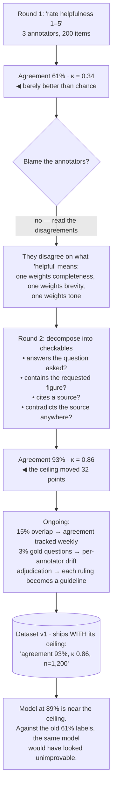

## The model

**Annotation** is people producing labels — for training, for a [[golden set]], for measuring a
judge. Those labels are treated as ground truth by everything downstream.

They are not ground truth; they are measurements with an error rate. And the error rate is
measurable, which changes everything: once you know your annotators agree 78% of the time, you
know that 78% is the **label noise ceiling** for every model, judge and eval score built on top
of them.

## When to use it

You are having people label anything that will be measured against.

1. **Is the question decidable?** If two qualified people cannot agree, the question is
   underspecified rather than the people being careless — and adding annotators will not help.
2. **Who are the right annotators?** Domain expertise matters enormously on some tasks and not
   at all on others. Ask whether a non-expert could be trained to do this reliably.
3. **How will you know the labels are good?** If the answer is "we trust them", you have no
   quality measurement and every number downstream inherits an unknown error.

## Speedrun

**What** — labelled data, plus the measurements that make it trustworthy: agreement, gold
questions, and adjudication.

**How to run annotation**

1. **Write guidelines before labelling**, with worked examples of the ambiguous cases. Guidelines
   written after are documentation of what happened rather than instructions.
2. **Train and qualify** annotators on a set with known answers before they touch real data.
3. **Overlap 10–20% of items** across annotators, and compute [[inter-rater agreement]]
   continuously rather than once.
4. **Seed [[gold questions]]** — items with known answers, mixed invisibly into the stream — to
   detect an individual annotator degrading.
5. **Adjudicate disagreements**, and turn each ruling into a new guideline. Disagreement is the
   raw material for a better question.
6. **Report the agreement rate alongside every dataset**, so consumers know the ceiling they are
   working under.

**Why it works** — measuring agreement turns labels from an assumption into a quantity. That
single move tells you whether a model scoring 75% is near the ceiling or far from it, and those
two situations call for completely different work.

**The move that beats everything else** — when agreement is low, rewrite the question. "Is this
answer good?" has no stable answer; "does it state the balance and cite a policy?" does, and the
rewrite typically moves agreement more than any amount of training or extra annotators.

## Going deeper

### Disagreement is a signal about the question

The instinct on seeing 70% agreement is to blame the annotators — better training, better people,
more of them. That is usually the wrong diagnosis.

Low agreement almost always means the task is underspecified. "Rate the helpfulness of this
answer from 1 to 5" has no stable answer, because helpfulness is not a property anyone can locate
in the text. Two careful people will disagree, and no amount of training fixes an unanswerable
question.

The fix is decomposition into checkable components. Instead of helpfulness, ask:

- Does it answer the question that was asked?
- Does it contain the specific figure requested?
- Does it cite a source?
- Is anything in it contradicted by that source?

Each is close to binary, and agreement rises sharply.

That rewrite has a second effect worth noticing. The same specificity that makes humans agree
makes a [[LLM-as-judge|judge]] consistent, so improving the question improves both — and a rubric
humans cannot agree on will never produce a stable judge.

The general principle: **agreement is a property of the question first and the annotators
second.** Measure it early, and treat a low number as a specification bug.

### Measuring quality, continuously

Three mechanisms, and they catch different failures.

**Overlap and agreement.** Have several annotators label the same 10–20% of items, and compute
agreement continuously rather than as a one-off. Report [[Cohen's kappa]] as well as raw
agreement, because raw agreement is inflated by chance on unbalanced tasks.

**Gold questions.** Items with known correct answers, seeded invisibly into the work stream at a
low rate. An annotator whose gold accuracy drops is degrading, and this catches it per person
rather than in aggregate — which overlap does not.

**Adjudication.** A third person resolves disagreements, and each ruling becomes a guideline.
Over time the guidelines encode every ambiguity anyone has hit, which is what makes **annotator
training** a matter of hours rather than weeks — a new person reads the accumulated rulings,
qualifies on a set with known answers, and starts.

**Annotator drift** is the failure these are guarding against. People become faster and less
careful over weeks, or their interpretation shifts gradually as they see more cases. Neither is
visible in a single quality check at onboarding, and both show up in gold accuracy over time.

Reviewer fatigue applies here as it does to a [[review queue]]: quality falls measurably after a
couple of hours, so it is worth measuring accuracy by hour into shift before concluding anything
about a person.

### The ceiling, and what it means downstream

If two qualified annotators agree 80% of the time, then on 20% of items there is no stable
correct answer. A model evaluated against those labels cannot meaningfully exceed 80%, because on
the disputed fifth there is nothing to be right about.

That number needs to travel with the dataset. A model scoring 78% against an 80% ceiling is
performing essentially at human level; the same 78% against a 95% ceiling means there is real
headroom. Reporting the score without the ceiling makes those indistinguishable, and teams
routinely spend months chasing the first situation believing it is the second.

It also bounds the [[calibration|judge calibration]] work. A judge cannot agree with humans more
often than humans agree with each other, so a judge at 78% against an 80% ceiling is close to the
maximum achievable rather than mediocre.

The practical consequence: **raise the ceiling before optimising against it.** An afternoon spent
rewriting the question to lift agreement from 78% to 92% is worth more than weeks of model work,
because it moves the bound on everything.

### Paying for annotation, and what that incentivises

How annotation is paid for shapes what you get, and [[Goodhart's Law]] applies here as
mechanically as anywhere.

Per-item payment optimises throughput, which means speed at the expense of care — and the labels
degrade in a way that looks like the task getting harder. Per-hour payment removes that pressure
and introduces a different one.

The pairing that works is the razor's advice applied to people: pay for throughput, and measure
gold accuracy as the guardrail. Neither number alone is trustworthy; together they are hard to
game, because the cheap way to raise one moves the other.

The other consideration is who annotates. Domain expertise is essential on some tasks — medical,
legal, anything where the correct answer requires knowledge — and irrelevant on others, where a
trained non-expert following good guidelines is as accurate and much cheaper. Deciding which you
have is worth doing explicitly, because the default assumption in both directions is expensive.

And the annotators' understanding of the *purpose* matters more than it sounds. People labelling
data whose use they understand produce better labels than people executing an unexplained
procedure, particularly on the ambiguous cases where judgement is what you are buying.

## See it work

Building a labelled set for a support-answer quality model.

The first round looks like a people problem and is not. Sixty-one percent agreement with a kappa
of 0.34 means the labels carry almost no information, and the instinct — retrain the annotators,
hire better ones — would have spent weeks without moving it.

Reading the disagreements is what produces the diagnosis. The three annotators are not careless;
they are applying three different definitions of helpfulness, all defensible, because the question
never specified which one. That is a specification bug wearing a quality problem's clothes.

Decomposing into four checkable questions moves agreement to 93%. The task did not get easier and
the annotators did not improve — the question became answerable, and that single afternoon raised
the ceiling for every model, judge and eval score that will ever use this data.

The ongoing measurements catch the failures the initial fix cannot. Overlap tracks whether
agreement holds as the corpus grows; gold questions catch an individual annotator drifting, which
aggregate agreement hides; and adjudication turns every remaining disagreement into a guideline
that prevents the next one.

Shipping the ceiling alongside the dataset is the discipline that makes it usable. A model at 89%
is near the maximum achievable against these labels — and against the round-one labels, that same
model would have appeared to have hit an unimprovable wall at 61%, which is exactly the wrong
conclusion.

## Next

Active learning covers which items to send for annotation in the first place, since annotation
capacity is the constraint everything here has been working around.
