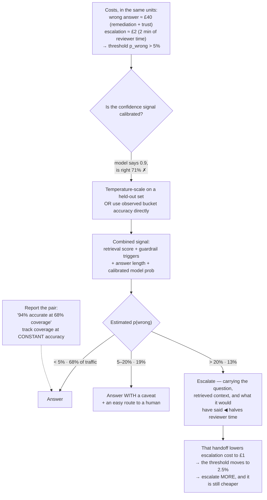

## The model

An **escalation threshold** is the line at which the system stops answering and hands to a human.
Below the line it acts; above it, it defers.

The temptation is to set it from a confidence score — "escalate below 0.7" — which is a number
with no units attached to anything. The threshold is properly derived from a comparison in
currency: what a wrong answer costs, against what an escalation costs. Only that comparison tells
you where the line belongs, and it is a product decision expressed as arithmetic.

## When to use it

Your system can decline to answer, and you are deciding when it should.

1. **What does a wrong answer cost?** A bad summary wastes a minute; a bad refund decision costs
   money; a bad medical suggestion is unbounded. That number sets how cautious to be.
2. **What does an escalation cost?** Reviewer time, user waiting, and the fraction of your
   [[review queue]] capacity it consumes. Escalation is not free and treating it as free produces
   a system that escalates everything.
3. **Is the confidence signal calibrated?** A model saying 0.9 should be right about 90% of the
   time. If it is not, thresholds on it mean nothing.

## Speedrun

**What** — a rule mapping a confidence signal to act, ask, or defer. The signal needs
calibration; the threshold needs a cost comparison.

**How to set one**

1. **Write both costs in the same units.** "A wrong answer costs £40 in remediation; an
   escalation costs £2 of reviewer time." Now the threshold is derivable rather than chosen.
2. **Check [[confidence calibration]] before trusting any score.** Bucket predictions by
   confidence and measure accuracy per bucket. If the 0.9 bucket is right 70% of the time, the
   score is not a probability.
3. **Combine signals rather than using one.** Model probability, retrieval score, guardrail
   triggers and answer length together beat any single number.
4. **Set the threshold where expected costs cross**, then adjust for the asymmetry your product
   actually has.
5. **Report [[coverage]] alongside accuracy.** "94% accurate on the 60% we answer" is a complete
   claim; "94% accurate" alone hides that you declined four questions in ten.
6. **Make abstention a real answer.** "I don't know, here's a human" is a good outcome and needs
   to be built, not treated as a failure path.

**Why it works** — the threshold trades two error types against each other, exactly like
[[precision]] and [[recall]]. Lowering it answers more and gets more wrong; raising it is safer
and escalates more. There is no setting that improves both, and the right point depends on the
relative costs.

**The number that makes it concrete** — if a wrong answer costs 20× an escalation, you should
escalate whenever the chance of being wrong exceeds about 5%. That is the whole derivation, and
it is more useful than any default.

## Going deeper

### Calibration, before thresholds mean anything

**Confidence calibration** is whether a stated confidence matches observed accuracy. A calibrated
system saying 0.8 is right 80% of the time.

Models are frequently poorly calibrated, and usually overconfident — a language model asserting
something at high confidence is often wrong at a rate the number does not suggest. Setting a
threshold on an uncalibrated score is setting it on a number that does not mean what it says.

Measuring it is straightforward. Bucket predictions by confidence, and for each bucket compare
stated confidence to measured accuracy. Plotting the two gives a reliability diagram, and the gap
from the diagonal is your miscalibration.

Fixing it is also tractable. Temperature scaling and isotonic regression both map raw scores onto
calibrated ones using a held-out set, and both are cheap. The important part is doing it at all —
an uncalibrated threshold is tuning a dial whose markings are wrong.

The practical alternative when calibration is hard: skip the score and use the *observed* accuracy
of a bucket directly. "Requests where retrieval score is below 0.6 and the answer exceeds 200
words are wrong 30% of the time" is an empirical statement you can threshold on without any
calibration theory.

### Deriving the threshold from costs

The arithmetic is simple and almost nobody does it, which is why thresholds are usually set by
feel and then argued about.

Let `p` be the probability the answer is wrong, `C_wrong` the cost of being wrong, and
`C_escalate` the cost of escalating. Answering has expected cost `p × C_wrong`; escalating costs
`C_escalate`. So escalate when:

$$
p \times C_{\text{wrong}} > C_{\text{escalate}}
\quad\Longrightarrow\quad
p > \frac{C_{\text{escalate}}}{C_{\text{wrong}}}
$$

With a wrong answer at £40 and an escalation at £2, the threshold is 5% — escalate whenever the
chance of error exceeds one in twenty. With a wrong answer at £4 and escalation at £2, it is 50%,
and the system should answer far more.

Two adjustments matter in practice. **Not all errors cost the same**, so the comparison is
per-category rather than global — a wrong refund amount and a wrong opening-hours answer are not
the same £40. And **reputational and unbounded costs** break the arithmetic: some errors cannot be
priced, and those categories get a hard rule rather than a threshold.

The value of doing this explicitly is not precision. It is that the conversation moves from "0.7
feels about right" to "we think a wrong answer costs about twenty times an escalation", which is a
claim someone can disagree with usefully.

### Coverage, and reporting honestly

**Coverage** is the fraction of requests the system answers rather than defers. It is the other
half of every accuracy number, and omitting it makes the accuracy meaningless.

A system that answers 30% of questions at 99% accuracy and one that answers 95% at 88% may both
be right choices, and they are completely different products. Quoting only accuracy hides which
one you built.

The pair moves together on a curve: raising the threshold raises accuracy and lowers coverage.
That is the same tradeoff as [[precision]] against [[recall]], and it should be reported the same
way — as a pair, or as accuracy at a fixed coverage.

The metric worth watching over time is coverage at *constant* accuracy. As the system improves,
you should be able to answer more questions at the same quality bar, and that number rising is a
cleaner measure of progress than accuracy alone — which can be improved trivially by escalating
more.

### Abstention as a designed outcome

A system that declines well is better than one that answers everything, and building the decline
path properly is often skipped.

**Abstention** should be a first-class answer with its own quality bar. "I'm not confident about
this — here's what I found, and here's how to reach someone" is far better than a refusal, and
much better than a confident guess. It preserves the user's time and the system's credibility.

Passing context along matters. An escalation that hands the human a blank slate wastes the work
already done; one that includes the question, what was retrieved, what the system was unsure
about, and what it would have said saves the reviewer most of their time — which changes the
escalation *cost* in the arithmetic above.

Two failure modes to design against. **Over-escalation** floods the queue and trains users to
skip the system entirely, and it usually comes from an uncalibrated threshold set cautiously.
**Under-escalation** produces confident wrong answers, and it is worse because it is invisible —
nobody reports a plausible wrong answer as an escalation failure.

Setting the initial threshold is close to a [[Type 1 decision]] in one respect: it establishes
user expectations, and a system that starts cautious and later becomes chattier is easier to
accept than one that goes the other way. Starting conservative and loosening on evidence is the
sequence that preserves trust.

## See it work

A support assistant deciding when to hand off.

The costs come first and in currency, which is what turns the threshold from a preference into a
derivation. Forty pounds against two gives 5%, and anyone who disagrees can argue about the £40
rather than about whether 0.7 feels right.

The calibration check is what makes the signal usable. A model claiming 0.9 and being right 71%
of the time would put the threshold in entirely the wrong place, and the fix is either scaling the
score or abandoning it for observed bucket accuracy — both cheap, and skipping both makes
everything downstream arbitrary.

The middle band is worth having. Between 5% and 20% the system answers *with a caveat* and an
easy route to a human, which is neither a confident answer nor a full escalation — and it covers
a fifth of traffic that a binary threshold would push into the queue.

The feedback at the bottom is the part that surprises people. Passing context with the escalation
halves the reviewer's time, which halves the escalation cost, which *moves the threshold down* —
so improving the handoff means you should escalate more, not less, and the system gets both safer
and cheaper at once.

The reporting line is the discipline. "94% accurate" is not a claim; "94% accurate at 68%
coverage" is, and tracking coverage at constant accuracy is what shows genuine improvement rather
than a threshold quietly being raised.

## Next

Annotation quality covers making the labels this queue produces trustworthy, and active learning
covers choosing which items to send for labelling in the first place.
