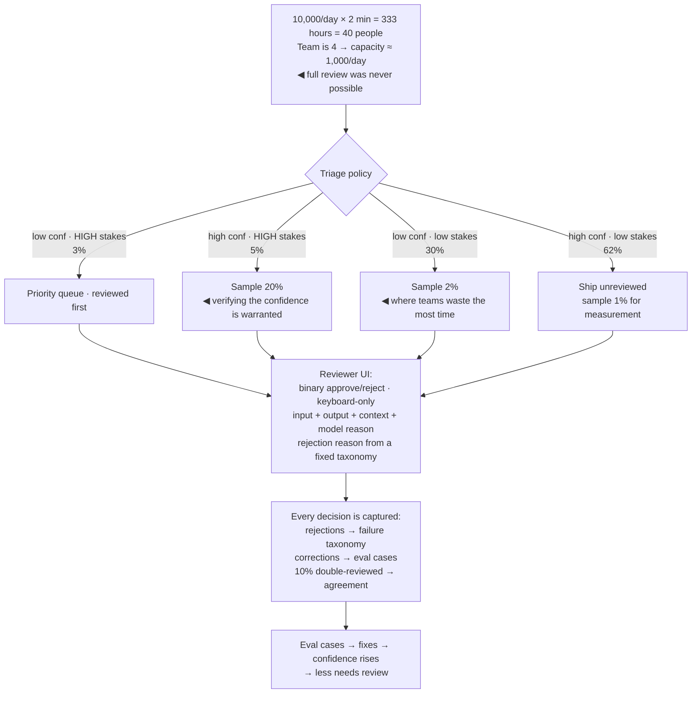

## The model

A **review queue** puts a human between a model's output and its effect. Someone reads, approves,
edits or rejects.

The design mistake is treating it as a pipe — everything goes in, humans work through it. Human
attention is the most expensive and least scalable resource in the system, so the queue's real
job is *selection*: deciding which small fraction of outputs deserves a person, and making that
person's decision fast when it arrives.

## When to use it

You are putting humans in the path of model output.

1. **Is this review or sampling?** Reviewing everything before it ships is a gate and bounds your
   throughput to human capacity. Sampling after the fact is measurement and does not.
2. **What is the reviewer deciding?** A binary approve/reject is seconds. "Fix this if it's
   wrong" is minutes, and the difference is an order of magnitude in cost.
3. **What is the arrival rate against reviewer capacity?** [[Little's Law]] settles whether a
   full-review design is possible at all, and it usually settles it before anyone builds
   anything.

## Speedrun

**What** — a prioritised queue, a decision interface, and a policy deciding what enters. The
policy is the design.

**How to build one**

1. **Do the arithmetic first.** Arrival rate × review time = reviewers needed. 10,000 items a day
   at 2 minutes each is 333 hours — 40 people. Establish that before designing anything else.
2. **Route by confidence and consequence**, not by arrival order. High-confidence low-stakes
   outputs ship unreviewed; low-confidence high-stakes ones are reviewed first.
3. **Make the decision binary where possible.** Approve/reject is seconds; "edit until correct"
   is minutes and does not scale.
4. **Show the reviewer what they need and nothing else** — the output, the input, the retrieved
   context, and the model's stated reason. Every extra element costs seconds on every item.
5. **Bound the queue.** An unbounded queue that grows faster than it drains is a backlog with a
   pretence of review, and stale items are worse than unreviewed ones.
6. **Feed decisions back** into the [[golden set]], so review produces training and eval data
   rather than only approvals.

**Why it works** — the value of review is concentrated in a small fraction of items. Most outputs
are obviously fine and reviewing them costs the same as reviewing the hard ones, so the entire
gain comes from spending attention where the outcome is genuinely uncertain.

**The number that decides the architecture** — items per day times minutes per item. If it
exceeds your headcount, full review is not a design you can build, and the conversation becomes
what to sample.

## Going deeper

### The arithmetic, done before the design

[[Little's Law]] applies directly and settles most of this. Items in the system equals arrival
rate times time in the system, so a queue that arrives faster than it drains grows without
bound — there is no staffing level that catches up later.

Work an example. Ten thousand outputs a day, two minutes each, is 333 reviewer-hours: about 40
full-time people, before breaks, meetings or holidays. If the team is four, full review is
impossible and every design that assumes it is fiction.

That arithmetic reframes the question from "how do we review everything" to "what 2.5% can these
four people review, and how do we choose it". Which is a much better question, and it is the one
the rest of this page answers.

The second number is the peak. Review arrival is rarely uniform — batch jobs, business hours,
campaign spikes — and a team sized for the mean is permanently behind after any burst. Either
size for the peak, or make the queue bounded so the overflow is visible rather than silent.

### Routing by confidence and consequence

Reviewing in arrival order treats every item as equally worth attention, which is never true.

Two dimensions decide routing. **Confidence** — how sure the system is, from model probability,
retrieval score, guardrail triggers or a [[LLM-as-judge|judge]]. And **consequence** — what
happens if this is wrong, which is a product property rather than a model one.

The four quadrants give four different policies:

- **High confidence, low consequence** — ship unreviewed.
- **Low confidence, high consequence** — front of the queue.
- **High confidence, high consequence** — sample, to verify the confidence is warranted.
- **Low confidence, low consequence** — usually the largest bucket, and the one to sample thinly.

That last quadrant is where teams waste most reviewer time, because low confidence *feels* like
it demands attention. It does not, when nothing turns on the answer.

Getting confidence right matters more than the routing logic. A raw model probability is often
poorly calibrated; retrieval score, guardrail triggers and judge scores combined usually beat it.
And the routing itself should be evaluated — sample some items the policy would have skipped, and
check how often they should not have been.

### The reviewer's experience, which is a throughput multiplier

**Reviewer throughput** is set by the interface as much as by the task, and a few seconds per
item compounds enormously at volume.

Binary decisions beat open editing by an order of magnitude. If the reviewer's job is "approve or
reject", each item is seconds; if it is "make this correct", each is minutes and the arithmetic
above gets ten times worse. Where editing is genuinely needed, offer a small set of common
corrections as buttons rather than a free-text box.

Show exactly what is needed to decide, positioned consistently. The input, the output, the
retrieved context, the model's reason, and whatever the specific decision turns on. Every
additional element is a saccade on every item.

Keyboard-first interaction matters more than it sounds. A reviewer processing a thousand items a
day who never touches the mouse is measurably faster than one who does, and it is a small amount
of engineering.

**Reviewer fatigue** is the constraint nobody plans for. Agreement and accuracy fall measurably
after roughly two hours of continuous review, so quality degrades in a way that looks like the
model getting worse. The defences are rotation, capped session lengths, and — importantly —
measuring accuracy *by hour into shift*, because if you do not measure it you will attribute the
decline to something else.

### Review as a data source

A queue that only approves and rejects is spending human judgement and keeping none of it.

Every decision is a label. A rejection with a reason is an [[error analysis]] data point; a
correction is a training example; an approval is a positive case. Capturing them turns the review
queue into the highest-quality labelled data stream the system has, produced by people who are
already looking.

Two things make that capture worth having. Reasons must be structured rather than free text —
a small taxonomy of rejection categories, chosen with a click, aggregates into a
[[failure taxonomy]] automatically. And a fraction of items should be reviewed by two people, so
[[inter-rater agreement]] is measurable and the labels have a known quality.

The loop that closes is worth naming. Review catches failures; failures become eval cases; eval
cases catch regressions; the system improves; confidence rises; less needs review. A queue
designed only to approve never starts that loop and stays the same size forever.

## See it work

A content assistant producing 10,000 outputs a day with four reviewers.

The arithmetic comes first and changes everything downstream. Forty people are needed for full
review and four exist, so the only honest design is one that selects — and knowing that before
building prevents a queue that is really a backlog.

Routing by both confidence and consequence is what makes 1,000 reviews cover the risk. The 3%
that are low-confidence and high-stakes get every item reviewed; the 62% that are confident and
harmless ship with a 1% sample for measurement rather than control.

The largest bucket is the one to notice. Thirty percent are low-confidence and low-stakes, and
the instinct is to review them because the model is unsure. Nothing turns on them, so they get a
2% sample — and that single decision is what frees the capacity for the 3% that matter.

The interface choices are throughput multipliers rather than polish. Binary decisions and
keyboard-only interaction are the difference between two minutes and twenty seconds per item,
which is the difference between reviewing 1,000 a day and 250.

Capturing decisions is what makes the queue an asset rather than a cost. Structured rejection
reasons aggregate into a failure taxonomy without anyone writing one; corrections become eval
cases; and 10% double-review gives the labels a measured agreement rate rather than an assumed
one.

## Next

Escalation thresholds decide the confidence boundary this routing depends on, and annotation
quality covers making the labels this queue produces trustworthy.
