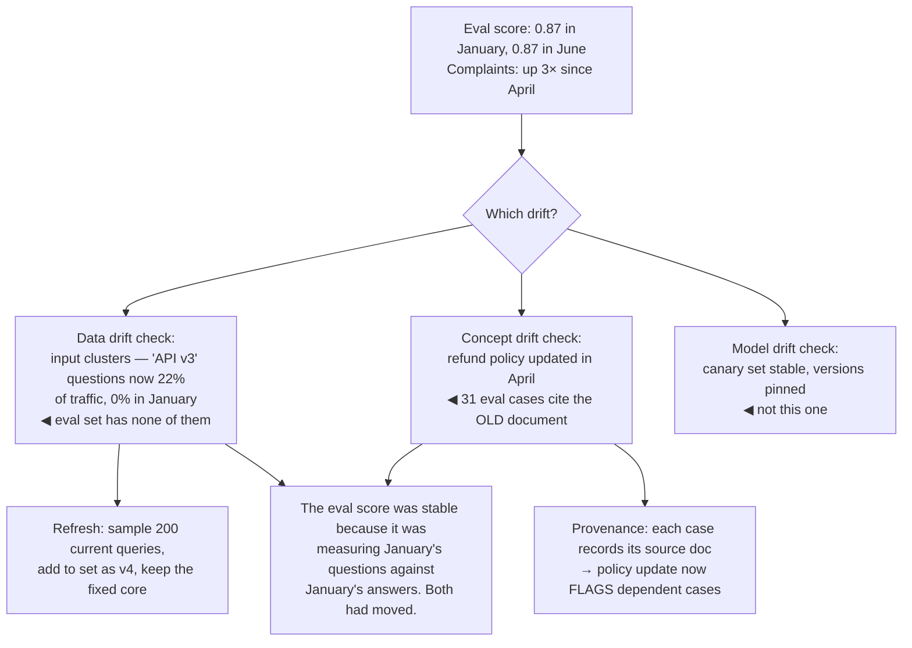

## The model

**Drift** is quality degrading without a deploy. Nothing in your repository changed, no alert
fired, and the system is worse than it was in March.

It has three distinct causes worth separating, because they have different fixes. **Data
drift** is the inputs changing; **concept drift** is the inputs staying the same while the right
answer changes; **model drift** is the provider updating the model underneath you.

All three produce **silent degradation**, which is what makes drift dangerous rather than
merely annoying.

## When to use it

You have a system in production that has been running for a while.

1. **When did you last check the eval against production?** If the answer is "at launch", your
   [[golden set]] is a snapshot of a distribution that has been moving ever since.
2. **Do you control the model version?** A floating model alias means your system can change
   without any action by you, and without any signal.
3. **Do your outputs become your inputs?** Any system trained or tuned on data it generated is
   drifting toward its own past beliefs, which is the hardest case to detect.

## Speedrun

**What** — three causes, three detections, three fixes:

| | What changed | Detected by | Fixed by |
|---|---|---|---|
| **Data drift** | the inputs | input distribution monitoring | refresh the eval set, retrain |
| **Concept drift** | the correct answer | outcome metrics falling with stable inputs | relabel, retrain |
| **Model drift** | the provider's model | a pinned **canary set** re-run on a schedule | pin versions, re-evaluate before upgrading |

**How to defend against it**

1. **Pin every version explicitly** — model, embedding model, prompt, index. A floating alias is
   an unannounced dependency change.
2. **Keep a canary set**: a small fixed set of inputs with known-good outputs, re-run daily.
   Changes here mean something moved that you did not move.
3. **Monitor the input distribution**, not just the outputs. New question types are the earliest
   signal that the eval set is going stale.
4. **Refresh the golden set from current traffic** on a schedule, and version each refresh so
   old scores stay interpretable.
5. **Re-evaluate before accepting any provider upgrade**, treating it as a model change rather
   than a patch — because it is one.
6. **Watch outcome metrics separately from proxy metrics.** Concept drift moves outcomes while
   leaving proxies unchanged, which is what makes it the hardest to see.

**Why it matters** — every other failure mode announces itself. Drift is defined by the absence
of a signal: no deploy, no error, no alert, and a system that is quietly worse than the one you
tested.

**The cheapest defence** — a canary set of fifty fixed inputs, re-run nightly, diffed against
yesterday. It costs almost nothing and catches provider changes, index corruption and prompt
regressions on the day they happen.

## Going deeper

### Data drift: the inputs moved

The distribution of what users send changes continuously. A product launches a new feature and
questions about it appear; a competitor's outage sends a different population your way; seasonal
patterns shift the mix.

Your [[golden set]] was sampled from a distribution that no longer exists, so its score becomes
decreasingly informative — high and stable while production quality falls, because the set tests
what people used to ask.

Detection is straightforward if you look: monitor the input distribution. Cluster incoming
queries and watch the cluster sizes; track the fraction of queries whose top retrieval score is
below a threshold, which rises when questions have no good answer in the corpus; track new
vocabulary.

The fix is a scheduled refresh, and the discipline is versioning it. Sample fresh cases from
current traffic quarterly, add them to the set, keep a fixed core so long-term comparisons remain
possible, and label each version with its sampling date and frame.

### Concept drift: the right answer moved

Harder, and less discussed. The inputs look the same, but what counts as a correct answer has
changed.

A refund policy is updated, so every previously-correct answer about refunds is now wrong. A
product is renamed. A regulation changes. The questions are word-for-word identical to last
month's, and the labels in your eval set are now false.

Nothing about the input distribution reveals this. Input monitoring shows a stable population;
retrieval scores look normal, because the model is confidently retrieving the old policy. The
only signals are downstream: outcome metrics falling, escalations rising, complaints.

The structural defence is to tie the eval set to the source of truth. If a case's answer came
from a document, record which document and which version, so a policy update flags every case
that depended on it. That turns concept drift from an invisible decay into a change notification
— and it is worth building early, because retrofitting provenance across an existing set is
tedious.

### Model drift: your dependency changed

Hosted models are updated by their providers, sometimes without a version change and usually
without notice. An endpoint that returned one behaviour in March returns a slightly different one
in June.

The effects are rarely catastrophic and frequently annoying: output formatting shifts, refusal
behaviour changes, a prompt that reliably produced JSON starts producing JSON in a code fence.
Embedding models are worse, because a change invalidates every stored vector and retrieval
quality falls with no error anywhere — [[embedding drift]] in its most expensive form.

The defence is pinning. Use explicit version identifiers rather than floating aliases, and treat
a version upgrade as a change requiring evaluation. That converts an unannounced dependency
change into a deliberate one you can schedule.

The **canary set** is what catches it when pinning is not available. Fifty fixed inputs, run
nightly, outputs diffed against the previous run. Semantic differences are noise; systematic ones
— everything got shorter, refusals appeared, formatting changed — mean the model moved. Cheap,
and it is the only detection that works when a provider changes something silently.

### The feedback loop, and drift you cause

The hardest case is a system drifting because of its own outputs.

A [[feedback loop|recommendation system]] trains on interactions with what it recommended, so
the data narrows toward its past beliefs. A support assistant whose answers become knowledge-base
articles is training on itself. An eval set updated with cases the current system handles is
drifting toward measuring what already works.

None of this shows in input monitoring, because the inputs are genuinely what users sent. The
distribution moved because the system moved it.

This is [[Goodhart's Law]] operating over months rather than sprints, and the mitigations are the
razor's: hold out a set nobody optimises against and never update it from current behaviour; keep
a randomised exploration slice whose data is not self-confirming; and sample human review from
the *whole* input distribution rather than from cases the system scored well on.

The tell that you are inside one: the metrics improve steadily and nobody can point at a change
that caused it.

## See it work

An assistant six months after launch. Eval score unchanged; complaints rising.

The eval score being unchanged is the whole problem rather than reassurance. A stable number
against a stale set is not evidence of stable quality — it is evidence that the set stopped
being connected to production.

The data drift is visible immediately once anyone looks at input clusters. A fifth of traffic is
about a feature that did not exist when the set was sampled, and the set contains zero cases for
it, so those failures are entirely outside what the score measures.

The concept drift is the one that needed provenance to find. The refund questions are identical
to January's, retrieval is confidently returning the refunds document, and thirty-one eval cases
assert answers that were correct until April. Nothing about the inputs signals this — only
tracing cases back to their source documents does.

Model drift is ruled out cheaply because versions were pinned and the canary set is stable.
That check costs almost nothing and is worth running first, since it eliminates the cause you
cannot control.

The fix for concept drift is the durable one. Recording which document each eval case depends on
means the next policy update automatically flags every case that rests on it — turning an
invisible decay into a notification, and paying for itself the first time a policy changes.

## Next

Guardrails cover the failures you can prevent at request time rather than detect afterwards.
