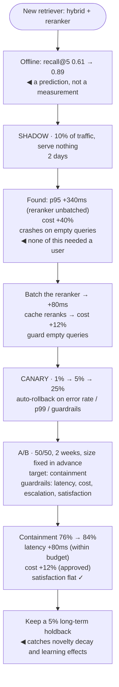

## The model

An offline score is a prediction. Real traffic is the measurement, and there are four distinct
ways to get it — each answering a different question at a different cost.

**Shadow** asks "does it work at all in production", **canary** asks "is it safe to roll out",
**A/B** asks "is it better", and **interleaving** asks "which ranking is better" far faster than
A/B for that specific case.

Reaching for A/B when you wanted shadow costs two weeks and exposes users to a bug you could
have caught for free.

## When to use it

You have a change and want evidence.

1. **Are you testing correctness or quality?** Correctness — does it run, is it fast, does it
   crash — is shadow. Quality is A/B.
2. **Is the output a ranked list?** If yes, interleaving needs far less traffic than A/B, because
   each user compares both systems rather than seeing one.
3. **What is the blast radius if it is bad?** Canary bounds it to a small fraction while
   collecting the same signal, which is why it comes before a full rollout regardless of what
   the A/B said.

## Speedrun

**What** — four techniques, in the order you would usually apply them:

| | Users see | Answers | Traffic needed | Risk |
|---|---|---|---|---|
| **Shadow** | nothing new | does it run correctly, fast, cheap | any | none |
| **Canary** | new, small % | is it safe at scale | small | bounded |
| **A/B** | one variant each | is it better | large | half your users |
| **Interleaving** | both, blended | which ranking is better | ~10× less than A/B | all users, mildly |

**How to run one**

1. **Shadow first.** Run the candidate on real traffic, serve nothing, log everything. This
   catches latency regressions, cost surprises and crashes before any user is affected.
2. **Canary next.** Route 1–5% of traffic, watch [[guardrail metric|guardrails]], and be ready
   to roll back in minutes rather than hours.
3. **Fix the sample size before launching**, and do not stop early on a good result — that is
   **peeking**, and it inflates false positives badly.
4. **Assign by a stable hash of the user id**, so a user sees one variant consistently across
   sessions and devices.
5. **Define guardrails in advance**: latency, cost, error rate, escalation, unsubscribes. A win
   on the target metric that moves a guardrail is not a win.
6. **Run long enough for the [[novelty effect]] to decay** — usually two weeks minimum, longer
   for anything users must learn.

**Why it works** — each technique isolates a different question, so you spend expensive traffic
only on the question that needs it. Shadow costs nothing and answers the cheap questions;
A/B costs weeks and answers the one that matters.

**The mistake that costs the most** — running an A/B to discover that the candidate is 400 ms
slower. Shadow would have told you in an hour, with no user affected and no experiment slot
consumed.

## Going deeper

### Shadow, which is underused

**Shadow deployment** runs the candidate alongside production on real requests, logs its output,
and serves the incumbent's. Users are unaffected; you get production inputs at production volume.

What it answers is everything except quality, and that turns out to be most of what goes wrong:
latency at real concurrency, cost per request on real inputs, crashes on inputs nobody thought
of, feature skew between training and serving, and output distribution shifts.

It is also the only way to test on the true input distribution before committing. Offline sets
are samples; shadow is the population.

The cost is running both systems, which for a model-backed feature is a real bill — you are
paying for inference nobody consumes. That is usually cheap against the alternative of finding
the same problems in an experiment, and it can be sampled: shadow 10% of traffic rather than all
of it.

The one thing shadow cannot do is measure quality, because nobody saw the output. Comparing
shadow outputs to production outputs with a [[LLM-as-judge|judge]] is a reasonable proxy and it
is still offline evaluation on better data.

### Canary, and bounding the damage

A **canary release** routes a small fraction of real traffic to the new version and watches. It
is not primarily an experiment — it is a risk control.

The distinction matters. A canary at 1% cannot detect a 2% quality improvement; it does not have
the traffic and that is not its job. What it detects is the thing that breaks obviously: error
rates, latency, cost, a guardrail firing constantly.

The discipline that makes canaries work is automatic rollback with pre-agreed thresholds. A
canary that requires a human to notice is a canary that runs all weekend. Error rate above X,
p99 above Y, guardrail trigger rate above Z — defined before launch, enforced by the deploy
system.

Progressive rollout is the generalisation: 1%, 5%, 25%, 100%, with a soak period at each step
and automatic rollback throughout. It is the standard shape and it composes with A/B rather than
replacing it — canary answers "safe", A/B answers "better".

### A/B, and the ways it goes wrong

The [[experiment assignment|assignment]] and sizing mechanics are on the eval platform page. The
failures specific to model-backed features are worth adding.

**Novelty effect.** Users engage with anything different, so a one-week test measures novelty as
much as quality. Model features are particularly prone to it — people try a new assistant because
it is new. Two weeks minimum, and holding back a long-term control group is what distinguishes a
real improvement from a temporary one.

**Peeking.** Checking daily and stopping when significance appears dramatically inflates false
positives, because you have taken many looks and reported the best one. Fix the horizon in
advance, or use a sequential test designed for early stopping.

**Latency confounds quality.** If the candidate is 300 ms slower, you are measuring quality *and*
latency together, and a quality win can be masked by a latency loss or vice versa. Shadow first
so latency is known and controlled.

**Cost is a guardrail, not a footnote.** A model change that improves satisfaction 2% and doubles
inference cost is a business decision, and the experiment should surface both numbers with equal
prominence.

**Learning effects run both ways.** Users adapt their phrasing to whatever system they have, so a
change that would be better after a month can lose in week one. Long-running holdbacks are the
only honest measurement of that.

### Interleaving, for ranked results

When the output is a ranked list — search, retrieval, recommendations — **interleaving** is
dramatically more efficient than A/B and is underused outside search teams.

Rather than showing one user system A and another system B, it blends both rankings into one
list and attributes each click to whichever system contributed that result. Every user is a
paired comparison, which removes between-user variance — the dominant noise source in A/B tests.

The efficiency gain is roughly an order of magnitude: an interleaving experiment reaching
significance in days can take weeks as an A/B. For teams iterating on retrieval or ranking, that
is the difference between a change a week and a change a month.

The limits are real. It only works for ranked output, so it cannot evaluate a change to
generated text. It measures relative preference rather than absolute effect, so it will tell you
B beats A without telling you engagement rose 3%. And the blending has to be fair — team-draft
interleaving is the standard method precisely because naive blending biases toward one side.

The practical pattern is interleaving to iterate quickly and A/B to confirm the winner and
measure the business effect.

## See it work

Shipping a retrieval change to an assistant.

The offline number is a prediction and is treated as one. A 28-point recall improvement is strong
evidence the change is worth testing, and no evidence at all that it works in production.

Shadow found three problems in two days at the cost of some inference, and none of them required
a user. An unbatched reranker adding 340 ms would have shown up in an A/B as a confounded quality
result — measuring the change *and* a latency regression together, which is uninterpretable.

The fixes happen before any user sees anything, which is the entire argument for shadow going
first. By the time the canary runs, the candidate is known to be fast enough, affordable and
crash-free, so the canary is only testing safety at scale.

The A/B then measures the one thing nothing else could: whether it is better. Containment rises
eight points, and the guardrails are reported alongside — latency within budget, cost up 12% and
explicitly approved, satisfaction flat. A containment win with satisfaction falling would have
been a different conversation entirely.

The long-term holdback is the part usually skipped. Five percent of users kept on the old system
indefinitely is what reveals whether the eight points hold up after novelty decays, and it is
the only way to measure the effect of a change three months later.

## Next

Feedback loops cover the data these experiments generate, and how it poisons itself if nobody is
careful.
