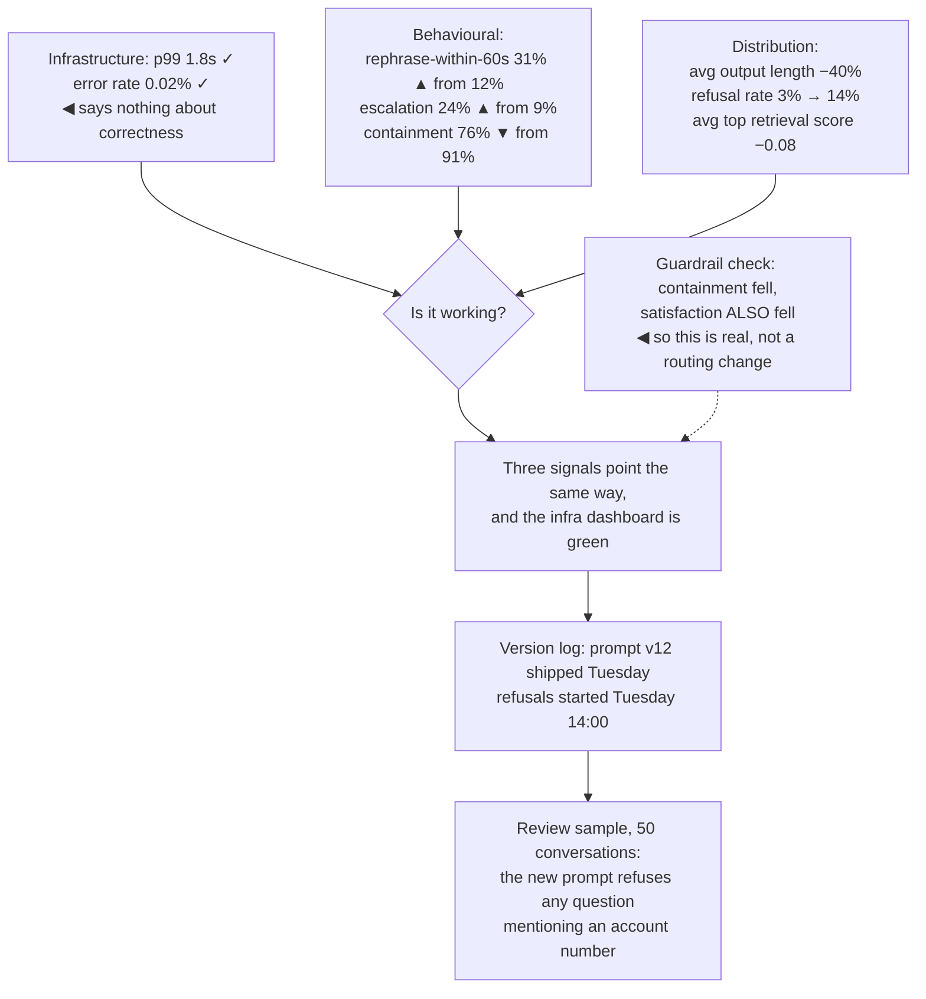

## The model

An [[eval]] tells you how a system performed on a fixed dataset. Production tells you how it
performs on the questions people actually ask, which is a different and moving population.

The difficulty is that production has no labels. Nobody says whether an answer was correct, so
the signals available are **proxy signals** — things correlated with quality that are cheap to
observe. Choosing those proxies well is most of the work, and most of them are behavioural
rather than model-level: what the user did next, not what the model produced.

## When to use it

You are putting a model-backed feature in front of users.

1. **What does a user do when it fails?** Retry, rephrase, escalate, abandon. Each is a
   measurable signal, and knowing which one your product produces is the start of monitoring it.
2. **Is there an outcome you can observe?** A resolved ticket, a completed purchase, a merged
   suggestion. Outcomes beat proxies and are usually delayed, so you need both.
3. **What would a silent failure look like?** The system that returns confident wrong answers
   at normal latency with normal error rates is invisible to conventional monitoring, and that
   is the failure this page exists for.

## Speedrun

**What** — four layers, and only the last is about quality:

| Layer | Examples | Tells you |
|---|---|---|
| Infrastructure | latency, error rate, throughput | is it up |
| Cost | tokens per request, spend per day | is it affordable |
| Behavioural | retries, rephrasing, escalation, abandonment | is it working |
| Outcome | resolution, conversion, task completion | did it help |

**How to instrument it**

1. **Log the whole interaction**, not just the output. Input, retrieved context, prompt version,
   model version, output, latency, cost. Without the context you cannot diagnose anything.
2. **Instrument what the user does next.** Rephrasing within thirty seconds, asking the same
   thing again, clicking through to a human — these are your labels, arriving for free.
3. **Track [[containment rate]] and [[escalation rate]]** as the headline behavioural pair for
   assistant-style products.
4. **Sample for human review continuously**, a fixed number per day regardless of what the
   metrics say. This is the only signal that catches a failure your proxies do not cover.
5. **Alert on distribution shifts, not just thresholds.** A sudden change in output length,
   refusal rate or retrieval score distribution is a regression signal before anyone complains.
6. **Pin and log versions of everything** — model, prompt, index, retriever — so a regression is
   attributable rather than mysterious.

**Why it works** — users reveal quality through behaviour. Someone who rephrases the same
question three times is telling you the first two answers were wrong, and that signal costs
nothing to collect and arrives in real time.

**The failure conventional monitoring misses** — confident wrong answers. Latency normal, errors
zero, dashboards green, and the system is wrong. Nothing in infrastructure monitoring can see
it, which is why the behavioural layer is not optional.

## Going deeper

### Proxy signals, and reading behaviour as a label

Production has no ground truth, so you infer it. The inference is imperfect and it is available
in enormous volume, which is the trade.

**Rephrasing** is the strongest single signal for assistants. A user who asks again in different
words within a minute did not get what they needed, and this correlates with human quality
ratings well enough to be useful as a proxy.

**Repeat questions** across sessions mean the answer did not stick or was wrong.

**Escalation** — clicking "talk to a human" — is the clearest negative signal available, and
**containment rate**, the fraction of conversations resolved without escalation, is the headline
metric for support products.

**Abandonment** mid-interaction means something went wrong, though it is noisier since people
get distracted.

**Explicit feedback** — thumbs up and down — is precise and rare. Response rates in the low
single digits are normal, and the users who respond are not representative: they are
disproportionately the delighted and the furious. Useful as a signal, dangerous as a
denominator.

The discipline that makes proxies trustworthy is validating them once against human judgement.
Sample two hundred conversations, have humans rate them, and check that your proxy correlates.
A proxy that turns out not to correlate is worse than no proxy, because it is monitored.

### Distribution shifts, which fire before complaints

Threshold alerts catch the failures you predicted. Distribution alerts catch the ones you did
not, and for model-backed systems they are the more valuable of the two.

The distributions worth watching are cheap to compute and surprisingly diagnostic:

**Output length.** A sudden change usually means a prompt or model change altered behaviour.
Getting longer often means the model started hedging; shorter often means it started refusing.

**Refusal rate.** Models refuse more after safety updates, and a jump means a class of legitimate
requests just stopped being served.

**Retrieval score distribution.** If the average top-result similarity drops, either queries have
changed or the index has. Both matter and neither raises an error.

**Token cost per request.** A quiet climb means context is growing — longer histories, more
retrieved chunks — and it is the earliest signal of a cost problem.

**Input distribution.** Users asking new kinds of things is the reason your [[golden set]] is
becoming unrepresentative, and it is worth knowing before the eval quietly stops predicting
production.

The general principle: **a model-backed system fails by changing its behaviour, not by throwing
errors.** So the monitoring has to watch behaviour rather than exceptions.

### The review sample, which nothing replaces

Every automated signal is a proxy, and every proxy has a blind spot shaped like the thing nobody
thought to measure. The only defence is reading real outputs on a schedule.

A fixed sample — fifty conversations a day, stratified across segments — reviewed by someone who
knows what good looks like. Not when something seems wrong; continuously, so the baseline is
known and the comparison is possible.

This is the same argument as the [[error analysis]] loop, run in production rather than against
a dataset. It is also where new failure categories are discovered, which is what feeds the next
round of eval cases.

The cost is real and small: an hour a day of someone qualified. Teams that skip it discover
failures through customer complaints instead, which is a slower and much more expensive review
process with a worse sample.

### The metric that gets gamed

[[Goodhart's Law]] applies to every proxy here, and containment rate is the clearest example.

Containment measures conversations resolved without a human. Optimise it and containment rises —
by making escalation harder to find, by having the assistant insist rather than hand off, by
burying the "talk to someone" button. The number improves and the product gets worse, and every
dashboard agrees it is going well.

The defence is the pairing the razor recommends. Containment alone is gameable; containment
paired with **post-conversation satisfaction**, **repeat contact within 48 hours**, and
**escalation outcome quality** is much harder to game, because the cheap ways of raising the
first move the others the wrong way.

The general form worth carrying: **for every metric you optimise, name the cheapest way to
improve it dishonestly, then instrument that.** If nobody can name the cheap cheat, the metric
is not yet understood well enough to be a target.

## See it work

A support assistant, one week after launch, dashboards green.

Infrastructure monitoring says the system is healthy, and it is — it is up, fast and
error-free. It is also refusing one question in seven, and nothing in that layer can see it.

The behavioural signals all move together, which is what makes them trustworthy. One metric
moving is noise; rephrasing, escalation and containment moving in the same direction within the
same window is a real regression with three independent witnesses.

The distribution signals point at the cause rather than the symptom. Output length down 40% and
refusal rate up 11 points is a specific behavioural change, not a general degradation — which
narrows the search enormously before anyone reads a single conversation.

Version logging is what turns that into an answer in minutes. Refusals started at a timestamp,
and a prompt version shipped at that timestamp. Without versions logged per request, this is an
afternoon of guessing.

The review sample is what makes it actionable. Fifty conversations read by a human produces
"refuses anything mentioning an account number", which is a bug report. The metrics said
*something* was wrong; only reading the outputs said *what*.

The guardrail check at the bottom is the discipline that prevents a wrong conclusion.
Containment falling could mean the assistant got worse, or it could mean escalation got easier
to find. Satisfaction falling alongside it rules out the benign explanation — which is exactly
why the pair is instrumented rather than the single number.

## Next

Drift covers the slower version of this, where nothing ships and quality falls anyway.
