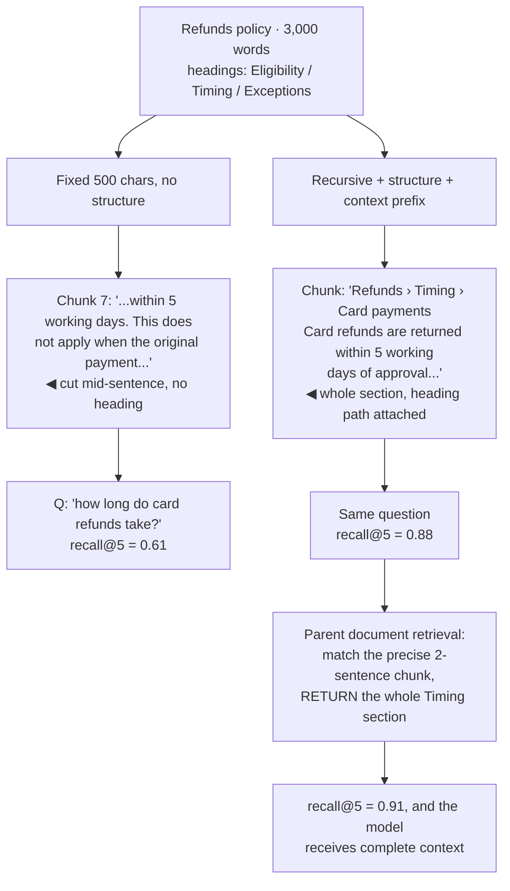

## The model

Documents are too long to embed as a whole — a vector for five thousand words is an average of
everything in it and matches nothing strongly. So documents are split into chunks, and each
chunk gets its own [[embedding]].

The **chunking strategy** decides where the cuts go, and it sets a ceiling nobody can raise
later. A fact split across a boundary may be unretrievable; a chunk covering three topics
matches all of them weakly. No reranker or better model recovers information the chunking
destroyed.

## When to use it

You are indexing a corpus and choosing how to split it.

1. **What is the natural unit of an answer?** If a question is answered by one paragraph, chunk
   at paragraphs. If it needs a whole section, chunking at paragraphs guarantees you retrieve
   fragments.
2. **Does the document have structure?** Headings, sections and lists are boundaries the author
   already decided. Ignoring them to split every 500 characters throws away free information.
3. **How self-contained is the prose?** Text full of "this approach" and "as described above"
   does not survive being cut, and needs either larger chunks or added context.

## Speedrun

**What** — split each document into passages, embed each one, store the text plus metadata. The
parameters are size, overlap, and where boundaries are allowed.

| Strategy | Boundary at | Fits |
|---|---|---|
| Fixed size | every N tokens | uniform prose, simplest |
| Recursive | paragraph → sentence → token, in order | general default |
| **Semantic chunking** | where the topic shifts | expensive, best quality |
| Document structure | headings and sections | anything with markup |

**How to choose**

1. **Start at 200–500 tokens with 10–20% overlap.** This is the defensible default, and the
   overlap exists so a fact spanning a boundary survives in at least one chunk.
2. **Split on structure first**, falling back to paragraphs, then sentences. Never split
   mid-sentence if you can avoid it.
3. **Attach the document title and section heading** to every chunk's text, so a passage
   retrieved alone still says what it is about.
4. **Embed the chunk, but return more than you embedded.** [[Parent document retrieval]] matches
   on a small precise chunk and hands the model the surrounding section.
5. **Measure with recall at k**, not by reading chunks. The question is whether the right passage
   is retrievable, and only a [[golden set]] answers that.
6. **Treat the choice as near-permanent.** Changing it re-embeds everything.

**Why it works** — retrieval matches a query against one chunk, so a chunk should be about one
thing and contain enough to answer. Those two pull in opposite directions, and every parameter
here is negotiating between them.

**The constraint that makes this a [[Type 1 decision]]** — changing chunking means recomputing
every embedding and rebuilding the index. It is a migration, not a setting, so it deserves
deliberation before launch rather than tuning after.

## Going deeper

### Size, and the two failures at either end

**Too small** and a chunk lacks the context to be understood. A paragraph beginning "This
approach fails when the dataset is imbalanced" is useless when retrieved alone — the antecedent
is in the previous chunk, and the embedding encodes a sentence about an unnamed thing.

**Too large** and the vector averages several topics. A 2,000-token chunk covering setup,
configuration and troubleshooting produces a vector that is somewhat near all three queries and
strongly near none, so it loses to a smaller chunk that is precisely about one.

That averaging effect is the more subtle failure, because larger chunks feel safer. They are
safer for *reading* and worse for *matching*, and retrieval is a matching problem.

The 200–500 token range is where most corpora land, and the right value depends on how
self-contained the prose is. Reference documentation, written in independent sections, tolerates
smaller chunks. Narrative prose with heavy back-reference needs larger ones, or needs the
context-attachment trick below.

**Chunk overlap** — repeating the last 10–20% of one chunk at the start of the next — exists for
exactly one reason: a fact spanning a boundary appears whole in at least one chunk. The cost is
duplicated storage and near-duplicate results, which the [[reranking]] stage usually removes.

### Boundaries, and using the structure you were given

Splitting every 500 characters ignores information the author already encoded. Headings,
sections, list items and paragraph breaks are all statements about where topics begin and end.

**Recursive splitting** is the practical default: try to split on paragraph breaks; if a piece is
still too large, split on sentences; only split mid-sentence as a last resort. Cheap, and it
almost never cuts through the middle of an idea.

**Structure-aware splitting** goes further by using the document's markup. A markdown document
splits at headings, and each chunk inherits its heading path — so a chunk knows it belongs to
`Billing > Refunds > Timing` without anyone writing that down.

**Semantic chunking** computes embeddings for consecutive sentences and cuts where the similarity
drops, placing boundaries where the topic actually shifts. It produces the best boundaries and
costs an embedding pass over every sentence before you have chunked anything, which is often
more expensive than the indexing itself.

The honest recommendation: recursive splitting with structure awareness handles most corpora
well. Reach for semantic chunking when the content genuinely lacks structure and retrieval
quality is the bottleneck you have measured.

### Decoupling what you match from what you return

The tension between small-for-matching and large-for-answering has a clean resolution, and it is
the technique worth taking from this page.

**Parent document retrieval** embeds small chunks — a few sentences, precise, unambiguous — but
returns the larger passage they came from. Matching happens on the small unit where precision is
high; the model receives the full section where context is complete.

The same idea appears as a **contextual chunk**: prepend the document title, the section
heading, and a one-line summary of what the section covers to each chunk's text before embedding.
The chunk now carries its own bearings, so "this approach fails when..." embeds as a sentence
about *that specific approach* rather than about nothing.

A stronger version generates a short context sentence per chunk with a model at indexing time —
"this passage is from the refunds policy and describes timing for card refunds" — and prepends
it. Expensive once, and it measurably improves retrieval on corpora full of back-reference.

The general principle: **the unit you embed and the unit you return do not have to be the same
thing.** Most chunking difficulty comes from assuming they do.

### Measuring it, rather than arguing about it

Chunking parameters are the subject of a great deal of unfounded opinion, and the reason is that
people evaluate them by reading chunks rather than by measuring retrieval.

The measurement is straightforward. Build a [[golden set]] of questions with the passage that
answers each one. For a candidate chunking, index the corpus and check whether the right passage
appears in the top k. **Recall at k** is the number, and it is directly comparable across
strategies.

That turns "500 or 1,000 tokens?" into an experiment costing an afternoon, and the answer is
frequently counterintuitive — corpora differ enough that borrowed defaults are guesses.

Two things to hold constant while testing: the embedding model, and the value of k. Changing
either alongside the chunk size means you learn nothing about which mattered.

And because rechunking means re-embedding, this experiment belongs *before* launch. Running it
afterwards means either living with a worse choice or paying a full corpus migration to fix a
parameter — the [[one-way door]] the model section already flagged.

## See it work

A support corpus where retrieval works for simple questions and fails for procedural ones.

The fixed-size split cuts mid-sentence and produces a chunk that starts with "...within 5 working
days", with nothing saying what is within five working days or which policy it belongs to. The
embedding of that fragment is about almost nothing.

Adding structure awareness and the heading path fixes most of it. The chunk now carries
`Refunds › Timing › Card payments` in its text, so the vector encodes a passage about refund
timing rather than an orphaned clause — and recall at 5 moves from 0.61 to 0.88 with no change of
model.

Parent document retrieval takes the last step by separating the two units. A precise two-sentence
chunk is what gets matched, because it is unambiguous; the whole Timing section is what gets
returned, because the model needs the surrounding conditions to answer correctly.

The number is the point of the diagram. These are not stylistic preferences — they are a 30-point
swing in recall, measured against a golden set, achieved without touching the embedding model or
the reranker.

And all of it had to be decided before indexing. Discovering it afterwards means re-embedding
three thousand documents, which is why chunking earns its place as the decision to deliberate
over rather than tune.

## Next

Vector indexes are how the nearest chunks get found among millions in milliseconds, and hybrid
retrieval covers the queries embeddings cannot answer at all.
