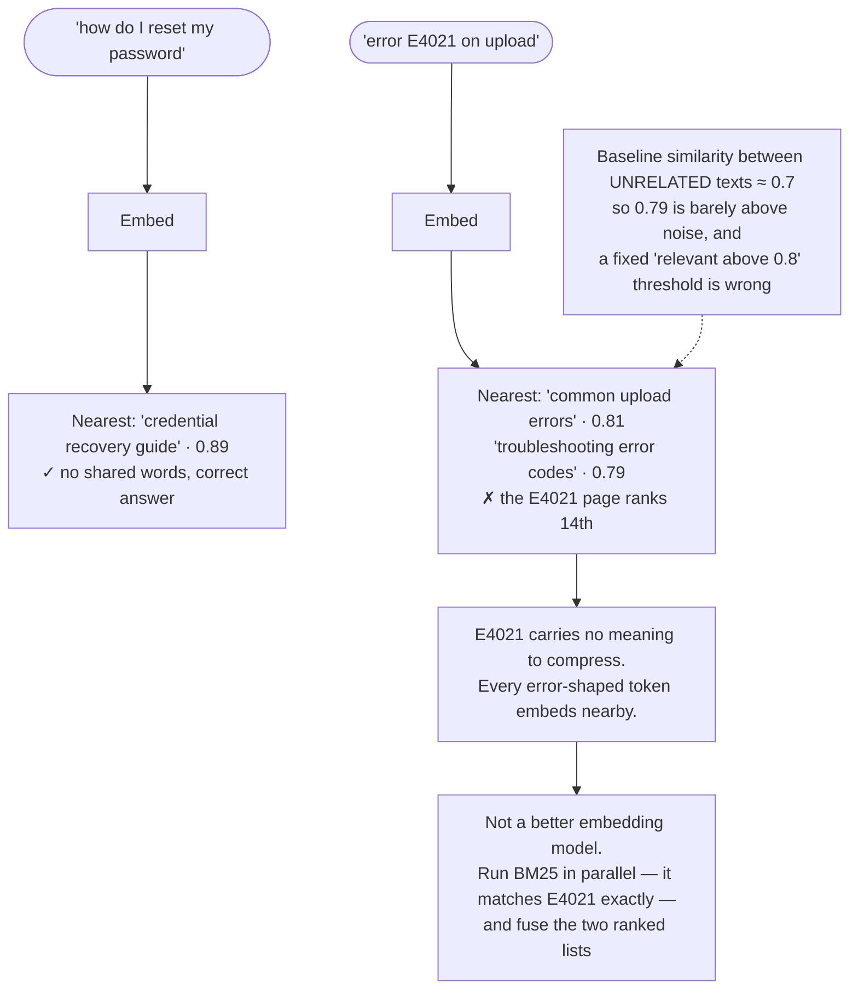

## The model

An **embedding** is a list of numbers representing a piece of text, produced so that texts with
similar meanings get similar numbers.

Think of it geometrically: every text becomes a point in an **embedding space** of several
hundred dimensions, and the model was trained so that points for related things land near each
other.

Once meaning is a position, "find similar text" becomes "find nearby points" — a geometry problem with fast
answers, rather than a language problem with none.

## When to use it

You need to compare texts by meaning rather than by their characters.

1. **Is the match semantic or literal?** "Reset my password" should find "credential recovery",
   which needs embeddings. Finding error code `E4021` needs literal matching, which embeddings
   are actively bad at.
2. **Is the comparison many-to-many?** Embeddings pay off when you compare one query against
   millions of items. Comparing two strings once is cheaper by other means.
3. **Will the corpus change?** Embeddings are computed by a specific model version, and changing
   the model means recomputing every one — a real migration rather than a config change.

## Speedrun

**What** — a model maps text to a vector, typically 384 to 1,536 numbers. Similarity is measured
by the angle between vectors:

$$
\text{cosine similarity}(a, b) = \frac{a \cdot b}{\|a\| \, \|b\|}
$$

Range −1 to 1; in practice for text models, roughly 0 to 1. Higher means more similar.

**How to use them**

1. **Embed the corpus once, offline.** Store the vector alongside the text and its metadata.
2. **Embed the query at request time** with the *same model*. Vectors from different models are
   not comparable — they are coordinates in different spaces.
3. **Compare with cosine similarity**, which measures direction and ignores magnitude. That is
   what you want: a long document and a short one about the same thing should match.
4. **Do not interpret the raw score.** 0.82 is not "82% similar". Scores are only meaningful
   *relative to other scores from the same model*.
5. **Pin the model version.** A provider updating their embedding model silently invalidates
   every stored vector, and nothing will tell you.
6. **Re-embed everything when you change models.** There is no migration path; the old and new
   spaces are unrelated.

**Why it works** — training pushes texts that appear in similar contexts toward similar
positions. Meaning is not stored anywhere in the vector; what is stored is *relative position*,
and that turns out to be enough for "find me things like this".

**The failure that surprises people** — embeddings blur exactly the tokens where you needed
precision. Names, codes, identifiers, numbers. A vector search for `E4021` returns documents
about errors in general, confidently.

## Going deeper

### What the numbers are, and are not

A 768-dimension vector has no interpretable dimensions. Nobody can tell you what dimension 412
means, and it does not correspond to a feature anyone named — it is a coordinate produced by
training, and only the *relationships* between coordinates carry information.

That has a practical consequence worth internalising: **an individual vector is meaningless; only
comparisons are meaningful**. You cannot look at an embedding and learn anything. You can only
ask whether it is near another one.

**Cosine similarity** measures the angle between two vectors and ignores their length. That
choice matters. A three-word query and a five-hundred-word document about the same topic point
in a similar direction but have very different magnitudes, so a distance measure that included
magnitude would call them unrelated. Angle is the right question.

Scores are also **not calibrated**. A cosine of 0.82 means something different for every model,
and comparing scores across models is meaningless. The only sound uses are ranking — this is
nearer than that — and thresholds tuned empirically against your own model and data.

Most text embedding models exhibit **anisotropy**: vectors cluster in a narrow cone rather than
spreading over the sphere, so typical similarities between *unrelated* texts sit around 0.7
rather than 0. That is why a raw threshold like "0.8 means relevant" fails — the baseline is
much higher than intuition suggests, and the useful signal is in the gap above the baseline
rather than the absolute number.

### Dimensionality, and what it costs

**Dimensionality** is the length of the vector, and it trades quality against cost on every
axis at once.

More dimensions represent finer distinctions and cost more memory, more storage and slower
comparison. A million documents at 1,536 dimensions in 32-bit floats is about 6 GB; at 384
dimensions it is 1.5 GB — and that difference decides whether the index fits in RAM, which
decides your latency.

The returns diminish sharply. Going from 384 to 768 helps noticeably on hard tasks; going from
768 to 1,536 often does not, and it doubles every cost. The right move is to measure on your own
retrieval task rather than assume bigger is better, because the answer is task-dependent.

Two techniques worth knowing by name. **Quantisation** stores each number in 8 bits instead of
32, cutting memory fourfold for a small recall loss — usually the best trade available.
**Matryoshka embeddings** are trained so that truncating the vector degrades gracefully, letting
you store 1,536 dimensions and search with the first 256, then rerank the survivors with the
full vector. That is the [[reranking|retrieve-wide-rerank-narrow]] shape again, applied to the
vector itself.

### Where embeddings fail

Being precise about the failures is what makes [[hybrid retrieval]] an obvious design rather
than a hedge.

**Exact tokens.** Product codes, error numbers, people's names, API method names, version
strings. Embeddings compress meaning, and these carry no meaning to compress — the model has
nothing to place them near except other identifier-shaped things.

**Negation.** "Documents about security" and "documents not about security" embed close
together, because they share almost all their content. Vector search cannot reliably represent
a negative.

**Numbers and comparisons.** "Under £50" and "over £50" are near-identical vectors. Anything
requiring arithmetic belongs in a filter, not a similarity search.

**Long text.** A vector for a 5,000-word document is an average of everything in it, which
matches nothing strongly. This is precisely why [[chunking strategy|chunking]] exists — you
embed passages so each vector is about one thing.

**Domain shift.** A general-purpose model has not seen your internal jargon, so your acronyms
land arbitrarily. Fine-tuning helps; noticing that it is the problem helps more.

### Drift, and the migration nobody plans for

**Embedding drift** is the gap opening between your stored vectors and the model that produced
them.

It happens two ways. The provider updates the model — often silently, on a hosted endpoint — so
new queries are embedded in a slightly different space from your stored corpus, and retrieval
quality falls with no error anywhere. And your content changes without being re-embedded, so
vectors describe documents that no longer say that.

The defences are the same discipline as everywhere else in this section. Pin the model version
explicitly rather than using a floating alias. Store which version produced each vector, so a
mismatch is detectable rather than mysterious. And treat a model change as a full corpus
re-embed, run into a new index and swapped by alias — the same pattern as [[inverted index|a
search index rebuild]], for the same reason.

Budget it honestly. Re-embedding ten million chunks is hours of compute and a real bill, and it
is not optional when the model changes. Teams that treat embeddings as a config value discover
this at the worst moment.

## See it work

Why one query fails and the fix is not a better model.

The first query is what embeddings are for. No word is shared between the query and the correct
document, and semantic search finds it anyway — which literal matching could never do.

The second query is the failure that defines the limits. `E4021` is a string with no semantic
content, so the model places it near other error-shaped tokens rather than near the specific page
about it. The retrieval is confidently wrong, and nothing in the score signals it.

The scores are the detail worth reading carefully. A 0.79 looks high until you know that
unrelated texts in this model baseline around 0.7 — the useful signal is the *gap above the
baseline*, not the absolute figure, and any threshold has to be calibrated per model.

The fix is not a better embedding model, and reaching for one is the standard wasted week. The
gap is structural: embeddings compress, identifiers have nothing to compress. Running keyword
search alongside and fusing the results covers exactly this blind spot, which is why
[[hybrid retrieval]] is a default rather than an optimisation.

## Next

Vector indexes are how you find the nearest points among millions fast enough to matter, and
hybrid retrieval is the composition this page just argued for.
