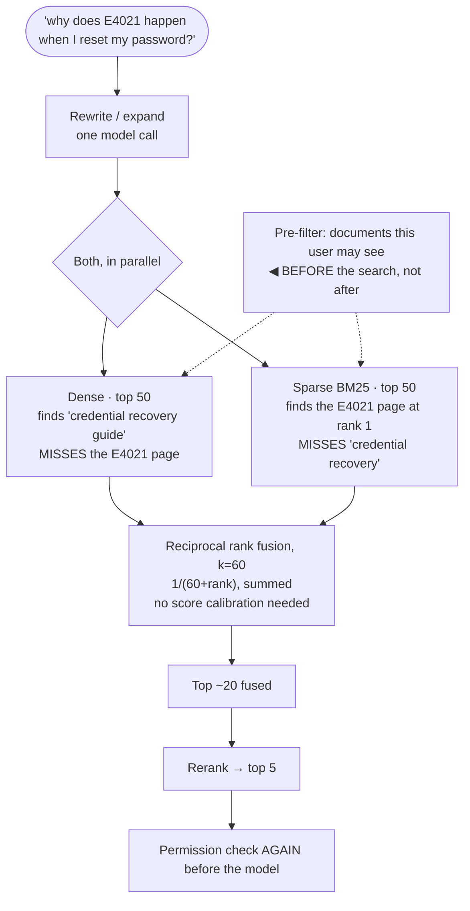

## The model

**Dense retrieval** uses [[embedding|embeddings]] and finds things by meaning. **Sparse
retrieval** uses term matching — [[BM25]] — and finds things by words.

Their blind spots are almost disjoint. Dense misses exact identifiers, negation and numbers.
Sparse misses paraphrase, synonyms and anything not sharing vocabulary. **Hybrid retrieval**
runs both and merges the ranked lists, which is why it beats either alone on almost every real
corpus rather than being a hedge.

## When to use it

You are building retrieval and choosing what to run.

1. **Does the corpus contain identifiers?** Product codes, error numbers, names, versions, API
   symbols. If yes, dense-only retrieval will fail on them and no better embedding model fixes
   it.
2. **Do users paraphrase?** Real questions rarely share vocabulary with documentation, which is
   what dense retrieval is for. Sparse-only fails there.
3. **Are there hard constraints?** "Only documents this user may see", "only the last 90 days".
   Those are **metadata filtering**, not retrieval, and they must be applied as filters rather
   than hoped for from similarity.

## Speedrun

**What** — issue both searches in parallel, then combine the two ranked lists into one.

| | Dense (vectors) | Sparse (BM25) |
|---|---|---|
| Finds | paraphrase, synonyms, intent | exact terms, identifiers, rare words |
| Misses | `E4021`, names, negation, numbers | anything not sharing vocabulary |
| Score scale | cosine, ~0.7 baseline | unbounded, corpus-dependent |
| Cost | ANN index lookup | inverted index lookup |

**How to combine them**

1. **Run both in parallel**, not in series. They are independent lookups and the latency is the
   maximum rather than the sum.
2. **Fuse with [[reciprocal rank fusion]]**, which combines by *rank* rather than by score and
   therefore needs no calibration between two incompatible scales.
3. **Retrieve more from each than you need.** Take the top 50 from each side, fuse, and let
   [[reranking]] cut to the final few.
4. **Apply metadata filters before or during retrieval**, never after. Filtering afterwards
   means your top 50 may contain nothing the user is allowed to see.
5. **Weight the two sides if your corpus demands it**, and tune the weight against a
   [[golden set]] rather than by intuition.
6. **Measure recall at k for each side separately**, so you know which one is carrying the
   result and which is contributing nothing.

**Why it works** — fusion by rank sidesteps the fact that cosine similarity and BM25 scores are
not comparable quantities. A document ranked first by either method gets a high fused score,
without anyone having to decide what a BM25 of 14.2 means relative to a cosine of 0.83.

**The reason it is a default rather than an optimisation** — the failure modes are structural.
Embeddings compress meaning and identifiers carry none; term matching needs shared vocabulary
and users do not share yours. Neither is fixable within its own method.

## Going deeper

### Reciprocal rank fusion, and why not to fuse scores

The obvious approach is to normalise both scores and add them. It does not work well, and the
reason is worth understanding.

BM25 scores are unbounded and depend on corpus statistics, so a "good" score varies by query and
by collection. Cosine similarities sit in a compressed band around a high baseline. Normalising
each to 0–1 makes them comparable in appearance only — the distributions are different shapes,
so the same normalised value means different things on each side.

**Reciprocal rank fusion** discards the scores and uses positions:

$$
\text{RRF}(d) = \sum_{r \in \text{rankers}} \frac{1}{k + \text{rank}_r(d)}
$$

with `k` typically 60. A document ranked 1 by either system contributes `1/61`; ranked 10 it
contributes `1/70`. Appearing high in *both* lists adds up, which is exactly the signal you want.

Two properties make this the standard answer. It needs no calibration, tuning or knowledge of
either scoring scale, so it works on day one. And the `k` constant damps the top of the
distribution, so a single ranker being wildly confident cannot dominate — which is precisely the
failure of score addition.

Weighting is available when one side is genuinely better for your corpus: multiply each ranker's
contribution before summing. Worth doing only after measuring each side separately, because the
common outcome is discovering that one side contributes almost nothing and the fix is
elsewhere.

### Filters, which are not retrieval

Permissions, date ranges, document types and tenant boundaries are **constraints**, not
preferences. A document the user may not see must not appear, no matter how similar it is.

The temptation is to retrieve first and filter afterwards, because it is easier to implement.
It fails in a specific way: if the top 50 results are all documents the user cannot access, you
filter them all out and return nothing — while relevant permitted documents sat at rank 51.

So filters belong **before or during** the search. Most vector databases support pre-filtering,
restricting the search to a subset before the nearest-neighbour walk. That is the correct
behaviour, and it has a cost worth knowing: aggressive pre-filtering degrades the approximate
index's assumptions, sometimes badly, because the graph it walks was built over the whole
corpus.

The alternative is partitioning the index by the filter dimension — separate indexes per tenant,
per language, per year — which sidesteps the problem when the dimension is low-cardinality and
stable. That is [[partitioning]] applied to a vector index, with the same tradeoffs.

For permissions specifically, the safe pattern is to filter at both ends: restrict the search,
and check again on the results before they reach a model. Retrieval bugs should not become
disclosure bugs.

### Query understanding, before either search runs

Both retrievers take a query, and improving the query improves both — which is often cheaper
than improving either retriever.

**Rewriting from conversation history** turns "what about the second one?" into a standalone
question. Without it, multi-turn assistants retrieve nothing useful, and no amount of retrieval
quality compensates for a query that means nothing on its own.

**Expansion** generates related phrasings and searches for all of them, which helps the sparse
side particularly — a user asking about "logging in" and a document saying "authentication" have
no shared terms until expansion bridges them.

**Decomposition** splits a multi-part question into parts, retrieves for each, and merges. "How
do refunds work and how long do they take" is two questions, and one query for both retrieves
the average of two topics.

The cost is a model call before retrieval, which adds latency to every request. Worth it when
queries are conversational or complex, and skippable when they are short and independent — and
that is a measurable question rather than a matter of taste.

## See it work

An internal assistant where each retriever alone fails a different half of the traffic.

This query needs both retrievers and would fail with either alone. `E4021` is a token with no
semantic content, so dense search cannot find its page; "reset my password" shares no vocabulary
with "credential recovery", so sparse search cannot find that one. The user asked about both in
one sentence.

Fusion by rank is what makes combining them trivial. The E4021 page is rank 1 on the sparse side
and absent from the dense side; the credential guide is the reverse. Both get high fused scores
because RRF only cares about position, and nobody had to decide how a BM25 of 14.2 compares to a
cosine of 0.83.

The permission filter runs before the search, which is the detail that separates a working
design from one that intermittently returns nothing. Filtering afterwards would mean discovering
that all 50 dense results were inaccessible and returning an empty list while permitted documents
sat just below the cut.

Retrieving 50 from each side rather than 5 is deliberate. Fusion works better with depth, and the
reranker is what cuts to the final few — recall wide, precision narrow, the shape that recurs
through this entire section.

The second permission check before the model is belt and braces, and it is worth the line. A
retrieval bug that leaks a document into a context window becomes a disclosure incident rather
than a relevance complaint.

## Next

Reranking is the precision stage this design keeps deferring to, and it is where most of the
final quality is decided.
