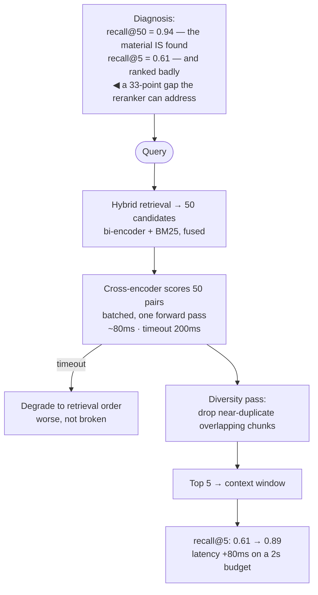

## The model

Retrieval is fast because it compares precomputed vectors. That speed comes from never letting
the query and the document meet — each was embedded alone, so the comparison misses everything
that depends on their interaction.

**Reranking** fixes that on a small set. A **cross-encoder** reads the query and a candidate
*together* and scores the pair directly, which is far more accurate and far too slow to run over
a corpus. So you retrieve widely with the cheap method and rescore narrowly with the expensive
one — **retrieve-and-rerank**, and it is typically the largest quality improvement available in
a retrieval system.

## When to use it

You have candidates and are deciding whether a second pass is worth its latency.

1. **Does the answer depend on the top result being right?** [[Retrieval-augmented
   generation|RAG]] sends only the top few to a model, so precision at the top is everything.
   A search results page showing twenty is more forgiving.
2. **Is retrieval returning the right documents in the wrong order?** Measure recall at 50
   against recall at 5. A large gap means the material is being found and mis-ranked, which is
   exactly what reranking fixes.
3. **What latency is available?** A cross-encoder over 50 candidates is tens to hundreds of
   milliseconds. If the budget cannot absorb it, rerank fewer or use a smaller model.

## Speedrun

**What** — two architectures, and the difference between them is the whole page:

| | **Bi-encoder** (retrieval) | **Cross-encoder** (reranking) |
|---|---|---|
| Encodes | query and document separately | the pair, together |
| Precompute | documents, offline | nothing — every pair at request time |
| Cost per item | one vector comparison | one model forward pass |
| Scales to | millions | tens |
| Accuracy | good | substantially better |

**How to apply it**

1. **Retrieve wide.** Take 50–100 candidates from [[hybrid retrieval]], not 5. The reranker can
   only reorder what it is given.
2. **Score each candidate against the query** with a cross-encoder, jointly.
3. **Keep the top 3–10**, depending on what the downstream stage can use.
4. **Batch the scoring**, since candidates are independent and a single batched forward pass is
   far cheaper than fifty sequential ones.
5. **Set a timeout and degrade to the retrieval order.** A late reranker should not fail the
   request — this is [[the tail at scale]] with an easy fallback.
6. **Measure recall@50 versus precision@5** before and after, so you know whether reranking is
   earning its latency.

**Why it works** — precision is expensive and recall is cheap, so you buy them separately. The
cheap stage guarantees the right document is *somewhere* in the candidates; the expensive stage
puts it first. Neither could do the other's job at an acceptable cost.

**The diagnostic that tells you it will help** — if recall@50 is high and recall@5 is much lower,
retrieval is finding the material and ordering it badly. That gap is precisely the reranker's
addressable space.

## Going deeper

### Bi-encoders and cross-encoders, and why the gap exists

A **bi-encoder** embeds the query and each document independently. Because documents are
embedded offline, a search is a vector comparison against precomputed data, which is what makes
retrieval over millions feasible.

The cost of that independence is that the document's vector was computed without knowing the
query. Whatever matters about *this* query against *this* document — which sentence answers it,
whether a qualifier applies, whether an apparent match is actually about something else — was
never available at encoding time.

A **cross-encoder** feeds the query and document into the model together, so every token of the
query can attend to every token of the document. The score reflects the interaction rather than
a distance between two summaries, and the improvement is large — reranking commonly moves
precision@5 by ten to twenty points on top of good retrieval.

The price is that nothing can be precomputed. Each pair needs a forward pass at request time, so
scoring a million documents is impossible and scoring fifty is routine. That asymmetry *is* the
architecture: bi-encoder for recall over everything, cross-encoder for precision over the
survivors.

The shape recurs throughout this atlas — [[candidate generation]] then ranking in a feed,
retrieval then ranking in recommendations, a light model then a heavy one in
[[ranking model|feed serving]]. Whenever precision is expensive, buy it only where it matters.

### How wide to retrieve

The candidate count is the parameter that matters most, and it is bounded on both sides.

Too few and the reranker cannot help. If the correct document sits at rank 60 and you retrieve
50, no amount of rescoring recovers it — **the reranker's ceiling is the retriever's recall**.
That is why the diagnostic above is recall@50: it measures whether the material is even
available to be reordered.

Too many and latency and cost rise linearly, since every candidate is a forward pass. Going from
50 to 200 quadruples the reranking cost for whatever recall the extra 150 contributed, which is
usually very little.

The empirical answer is to plot recall against depth and find where it flattens. Most corpora
show recall rising steeply to about 20–50 and then almost flat, which is why 50 is a common
default rather than a magic number.

Two refinements worth knowing. **Cascading** uses a small fast reranker over 200 candidates, then
a large accurate one over the surviving 20 — the same split again, one level down. And an
**early exit** skips reranking when the retrieval scores show a clear winner, spending the
latency only on ambiguous queries.

### Beyond relevance

A reranker orders by predicted relevance, and the final list often needs properties relevance
alone does not produce.

**Diversity reranking** prevents near-duplicates filling the results. Retrieval with
[[chunk overlap|overlapping chunks]] reliably returns three passages saying the same thing, which
wastes the [[context window]] on redundancy. Maximal marginal relevance is the standard
technique: pick the best candidate, then repeatedly pick the one maximising relevance *minus*
similarity to what is already chosen.

**Recency** matters when documents go stale, and it is usually applied as a decay multiplier
rather than a reranker feature, so it stays inspectable.

**Authority** — official documentation over a forum post, current policy over an archived one —
is metadata the reranker has no way to know.

These are constraints rather than predictions, and they belong in a pass *after* the reranker for
the same reason the feed re-ranker exists separately from the ranking model: encoding "at most
two chunks from one document" into a relevance score makes both harder to reason about.

### What it costs, and when to skip it

Reranking adds a model call to every request, and the honest accounting is worth doing before
adopting it.

A hosted reranker over 50 candidates is tens to low hundreds of milliseconds and a per-request
fee. For a RAG assistant whose total budget is seconds, that is easily affordable. For an
autocomplete with a 50 ms budget, it is not, which is why [[suggestion index|autocomplete]]
precomputes instead.

Skip it when retrieval is already precise — measure first — or when the downstream stage
consumes many results anyway, since reordering matters less if all twenty are shown. And skip it
when the latency budget genuinely cannot absorb it, rather than degrading the whole request to
fit.

The timeout-and-degrade behaviour is what makes it safe to add. If the reranker is slow or down,
serve the retrieval order: slightly worse results are much better than an error, and it removes
the reranker from the [[availability]] multiplication.

## See it work

A RAG assistant where recall is good and answers are wrong.

The diagnosis is the part to do first and the part usually skipped. Recall@50 at 0.94 says
retrieval is finding the right passage almost always; recall@5 at 0.61 says it is arriving in the
top five only sometimes. That 33-point gap is the reranker's entire addressable space, and
measuring it beforehand is what distinguishes a justified change from a fashionable one.

Fifty candidates is chosen because recall flattens there. Retrieving 200 would quadruple the
reranking cost to chase the four points of recall between 50 and 200 — a bad trade, and one that
is only visible if you plotted the curve.

The cross-encoder scores all fifty in one batched pass, which is what keeps 80 milliseconds
achievable. Fifty sequential calls would be several times that and would make the whole approach
marginal.

The diversity pass exists because overlapping chunks reliably produce near-duplicates. Three
passages saying the same thing consume three of the five context slots, and dropping them is
free quality — the model gets three *different* things to reason with instead.

The timeout is what makes this safe in production. A reranker that is slow or unavailable
degrades to the retrieval order, which is worse and works. Without it, adding a reranker means
adding a dependency in series to every request, and the availability arithmetic makes that a bad
bargain regardless of the quality gain.

## Next

Vector indexes cover how the retrieval stage finds candidates among millions fast enough for any
of this to matter.
