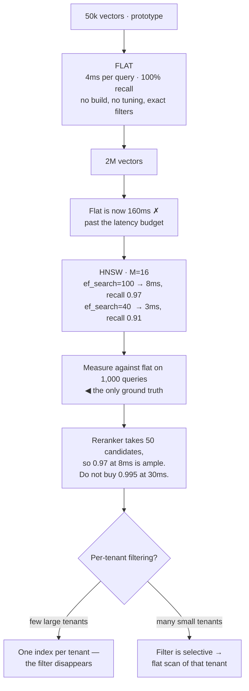

## The model

Comparing a query vector against every stored vector is exact and linear. At a million vectors
and 768 dimensions that is roughly 750 million multiplications per query — too slow for a
request path, and it gets worse as the corpus grows.

**Approximate nearest neighbour** search gives up exactness to escape that. It finds *most* of
the true nearest neighbours in logarithmic or sublinear time, and the fraction it finds is
**recall** — a dial you set rather than a property the system has. Every index type is a
different way of trading recall for speed and memory.

## When to use it

You have vectors and are choosing how to search them.

1. **How many vectors?** Under about 100,000, a **flat index** — brute force — is fast enough
   and exactly correct. Reaching for HNSW below that scale is complexity with no benefit.
2. **How often does the corpus change?** Some indexes are cheap to build and expensive to
   update. A corpus rebuilt nightly and one accepting continuous inserts want different answers.
3. **Does memory or recall bind harder?** HNSW is fast and memory-hungry; IVF with quantisation
   is compact and less accurate. That is the whole decision.

## Speedrun

**What** — three families, and picking between them is mostly about corpus size and update
pattern.

| | Build | Query | Memory | Recall | Updates |
|---|---|---|---|---|---|
| **Flat** | none | O(n) | vectors only | 100% | trivial |
| **IVF** | cluster the space | scan a few clusters | vectors + centroids | tunable | rebuild to stay balanced |
| **HNSW** | build a graph | walk the graph | vectors + graph (~1.5×) | high | supports inserts |

**How to choose**

1. **Start flat.** Under 100k vectors, exhaustive search is milliseconds and exactly right. Do
   not add an index you cannot yet justify.
2. **Use HNSW as the default** past that point. It gives the best recall-per-millisecond and is
   what most vector databases run.
3. **Use IVF with [[product quantisation]] when memory binds** — a hundred million vectors that
   must fit in RAM, where 4× compression decides feasibility.
4. **Measure recall against a flat index** on a sample. That is ground truth, and it is the only
   way to know what your approximation costs.
5. **Tune the search parameter, not the index.** HNSW's `ef_search` and IVF's `nprobe` both trade
   latency for recall at query time, without rebuilding anything.
6. **Check how filtering interacts.** Pre-filtering degrades graph traversal, and heavy filters
   can quietly collapse recall.

**Why it works** — exact search must compare everything because any vector could be nearest.
Approximation exploits structure: nearby vectors cluster, so a search that walks toward the query
through neighbours reaches the right region without visiting the rest.

**The number to hold** — recall at 95% versus 99% is often a 3–5× latency difference. Which you
need is a product question, and asking it is how you avoid paying for precision nobody uses.

## Going deeper

### Flat, and why to start there

A **flat index** stores vectors and compares against all of them. No structure, no build step,
no approximation.

It is genuinely the right answer more often than it is used. A hundred thousand vectors at 768
dimensions is 300 MB and about 75 million multiplications per query — a few milliseconds with
SIMD, and exactly correct. Modern hardware is fast enough that "brute force" covers most
internal tools, most document sets, and most products before serious scale.

The advantages beyond speed matter. Recall is 100% by construction, so retrieval quality
problems are never index problems and you have one fewer variable when debugging. Updates are
trivial — append a vector. Filtering is exact, because you are scanning anyway.

The rule worth carrying: **measure your actual corpus before adding an approximate index.** The
complexity is real — a build step, tuning parameters, a recall number that can silently drift —
and it should be bought with a measurement rather than an assumption about scale.

### IVF, and the cluster-and-scan idea

**IVF** — inverted file index — clusters the vectors during build, keeping a centroid per
cluster. A query is compared against the centroids, and only the nearest few clusters are
scanned.

With a million vectors in a thousand clusters, scanning ten clusters touches about 1% of the
corpus. `nprobe` — how many clusters to scan — is the dial: more clusters means better recall
and more work, tunable per query without rebuilding.

The failure is at cluster boundaries. A true nearest neighbour sitting just inside a cluster you
did not scan is missed, and no amount of care at query time recovers it. Raising `nprobe`
reduces the effect and costs latency, which is the tradeoff in its plainest form.

IVF pairs naturally with **product quantisation**, which splits each vector into sub-vectors and
replaces each with a codebook index. A 768-dimension float vector at 3 KB becomes 96 bytes — a
32× reduction, with a real recall cost. That combination is what makes hundred-million-vector
indexes fit in memory, and it is the reason IVF persists despite HNSW generally winning on
quality.

The operational catch: clusters are computed from the data at build time, so a corpus that grows
or shifts leaves them unbalanced. IVF wants periodic rebuilds, which fits batch-updated corpora
and fights continuous ones.

### HNSW, and why it is the default

**HNSW** — hierarchical navigable small world — builds a layered graph. Each vector is a node
connected to its neighbours; upper layers are sparse for long jumps, lower layers dense for
local refinement.

A search enters at the top, greedily walks toward the query, drops a layer, and repeats. The
upper layers cover distance quickly and the lower ones refine, which gives roughly logarithmic
search — the same intuition as a skip list, in vector space.

It is the default in most vector databases because it gives the best recall for the latency, and
because it supports incremental inserts without a rebuild. Two parameters matter: `M`, the
connections per node, set at build time and trading memory for quality; and `ef_search`, the
candidate list size at query time, which is the recall-latency dial.

The costs are worth stating plainly. Memory is the vectors plus the graph — commonly 1.5× the
raw vector size, which is substantial at scale. Build is slow, since each insert searches the
existing graph to find its neighbours. And deletes are awkward: most implementations tombstone
rather than remove, so a corpus with heavy churn degrades until it is rebuilt.

### Recall, filtering, and what to actually measure

**Recall** here means the fraction of true nearest neighbours the approximate search returned,
and it is measurable rather than theoretical: run a sample of queries against a flat index, and
compare.

That measurement is not optional and is frequently skipped. An index at 85% recall is losing one
relevant document in seven before the [[reranking|reranker]] ever sees the candidates, and
nothing in the output signals it — the results look plausible because they are plausible, just
not the best available.

The **recall-latency tradeoff** is a curve, and both HNSW and IVF let you move along it at query
time. Going from 95% to 99% recall is commonly 3–5× the latency, so the useful question is what
the downstream stage needs. A reranker over 50 candidates is forgiving of a few misses; a system
returning the top 3 directly is not.

Filtering is where recall quietly collapses. HNSW's graph was built over the whole corpus, so
restricting the search to 1% of it means the walk keeps landing on excluded nodes and the
traversal degrades — sometimes to worse than brute force over that 1%. The mitigations are
partitioning by the filter dimension when it is low-cardinality, or accepting a flat scan when
the filter is selective enough to make the subset small.

Choosing an index is close to a [[one-way door]] in one specific respect: the build cost. Moving
a hundred million vectors from IVF to HNSW is hours of compute and a full rebuild, so the
decision deserves a measurement rather than a preference — while the *search* parameters remain
cheap to change, which is where tuning belongs.

## See it work

A corpus growing from a prototype to production.

The prototype uses a flat index and should. Fifty thousand vectors is four milliseconds,
perfectly accurate, with no build step and no parameter that can silently drift — and adding
HNSW at that scale would buy nothing while introducing a recall number nobody is watching.

At two million, flat crosses the budget and HNSW earns its place. The two `ef_search` settings
show the dial: 0.97 recall at 8 ms, or 0.91 at 3 ms, same index, changed per query.

The measurement against flat is the step that makes the choice real. Without it, 0.97 is a
number from a benchmark on someone else's data, and the actual recall on this corpus is unknown.

The decision then comes from downstream rather than from ambition. A reranker examining 50
candidates tolerates a few misses easily, so buying 0.995 recall at 30 ms is paying four times
the latency for quality the pipeline discards.

Filtering forces the last decision, and the answer depends on shape rather than principle. A few
large tenants means separate indexes and the filter stops existing. Many small ones means the
filtered subset is small enough to scan exactly — which is the flat index returning, at a scale
where it is once again the right answer.

## Next

When RAG is the wrong answer closes this group by asking whether retrieval was the right shape
for the problem at all.
