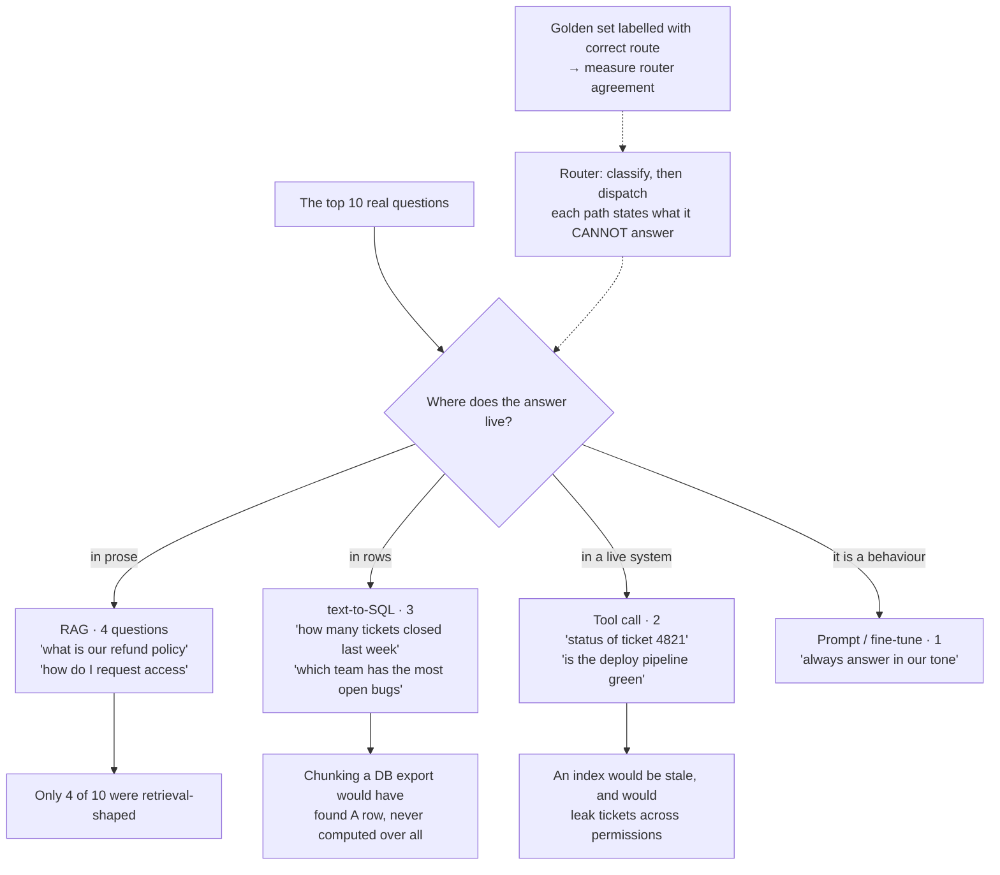

## The model

[[Retrieval-augmented generation|RAG]] answers questions by finding relevant passages and having
a model read them. That works when the answer *is written down somewhere in prose* — a
**retrieval-shaped question**.

Many questions are not that shape. "How many orders shipped late last month" is arithmetic over
rows, and no passage contains it; "always respond in our house style" is a behaviour rather than
a fact; "what is the status of ticket 4821" is a lookup against a live system.

Retrieval answers all three badly and confidently, which is worse than not answering them.

## When to use it

You are about to build retrieval, and it is worth ten minutes to check the shape first.

1. **Is the answer written in a document?** If the answer must be computed, aggregated, or read
   from a live system, no chunk contains it and retrieval cannot find it.
2. **Is the corpus small enough to fit in context?** Fifty pages of policy fits in a modern
   **long-context** window. Building an index for it is machinery you do not need.
3. **Is this knowledge or behaviour?** Facts belong in retrieval. Tone, format and consistent
   procedure belong in the prompt or in **fine-tuning**, and trying to retrieve them produces a
   system that occasionally remembers to behave.

## Speedrun

**What** — five alternatives, each fitting a shape retrieval fits badly:

| The question | The right answer |
|---|---|
| Aggregation, counts, filters over records | **text-to-SQL** over the database |
| Live state — status, balance, availability | **tool use** — call the API |
| Small fixed corpus | put it all in the **long-context** window |
| Tone, format, house style | prompt, or **fine-tuning** |
| "What is written about X" across many documents | RAG |

**How to check the shape**

1. **Write the top ten real questions down** before choosing an architecture. This alone
   resolves most cases.
2. **For each, ask where the answer physically lives.** In prose, in rows, in another system, or
   nowhere yet.
3. **Count the corpus.** Under roughly 100k tokens and stable, long context is simpler and more
   accurate than any retrieval you will build.
4. **Separate knowing from behaving.** Retrieval supplies facts; it does not reliably supply
   consistency of manner.
5. **Route rather than choose.** Real assistants need several of these, and the interesting
   design is the router that picks per question.
6. **Say what each path cannot answer**, so the failure is designed rather than discovered.

**Why it matters** — retrieval that cannot possibly contain the answer does not fail loudly. It
returns the nearest prose it can find and the model writes something plausible from it, which
is the most expensive failure mode available.

**The tell** — if you cannot point at the passage that would answer a question, retrieval will
not find it either.

## Going deeper

### Questions over records, not prose

"How many enterprise customers churned in Q3" has an answer, and it is not in any document. It
is a `COUNT` with a `WHERE` clause.

Chunking a database export into passages and embedding them destroys exactly the structure the
question needs. Aggregation, filtering, sorting and joining are what a query language is for,
and a vector search over row-shaped text can at best find *a* row rather than compute over all
of them.

**Text-to-SQL** is the right shape: a model translates the question into a query, the database
executes it, and the model explains the result. The answer is then computed rather than
recalled, which means it is correct rather than plausible.

The engineering is not trivial — the model needs the schema, generated SQL must be sandboxed and
read-only, and results need a size limit before they reach a context window. But the failure
modes are legible: a bad query errors or returns visibly wrong rows, rather than producing
confident prose about a number nobody computed.

The tell for this case is any question containing "how many", "total", "average", "top", "since",
or a comparison between periods.

### Live state, and the case for tools

"What is the status of order 4821" has an answer that changes. Anything indexed is a snapshot,
and a snapshot of live state is stale by construction.

**Tool use** is the shape: the model calls an API, gets the current value, and answers from it.
The advantages compound — always current, no index to maintain, permissions enforced by the
system that owns the data rather than duplicated into a vector store, and an audit trail.

This is also the honest answer to a permissions problem people meet late. Indexing every ticket
into a shared vector store means retrieval can surface documents a user should not see, and
[[metadata filtering|filtering]] mitigates rather than solves it. Calling the ticket API as the
user delegates the question to a system that already answers it correctly.

The tell: if the answer would be different tomorrow, it belongs behind a tool rather than in an
index.

### Small corpora, and the long-context option

Context windows now hold hundreds of thousands of tokens. A corpus of fifty pages fits entirely,
and putting it all in the prompt beats any retrieval you could build over it.

The reason is that retrieval can only lose information at that scale. If everything fits, there
is nothing for retrieval to add — it can only fail to select the right passage, which is a
failure mode you have introduced for no benefit.

The costs of long context are real and worth stating: you pay for every token on every request,
latency grows with context length, and models attend less reliably to material in the middle of
a very long context. So the boundary is not "does it fit" but "does it fit and is the per-request
cost acceptable".

The practical line is roughly: under 100k tokens and stable, use long context. Above that, or
changing constantly, index it. In between, prompt caching makes long context substantially
cheaper and moves the line upward — and it is worth checking that before assuming an index.

### Behaviour is not knowledge

"Respond in our house style", "always ask a clarifying question before booking", "never promise a
delivery date" — these are behaviours, and they are the case where reaching for RAG is most
clearly [[the wrong abstraction]].

Retrieving a style guide into the context produces a system that follows it *sometimes*, because
the guidance competes for attention with everything else in the window and is not consistently
retrieved in the first place.

Behaviour belongs in the system prompt when it is short, and in **fine-tuning** when it is
extensive or must be reliable. Fine-tuning teaches consistent manner, format and procedure from
examples, and it is unusually good at exactly what retrieval is bad at.

The clean division: **fine-tune for how, retrieve for what.** A model fine-tuned on your house
style and given retrieved facts is a substantially better system than either alone, and the two
are not alternatives.

Fine-tuning is genuinely wrong for facts, though — it is expensive, updates require retraining,
and the model will state outdated facts with the same confidence as current ones. That is the
mirror image of the mistake this page is about.

### Routing, because real systems need several

The honest conclusion is that a real assistant needs most of these, and the design work is the
router.

A question arrives; a classifier or the model itself decides whether it is a lookup, an
aggregation, a policy question or a live-state question; and it goes to the appropriate path.
Each path has a shape it handles and a shape it refuses.

That routing is where the design difficulty moves, and it has its own failure: a misrouted
question gets a confident answer from the wrong mechanism. So the mitigation is the same
discipline as everywhere in evaluation — a [[golden set]] of questions labelled with their
correct route, and a measurement of how often the router agrees.

The thing to volunteer in a design discussion is what each path *cannot* answer. A system that
knows "this is an aggregation question and I do not have query access" and says so is better
than one that retrieves three passages about orders and writes a number.

## See it work

Ten real questions from an internal assistant, sorted by shape before anything is built.

Writing the ten questions down took an afternoon and changed the architecture. Only four were
retrieval-shaped — and a team that had started building a vector store would have been six
questions into a system that could not answer six of them.

The three aggregation questions are the clearest case. "How many tickets closed last week" is a
`COUNT`, and no passage anywhere contains it. Retrieval would return the nearest prose about
tickets and the model would produce a number with no relationship to the data, phrased exactly
like a correct answer.

The two live-state questions are the second trap, and the permissions point is the one usually
discovered late. Indexing every ticket into a shared store means retrieval can surface tickets
across boundaries, and filtering is a mitigation rather than a fix. Calling the API as the user
delegates the whole question to a system that already gets it right.

The tone requirement is not knowledge at all. Retrieving a style guide produces a system that
sometimes remembers to follow it, because the guidance competes for attention and is not
reliably retrieved. That belongs in the prompt, or in a fine-tune if it must be consistent.

The router is where the remaining difficulty lives, and it needs the same treatment as any other
component: a golden set of questions labelled with their correct route, and a measured agreement
rate. Otherwise a misrouted question produces a confident answer from the wrong mechanism, which
is the failure this entire page exists to prevent.

## Next

That completes Retrieval. The Online group covers what changes once these systems face real
users — monitoring, drift, guardrails and experiments.
