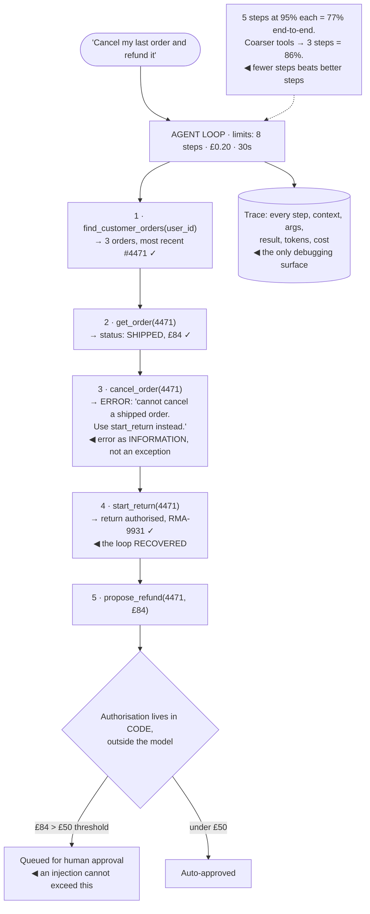

## The model

A workflow is a sequence you wrote. An **agent loop** is a sequence the model decides at runtime:
observe, choose a tool, act, observe the result, repeat until done.

That is a real capability — it handles tasks whose steps you could not enumerate. It is also a
trade you should make deliberately, because you have replaced a control flow you can read with one
that varies per request, costs a variable amount, and fails in ways no stack trace explains.

## When to use it

You are deciding between a fixed pipeline and letting the model drive.

1. **Can you write the steps down?** If the sequence is knowable, write it. A workflow with model
   calls at specific points is cheaper, faster, testable and debuggable.
2. **What can the tools actually do?** [[tool use|Tool access]] is capability, and capability is
   what an injection can abuse. A read-only agent and one that can move money are different risk
   categories entirely.
3. **What bounds the loop?** Steps, wall-clock time, and cost all need hard ceilings, because a
   loop that decides its own termination sometimes does not.

## Speedrun

**What** — a loop: model sees state, emits a tool call, code executes it, result goes back into
context, repeat until the model says it is done or a limit stops it.

**How to build one that survives production**

1. **Prefer a workflow where the steps are knowable.** Most tasks labelled "agentic" are a fixed
   pipeline with a model in two places.
2. **Write tools as a narrow, well-described API.** The **tool schema** — name, parameters, and a
   description of when to use it — is the whole interface, and vague descriptions are the most
   common cause of wrong tool choice.
3. **Set a hard step limit**, plus a cost and time ceiling. Every loop needs a termination
   guarantee that does not depend on the model's judgement.
4. **Return errors as information, not exceptions.** A tool result of "no customer with that id"
   lets the model recover; a thrown exception ends the run.
5. **Keep the tool set small.** Accuracy of tool selection falls as the list grows; past roughly a
   dozen, group them or route first.
6. **Trace everything.** The **agent trace** — every step, tool call, argument and result — is the
   only way to debug a run, and it has to be built in from the start.

**Why it works** — for genuinely open-ended tasks, the model choosing the next step generalises to
situations you never enumerated, which no fixed pipeline does.

**The number that should worry you** — per-step reliability compounds. Ninety-five percent per step
over ten steps is a 60% success rate, and 90% over ten steps is 35%. Long agent loops fail not
because any step is bad but because many decent steps multiply.

## Going deeper

### Compounding error, which is the central constraint

**Compounding error** is what makes long agent loops unreliable, and the arithmetic is worth
internalising because it governs every design decision here.

If each step succeeds independently with probability `p`, then `n` steps succeed with probability
`p^n`:

$$
P(\text{success}) = p^{n}
\qquad
\begin{aligned}
0.95^{5} &= 77\% \\
0.95^{10} &= 60\% \\
0.90^{10} &= 35\%
\end{aligned}
$$

So the lever is not making steps slightly better — it is having fewer of them. Halving the step
count does more than a five-point improvement in per-step reliability, and it is usually easier.

Three ways to shorten the loop. **Make tools coarser**: one `create_order` tool beats six calls
that assemble an order. **Do the deterministic parts in code**, so the model only decides the parts
that need deciding. **Constrain the space** — a plan-then-execute shape where the model produces a
plan once and code runs it is far more reliable than deciding each step fresh.

Recovery changes the arithmetic in your favour. If a failed step can be detected and retried, `p`
per *attempt* matters less than `p` per *step with retries*. Which is why returning errors as
readable information — "that customer id does not exist, here are three similar ones" — is not
politeness; it is what converts a terminal failure into a recoverable one.

### Tools, which are the actual interface

The **tool schema** is what the model sees: a name, a parameter schema, and a description of when
to use it. Everything about tool choice quality flows from it.

Descriptions do most of the work, and they should say *when to use this instead of the alternatives*
rather than what the function does. "Search the knowledge base" and "Search customer records" are
confusable; "Search published help articles — use for how-to and policy questions, not for anything
about a specific customer's account" is not.

Parameters should be as constrained as the domain allows. Enums beat free strings, required fields
beat optional ones, and a schema that makes an invalid call unrepresentable removes a whole class
of failure before it happens.

Granularity is a real design decision with a real tradeoff. Coarse tools mean fewer steps and less
compounding; fine tools mean more flexibility and more chances to go wrong. Default coarse, and
split only where the flexibility is actually being used.

Size matters more than people expect. Selection accuracy degrades as the tool list grows — past
roughly a dozen, the model starts confusing similar ones. The fix is hierarchy: a router that picks
a category, then a small tool set within it.

And the tools *are* the risk surface. A model with read-only tools that is injected can be made to
say something wrong. A model that can issue refunds, send email or write to a database can be made
to do those things, and no prompt reliably prevents it — which is why authorisation belongs outside
the model, as the [[guardrail]] page argues.

### Bounding the loop

An agent that decides its own termination will sometimes decide wrong, so termination cannot be
left to it.

**The step limit** is the primary bound: a hard cap after which the loop stops and reports what it
achieved. Set it from the observed distribution — if the p95 successful task takes six steps, a cap
of ten is generous; a cap of fifty is a budget with no owner.

**Cost and time ceilings** matter independently, because a small number of expensive steps can
exceed a large number of cheap ones. Track spend per run, and abort at a threshold.

**Loop detection** catches the specific pathology of an agent calling the same tool with the same
arguments repeatedly. It is cheap to detect and common enough to be worth building.

The [[error budget]] framing helps decide how tight to set these. Agent runs fail; the question is
what failure rate the product tolerates and what happens to the ones that fail. A design where a
hit limit produces a clean handoff to a human — carrying the trace and the partial work — is
acceptable at a much higher failure rate than one where hitting the limit means silence.

And there is a failure mode worse than stopping: an agent that stops and reports success having
done nothing useful. Verifying the outcome — did the record actually change, does the file exist,
does the query return what was claimed — is code's job, not the model's self-report.

### Debugging, which is different

An agent bug is not a stack trace. It is a decision that seemed reasonable given the context, made
three steps ago, that put the run somewhere it could not recover from.

The **agent trace** is the entire debugging surface: every step, the context the model saw, the tool
it chose, the arguments, the result, and the token cost. Without it a failed run is unexplainable;
with it, the wrong decision is usually visible on inspection.

Non-determinism makes this harder than ordinary debugging. The same input produces a different
trajectory, so "reproduce the bug" is not always available. Trace-replay — re-running with the
recorded tool results — is the closest equivalent and worth building.

Evaluation is also harder, because a run has both an outcome and a path. Judge the outcome —
did the task get done — as the primary metric, and track the path as diagnostics: steps taken, cost,
tools used, retries. A run that succeeds in twenty steps and one that succeeds in four are both
successes and are not equally good.

The cheapest failures to eliminate are usually the ones visible in aggregate rather than in any one
trace. A tool chosen wrongly 30% of the time has a description problem, and that only shows up when
you count tool choices across runs.

## See it work

An agent handling "cancel my last order and refund it to my card".

The recovery at step three is the design working. A shipped order cannot be cancelled, and the tool
returns that as a readable message naming the alternative — so the model corrects itself and
continues. Had that been a thrown exception, the run would have ended with the user's request
unmet and no explanation.

Authorisation sits outside the loop deliberately. The model may *propose* a refund; the threshold
check is code, so the worst outcome of a prompt injection reaching this agent is a proposal that a
human declines. Capability is what bounds the damage, not instructions.

The bounds are set from observed behaviour rather than picked. Eight steps against a task that
normally takes five, twenty pence against a run that costs four, thirty seconds against a run that
takes eight — generous enough not to fire on normal work, tight enough that a runaway loop stops
before it matters.

The trace is not optional infrastructure. When this run fails next week — a wrong order selected, a
tool called with the wrong id — nothing else will explain it, because there is no stack trace and
the same input may not reproduce the same path.

And the arithmetic in the corner is the design lever. Five steps at 95% is a 77% success rate; the
way to improve that is not a better prompt but a coarser `return_and_refund` tool that collapses
three steps into one. Fewer steps beats better steps, almost every time.

## Next

Context management covers the other thing that grows with every agent step — the conversation
itself, and what to do when it stops fitting.
