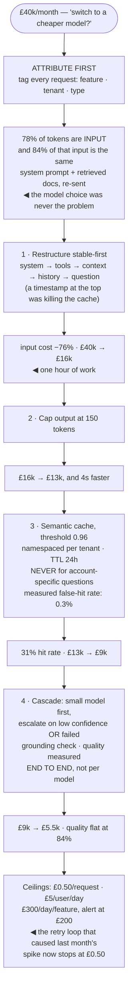

## The model

An AI feature's bill is mostly the same tokens, over and over: the same system prompt, the same
retrieved documents, the same questions asked by different users.

Four techniques recover it:

- **Prompt caching** makes a repeated prefix nearly free.
- A **semantic cache** answers a repeat question without a model call at all.
- A **model cascade** sends the easy majority to a cheap model.
- A **cost ceiling** stops a runaway before it becomes an invoice.

None of them requires accepting worse answers, which is what separates them from the suggestion
everyone reaches for first.

## When to use it

Spend is material, or growing faster than usage.

1. **What fraction of your tokens are repeated?** System prompts and retrieved context repeat
   across every turn of every conversation, and that is usually most of the input.
2. **Do questions repeat across users?** Support and documentation assistants see the same twenty
   questions constantly; a bespoke analysis tool does not.
3. **Do all requests need the strongest model?** Almost never. The question is what fraction does,
   and whether you can tell which in advance.

## Speedrun

**What** — four independent levers, in order of return per unit of effort:

| | Saves | Costs you | Works when |
|---|---|---|---|
| **Prompt caching** | up to 90% of repeated input | prompt must be stable-first | always |
| **Semantic cache** | 100% of a hit | staleness risk, similarity tuning | questions repeat |
| **Cascade** | 70–90% on routed traffic | a routing decision that can be wrong | difficulty varies |
| **Shorter output** | cost and latency together | nothing | always |

**How to apply them**

1. **Restructure the prompt stable-first** so the system prompt and retrieved context form a
   cacheable prefix. This is usually a one-hour change with the largest single return.
2. **Cap output length.** Output costs several times input per token and dominates latency.
3. **Add a semantic cache** for repeated questions, with a similarity threshold you have actually
   measured and a TTL tied to how fast the underlying content changes.
4. **Cascade by difficulty.** A small model handles the easy majority; escalate on low confidence
   or a failed check.
5. **Attribute cost per feature, per customer and per request.** An aggregate bill tells you the
   number and nothing about where it came from.
6. **Set hard ceilings** per request, per user and per day, with alerts before them. A retry loop
   with no ceiling is an unbounded invoice.

**Why it works** — none of these degrade the answer. They remove repeated work, avoid work already
done, and match the model to the difficulty of the request.

**What to do before any of this** — measure where the money goes. Teams routinely optimise the
model choice while 80% of spend is a system prompt being re-sent on every turn.

## Going deeper

### Prompt caching, which is the biggest single win

**Prompt caching** stores the model's internal state for a prefix of the prompt, so a later request
sharing that prefix skips recomputing it. Providers expose it as a discount — typically 90% off the
cached portion — and self-hosted servers get it through prefix sharing in the [[KV cache]].

The constraint that governs everything: it matches on an **exact prefix**. The cached portion must
be byte-identical and at the start. One variable character near the top invalidates everything
after it.

Which makes prompt layout a cost decision. Order the prompt: system prompt, then tool definitions,
then retrieved context, then history, then the user's question — most stable first, most variable
last. A timestamp or a user's name inserted at the top of the system prompt destroys the entire
cache, and it is a surprisingly common bug.

The arithmetic is worth working. A 5,000-token prompt where 4,200 tokens are stable, at £2 per
million input tokens: uncached, £0.010 per turn. With 4,200 tokens cached at 10%, £0.0024 — a 76%
reduction on input, from restructuring alone.

The two things to know before relying on it: caches have a short TTL, typically minutes, so the
benefit appears at sustained traffic rather than on sporadic requests; and there is usually a
minimum cacheable length, below which nothing happens.

### Semantic caching, and its risk

A **semantic cache** stores question-answer pairs and serves a stored answer when a new question is
sufficiently similar by embedding distance. A hit costs nothing and returns in milliseconds.

The hit rate is what decides whether it is worth building, and it is highly product-dependent. A
support assistant where "how do I reset my password" arrives in forty phrasings can see 30–40%
hits. A tool answering questions about a user's own data sees approximately zero, because every
question is about different data.

The risk is the whole design problem: **similar questions can have different correct answers.**
"What is my order status" and "what is my refund status" are close in embedding space and must
never share an answer. So must "is the API rate limit 100 or 1000" — a small wording difference
that changes the answer entirely.

The defences are all necessary rather than optional:

- Set the similarity threshold high — 0.95 and above — and *measure* the false-hit rate rather than
  trusting the number.
- Namespace the cache by user and tenant, so one customer's answer can never reach another.
- Never cache anything personalised or account-specific.
- Set a TTL from how fast the underlying content changes, plus explicit invalidation when a source
  document is updated.

The failure mode when this goes wrong is bad in a specific way: it is silent, it is confidently
wrong, and it is served to many users at once because a popular question is exactly the one that
gets cached.

### Cascades

A **model cascade** routes by difficulty: a small cheap model handles what it can, and harder
requests escalate to a larger one. The cost saving is large because the difficulty distribution is
usually very skewed.

Two ways to route. **Predict difficulty first**, with a classifier or heuristics on the request —
cheap, and wrong sometimes. Or **try small, then escalate** on low confidence, a failed validation
or a self-reported inability — more accurate, and it pays for the small model's call on every
escalation.

The arithmetic decides which. If the small model costs a tenth of the large one and handles 70%
correctly, try-then-escalate costs `0.1 + 0.3 × 1.0 = 0.4` of the large-model-only cost — a 60%
saving, with the small call wasted on the 30% that escalate. Predict-first avoids that waste and
adds routing errors instead.

What makes a cascade safe is the escalation criterion. Confidence alone is unreliable, so combine
it with a validation check, a [[guardrail]] result, or a cheap [[LLM-as-judge|judge]] on the small
model's output. And measure the quality of the cascade *end to end* — the number that matters is
the accuracy of the whole system, not of either model.

The tempting version to avoid is quietly downgrading everyone to a cheaper model and calling it
cost control. That is a quality decision, and it should be made with an eval run and stated
explicitly rather than arriving as a cost saving.

### Attribution and ceilings

You cannot control what you cannot attribute. **Cost attribution** means every request logs its
token counts and cost, tagged with feature, user, tenant and request type.

That is what turns "the bill is £40k" into "one feature is 60% of it, and 3% of users are 40% of
that" — and those are the sentences that lead to action. Aggregate spend leads to a meeting.

**Cost ceilings** are the safety net, and they belong at several levels. Per request, so one runaway
[[agent loop]] cannot spend indefinitely. Per user per day, which catches abuse and bugs alike. And
per feature per day, with an alert well before the ceiling, so the first signal is not the hard
stop.

The [[error budget]] framing decides what happens at the ceiling. Refusing service to stay within
budget is a real availability cost, so the ceiling should be set where the spend genuinely matters
more than the request — and for most features that means the ceiling is a backstop against bugs
rather than a routine throttle.

The specific failure to design against is the retry loop. A request that fails, retries, fails and
retries can spend an unbounded amount in minutes, and it looks like normal traffic until the
invoice arrives. Cap retries, cap total spend per request, and alert on the *rate* of spend rather
than only the total.

## See it work

A support assistant at £40,000 a month, worked through in order.

Attribution before optimisation is the whole lesson. The opening question was which model to use;
the measurement showed that 78% of tokens were input and most of that input was the same text
re-sent every turn — so the model choice was never where the money was.

The stable-first restructure is an hour of work for £24,000 a month. The bug it fixed is worth
noticing on its own: a timestamp at the top of the system prompt made every prefix unique, so the
cache had never worked at all, and nothing in the bill said so.

The semantic cache is the one carrying real risk, and every defence is load-bearing. A 0.96
threshold, per-tenant namespacing, no account-specific questions, a 24-hour TTL, and a *measured*
0.3% false-hit rate — without those, a popular question gets a confidently wrong cached answer and
serves it to everyone who asks it.

The cascade comes last deliberately, because it is the only lever that can affect quality. Measured
end to end, the system holds at 84% while cost falls by nearly 40% — and "end to end" is the part
that matters, since either model's individual accuracy could look fine while the routing between
them loses points.

The ceilings are not a cost lever at all; they are a bug lever. Last month's spike was a retry loop,
and a £0.50 per-request cap converts that class of incident from an invoice into a logged failure.

## Next

Versioning and rollback covers changing any of this safely, since every lever here alters what the
model sees.
