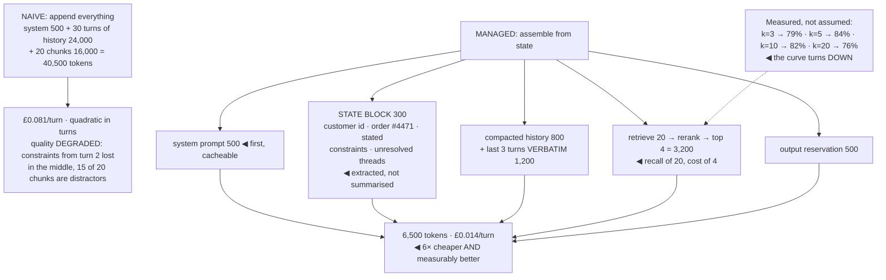

## The model

Every request assembles a **context budget** from competing claimants: the system prompt,
conversation history, retrieved documents, tool results, and room for the answer.

The instinct when the window is large is to fill it. That is wrong in both directions — cost grows
with everything you send, and quality frequently *falls* as the window fills. A well-managed 8k
context routinely beats a lazily-assembled 100k one, and it costs a twelfth as much.

## When to use it

Conversations run long, or you are assembling context from several sources.

1. **What is competing for the window?** Enumerate the claimants and their sizes. Most teams have
   never counted, and the count is usually surprising.
2. **What happens at the limit?** A conversation that grows without bound will hit it, and
   discovering how at 3am is worse than deciding now.
3. **Is more context actually helping?** Measure it. Ten chunks versus five is an eval question,
   and the answer is often that five is better *and* cheaper.

## Speedrun

**What** — a policy for what goes into each request and what gets dropped when it does not fit.

**How to manage it**

1. **Count the claimants** — system prompt, history, retrieved chunks, tool results, output
   reservation. Write down the token cost of each.
2. **Put stable content first.** It makes the prefix cacheable, and it puts the instructions where
   the model attends most reliably.
3. **Retrieve less than you can afford.** Five relevant chunks beat twenty that include fifteen
   near-misses, on quality as well as cost.
4. **Compact history rather than truncating it.** **Compaction** replaces old turns with a summary
   that preserves decisions and facts; truncation drops them silently.
5. **Reserve room for the answer.** A request that fills the window and leaves 200 tokens produces
   a truncated response, which is a confusing failure.
6. **Measure quality against context size.** More is not monotonically better, and the curve
   usually turns down well before the limit.

**Why it works** — attention is finite and spread across everything present, so irrelevant context
does not sit inertly. It competes, and it dilutes.

**The counterintuitive result** — cutting retrieved chunks from twenty to five commonly *improves*
answer quality while cutting cost by more than half. Test it before assuming otherwise.

## Going deeper

### Where attention actually goes

Models do not attend uniformly across a long context, and the shape of the bias is consistent
enough to design around.

**Lost in the middle** is the name for it: information at the beginning and end of a long context
is used far more reliably than information in the middle. A fact placed halfway through a
60k-token window is measurably more likely to be missed than the identical fact at the top — and
the effect strengthens as the window fills.

The design consequences are direct. Put instructions at the very start and, for anything critical,
repeat them at the end. Order retrieved chunks by relevance so the best material is at the edges
rather than buried. And treat a long middle section as the place where things go to be ignored.

**Context rot** is the related degradation over a long conversation. Early instructions get
outweighed by accumulated exchange, the model starts drifting from the established format, and
contradictions build up as the conversation revises itself without removing what it revised. A
conversation is not a transcript the model reads carefully; it is a pile of text competing for
attention.

That degradation is also why "the model has a 200k window" is not the capability it sounds like.
The window is what fits, not what is used well, and the two numbers are far apart.

### Compaction, and what it must preserve

Long conversations need a policy, and there are only a few options.

**Truncation** — drop the oldest turns — is simplest and loses whatever was decided early. The
user's stated constraints from turn two vanish, and the model contradicts them at turn thirty with
no indication anything was dropped.

**Compaction** — also called **conversation summarisation** — replaces older turns with a generated
summary. Done well it preserves what matters and costs a fraction of the tokens; done badly it is
truncation with extra steps.

What a compaction must preserve, in priority order:

- **Decisions and constraints.** "Use PostgreSQL", "the budget is £5k", "the user is in Germany" —
  these govern everything after them.
- **Facts established.** Names, ids, numbers, anything the conversation will refer back to.
- **Unresolved threads.** What was asked and not yet answered.
- **The current task state**, especially for an agent mid-task.

What it can drop: pleasantries, superseded intermediate reasoning, tool results already
incorporated, and anything the summary already implies.

Two mechanics matter in practice. Compact *before* the limit rather than at it, because a
compaction triggered by overflow happens at the worst moment. And keep the most recent few turns
verbatim — recency carries disproportionate meaning, and summarising the last exchange makes the
model lose the thread of the current question.

There is also a quality risk worth naming: the summary is generated by a model, so it can lose or
distort things. A compacted conversation is lossy by construction, and for anything critical the
structured facts should live outside the context — in application state — rather than depending on
a summary to survive.

### Structured state beats a long transcript

The reframe that solves most long-conversation problems: **stop treating the conversation as the
memory.**

An application that extracts structured state — the user's id, the order under discussion, the
constraints stated, the current step — and reassembles a compact context from it each turn is far
more robust than one that appends to a transcript and hopes.

The context becomes: system prompt, a rendered state block, the last few turns verbatim, and
whatever was retrieved for *this* question. Bounded, stable, cacheable, and it does not degrade at
turn forty.

This also makes the state inspectable, which is worth a great deal when something goes wrong. "The
model forgot the budget" becomes a question you can answer by looking at a field, rather than by
reading eleven thousand tokens of history.

The cost argument reinforces it. Conversation cost is quadratic in turns when history accumulates —
every turn re-sends everything before it — and bounded when state is structured. On a long
conversation that is not a small difference.

### Retrieval, and knowing when more hurts

Retrieved context is usually the largest and most variable claimant, and the default `k` is almost
always too high.

The tradeoff is not "more chunks, more recall, better answer". More chunks means more recall *and*
more distractors, and distractors actively hurt — a near-miss chunk about a similar policy is worse
than no chunk, because the model has no reliable way to tell it is the wrong one.

The measurement is straightforward and rarely done. Run the [[eval]] set at k = 3, 5, 10 and 20 and
plot answer quality. The curve typically peaks in the middle and declines, and the peak is where k
should be — not at the largest value the budget allows.

[[Reranking]] is what lets a low `k` work. Retrieve twenty candidates cheaply, rerank them
precisely, and pass the top four. You get the recall of twenty and the context cost of four, which
is the best available trade in this whole area.

The other lever is [[metadata filtering]] before retrieval. Filtering to the relevant product, date
range or locale removes distractors before they can be retrieved, which is cheaper and more
reliable than hoping the model ignores them.

## See it work

A support assistant at turn thirty, assembled two ways.

The naive assembly is what accumulates by default, and both of its problems are invisible from
inside. Forty thousand tokens a turn is six times the cost, and the quality damage — constraints
from turn two buried in the middle, fifteen distractor chunks competing with five good ones — shows
up as "the model is getting worse" rather than as a context problem.

The state block is the structural fix. Three hundred tokens of extracted fields carry what
twenty-four thousand tokens of transcript were carrying badly, and unlike a summary they cannot be
distorted by a generation step — they are read from application state.

Keeping the last three turns verbatim matters more than it looks. Recency carries the thread of the
current question, and a compaction that summarises the immediately preceding exchange reliably makes
the model lose track of what is being discussed right now.

Retrieve-then-rerank is the single best trade available here. Twenty candidates cost almost nothing
to fetch, reranking is cheap, and passing four gives the recall of a wide search at the context cost
of a narrow one.

And the measured curve is the part to actually run. Quality peaks at k = 5 and falls by eight points
by k = 20 — so the default of "retrieve as much as fits" is not merely wasteful, it is worse. That
is a twenty-minute experiment that most teams never do.

## Next

Caching and cost control takes the bounded context this produces and makes the repeated parts of it
nearly free.
