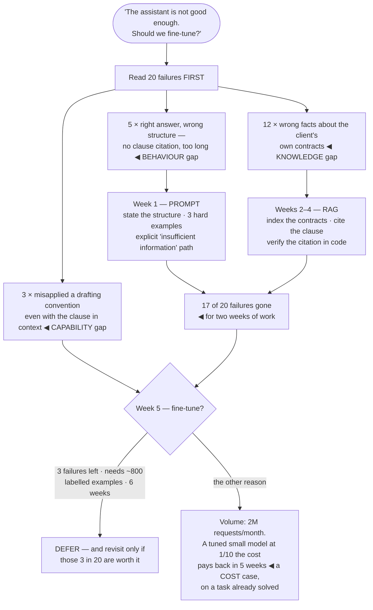

## The model

The model is not doing what you want. There are three ways to change that, and they are not
interchangeable — each fixes a different kind of gap.

A **knowledge gap** means the model does not know the facts, and retrieval fixes it. A **behaviour
gap** means it knows enough but responds in the wrong shape, and prompting fixes it. A **capability
gap** means it cannot do the task at all, and fine-tuning might. Diagnosing which one you have is
the whole decision, and teams routinely fine-tune a knowledge gap and get nothing.

## When to use it

Your outputs are not good enough and you are deciding what to change.

1. **Would a knowledgeable person get this right with the documents in front of them?** If yes, it
   is a knowledge gap and the answer is [[retrieval-augmented generation|retrieval]].
2. **Would they get it right with better instructions?** If yes, it is a behaviour gap and the
   answer is a better prompt, usually with examples.
3. **Would they get it right only after weeks of training on your specific task?** That is a
   capability gap, and it is the only case where [[fine-tuning]] is the first answer.

## Speedrun

**What** — three interventions, in ascending order of cost:

| | Fixes | Cost | Updates | Try it in |
|---|---|---|---|---|
| **Prompting** | behaviour, format, tone | ~zero | instantly | minutes |
| **RAG** | missing facts | retrieval infra + per-request tokens | when documents change | days |
| **Fine-tuning** | task capability, consistent style | labelled data + training + hosting | a retraining cycle | weeks |

**How to decide**

1. **Diagnose the gap first** by reading twenty failures. Missing facts, wrong shape, or genuinely
   cannot do it — the failures tell you which, and guessing does not.
2. **Exhaust prompting before anything else.** Better instructions, a specified output format, and
   three well-chosen examples fix more than people expect.
3. **Use RAG for anything that changes.** Facts that update — policies, prices, documents, a
   customer's data — belong in the context, never in weights.
4. **Fine-tune for form, not for facts.** It reliably teaches consistent structure, tone, and a
   narrow task; it teaches facts badly and unverifiably.
5. **Check you have the data before committing.** Fine-tuning needs hundreds to thousands of
   examples of the *desired output*, and gathering them is usually the real cost.
6. **Combine them.** A fine-tuned model that also retrieves is common and correct — the tuning
   handles form, the retrieval handles facts.

**Why it works** — the three interventions act on different parts of the system: the instruction,
the context, and the weights. Matching the intervention to where the deficiency actually lives is
the difference between a week and a quarter.

**The mistake that costs the most** — fine-tuning to teach the model your documentation. It will
learn the *style* of your documentation and still get the facts wrong, with no citation and no way
to check. That is a knowledge gap, and retrieval is the answer.

## Going deeper

### Diagnosing the gap

The diagnosis is empirical and takes an afternoon: collect twenty failures and sort them.

**Missing facts** — the model gave a confident answer about something it could not know: your
pricing, a customer's order, a policy written last month. That is a knowledge gap. No amount of
prompting or tuning creates information the model never had.

**Wrong shape** — the facts are right and the response is too long, in the wrong format, in the
wrong tone, or missing a required element. That is a behaviour gap, and it is the cheapest one to
close.

**Genuinely cannot** — the task requires reasoning, a domain convention, or an output structure the
model gets wrong even with perfect context and clear instructions. That is a capability gap, and it
is rarer than people assume.

Most real distributions are mostly the first two. A sample where fifteen of twenty failures are
missing facts and four are formatting means the roadmap is retrieval and a prompt fix — and the
fine-tuning project someone proposed would have addressed one failure in twenty.

This is the same [[error analysis]] discipline as everywhere else in the section, applied to a
build decision rather than a quality one.

### Prompting, which is underexploited

Before anything expensive, the prompting moves that reliably work:

- **Specify the output shape explicitly.** Most "wrong format" failures are the format never having
  been stated.
- **Add two or three [[few-shot example|examples]] of the hard cases** — the ambiguous input, the
  one where the answer is "I don't know", the format edge.
- **Give it an explicit way out.** Without a defined "insufficient information" response, the model
  must invent something.
- **Decompose.** Two focused calls frequently beat one call asked to do two things.
- **Put the important instructions at the edges**, not buried in the middle of a long context.

The reason this is underexploited is that prompting feels unserious next to training a model. It is
not: it costs nothing, ships in minutes, and closes a large share of real gaps. Reaching past it is
usually a status decision rather than an engineering one — which is what [[boring technology]]
argues about in general.

The honest limit is consistency. Prompting shifts a distribution; it does not constrain it. If you
need a specific structure on every single output, a fine-tuned model or a constrained decoder will
beat any instruction.

### What fine-tuning is actually for

**Fine-tuning** continues training on your examples, adjusting the weights. Modern practice usually
means an **adapter** — LoRA and similar — which trains a small set of additional parameters rather
than the whole model, cutting cost and making many tuned variants cheap to host.

What it does well:

- **Consistent form.** A specific output structure, a house style, a domain's conventions, every
  time.
- **A narrow task, cheaply.** A small tuned model matching a large model's quality on one task, at
  a fraction of the per-request cost — often the strongest economic argument for it.
- **Conventions no prompt captures.** Legal drafting norms, a specific classification taxonomy,
  a domain's idiom.
- **Shortening prompts.** Behaviour baked into weights does not have to be re-sent every request,
  which for high volume can pay for the tuning outright.

What it does badly is facts. Weights have no citation, no update path short of retraining, and no
way to tell you which fact is stale. A fact learned in training is indistinguishable from a fact
invented at inference.

The costs to price honestly: gathering hundreds to thousands of examples of desired output, a
training cycle per iteration, hosting a custom model, re-tuning when the base model is deprecated,
and the loss of the option to switch providers. **Continued pretraining** — further training on a
large unlabelled domain corpus — is a heavier variant, for genuinely distinct domains, and it is
rarely the right first move.

### Combining them

These compose, and most mature systems use more than one.

**RAG plus prompting** is the default shape, and it should be exhausted before anything else is
considered.

**RAG plus fine-tuning** is the mature answer for a specialised product: tuning teaches the model
to use retrieved context in your house format and to cite properly; retrieval supplies the facts.
Each does what it is good at.

The sequence that avoids waste is fixed: **prompt, then retrieve, then tune.** Each step is more
expensive and slower to iterate than the last, and each one changes what the next would need to
fix. Tuning first means tuning against a problem retrieval would have removed.

The one signal that genuinely justifies going straight to tuning is volume economics — when a small
tuned model at a tenth the per-request cost, on a task you have already solved with a large model,
pays back the tuning within weeks. That is a cost decision with a known quality target, which is a
very different situation from tuning to fix an unmeasured quality problem.

## See it work

A legal-document assistant that is not good enough.

The afternoon of error analysis is what makes the rest of this cheap. "Should we fine-tune" has no
answer; "twelve of twenty failures are missing facts" has an obvious one, and it is not fine-tuning.

Prompting and retrieval together close seventeen of twenty in two weeks. The fine-tuning project
someone proposed at the start would have addressed three of them, taken six weeks, and left the
other seventeen exactly where they were.

The remaining three are a real capability gap and the decision is still to defer. Three failures in
twenty against eight hundred labelled examples and six weeks is a bad trade at this stage — and it
stays available if those three turn out to matter more than the count suggests.

The economics branch is the one worth remembering, because it is the strongest genuine case for
tuning and it looks nothing like the original question. Once the task is *already solved* by a large
model, tuning a small one to match it at a tenth the cost is a straightforward payback calculation —
a cost decision with a known quality target, not a quality decision with an unknown cost.

## Next

Agents and tool use covers what happens when one model call is not enough, and the failure modes
that arrive with the second one.
