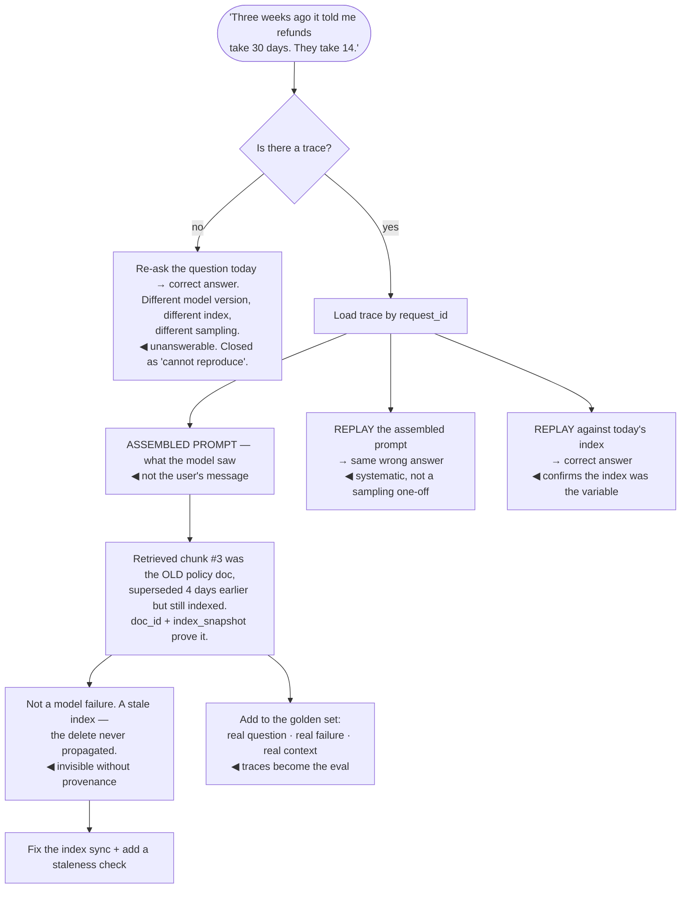

## The model

In ordinary software, debugging starts with reproducing the bug. With a model you frequently
cannot: the same input produces a different output, and the version that produced the complaint may
no longer exist.

So the record has to be captured at the time. A **trace** — the complete input, the assembled
context, the artifact versions, and the exact output — is what replaces reproduction. Without it a
production complaint is unanswerable; with it, most are answerable in minutes.

## When to use it

Any model-backed system where someone will eventually ask "why did it say that?"

1. **Can you reconstruct the exact input?** Not the user's message — the *assembled prompt*,
   including retrieved chunks and history. That is what the model saw.
2. **Can you tell what produced it?** Prompt version, model version, index snapshot, retrieval
   parameters. Without them, a replay tests today's system rather than the one that failed.
3. **What is the retention?** A complaint arriving three weeks later needs a trace that is still
   there.

## Speedrun

**What** — a stored record per request containing everything needed to explain, replay and
evaluate that request later.

**How to capture one**

1. **Store the raw input and the fully assembled prompt** — including retrieved chunks with their
   document ids, so **provenance** is answerable.
2. **Stamp the complete artifact version set** — prompt, model, embedding model, index snapshot,
   retrieval and guardrail configuration.
3. **Keep the exact output**, before and after any post-processing or guardrail edits.
4. **Record every intermediate step** for agents and multi-call flows: tool calls, arguments,
   results, and the model's stated reasoning where available.
5. **Attach the operational numbers** — token counts, cost, latency per stage, cache hits,
   guardrail triggers.
6. **Sample rather than storing everything.** Full traces on errors, escalations and a random
   slice is affordable at volume and nearly as useful.

**Why it works** — it converts an unreproducible event into a stored artifact. Traces are the
input to debugging, to [[error analysis]], to building the [[golden set]], and to any incident
report — all from one capture.

**Why temperature 0 does not solve it** — even at temperature 0, GPU batching and floating-point
non-associativity make output vary run to run. **Determinism is a convenience, not a guarantee**,
and building on the assumption that it holds produces flaky tests and false confidence.

## Going deeper

### The observability floor

There is a minimum below which a model-backed system cannot be operated, and it is higher than for
ordinary software.

The **observability floor** is: for any output, you can retrieve the exact input, the exact
assembled context, the artifact versions, and the output. Below that line, every quality question
is speculation, and every production complaint ends in "we couldn't reproduce it".

The part teams underbuild is the *assembled* prompt. Logging the user's message is not enough,
because the model saw the system prompt, the retrieved chunks, the compacted history and the tool
results too — and the bug is usually in that assembly rather than in the model. A wrong chunk
retrieved, a history compaction that dropped a constraint, a tool that returned stale data: none of
those are visible from the user's message alone.

Cost is the honest objection, and sampling is the answer. Full traces on every request at high
volume is real storage; full traces on all errors, all escalations, all guardrail triggers, and a
1–5% random slice captures nearly everything of value at a fraction of the size. Keep the summary
row — versions, token counts, latency, cost — on 100% of requests, since it is small and it is what
makes the version-stamp queries work.

Privacy shapes this too. Traces contain user input, which contains personal data, so retention
limits, access controls and redaction are part of the design rather than an afterthought. Redacting
on the way in is better than redacting on the way out.

### Replay, which is the closest thing to reproduction

**Trace replay** re-runs a stored trace. It is not reproduction — the output will differ — but it
answers most of the questions reproduction would.

Three modes, and they answer different things:

- **Replay the assembled prompt** against the same model version. Was this a one-off sampling
  artifact, or does the model reliably answer this way?
- **Replay with recorded tool results.** For an agent, feeding back the stored tool outputs isolates
  the model's decisions from the tools' behaviour — which is usually where the bug turns out to be.
- **Replay against a candidate.** Take a hundred traces of failures and run them against a new
  prompt or model. That is an eval built entirely from real production failures, which is the most
  valuable kind.

The last one is where traces pay for themselves. A [[golden set]] assembled from real traces beats
a synthetic one on every dimension: real distribution, real phrasing, real failures, and each case
carries the context that produced it.

The limitation to be honest about: replay tests the model given a context, not the retrieval that
built the context. If the index has changed, replaying the *question* and replaying the *assembled
prompt* are different experiments — and both are useful, for different questions.

### Determinism, and what it is worth

**Seed** parameters and temperature 0 reduce variation. Neither eliminates it.

Batching changes the arithmetic — a request in a batch of eight and the same request in a batch of
thirty-two can produce different floating-point results, and floating point is not associative, so
different summation orders give different values. Those differences are tiny and occasionally flip a
token choice, and one flipped token changes everything after it.

Provider-side changes make it worse: infrastructure, batching strategy and serving stack all shift
without notice, so even a pinned model version is not a promise of identical output.

The practical stance that follows. **Do not write tests that assert exact output** — they will be
flaky, and the flakiness will train the team to ignore them. Assert properties instead: schema
validity, required fields present, a claim being grounded, a number falling in a range. And use
scored evaluation over sets for quality, where a few tokens of variation is noise rather than a
failure.

Temperature 0 is still worth using for structured extraction and classification, where you want the
argmax rather than a sample. Just do not confuse "less variable" with "deterministic".

### Traces as the system's memory

The reframe worth ending on: a trace store is not a debugging tool that happens to be useful
elsewhere. It is the system's memory, and nearly every discipline in this section reads from it:

- [[Error analysis]] samples it.
- The [[golden set]] is built from it.
- Regression checks replay it, and incident reports quote it.
- [[Active learning]] selects from it, and cost attribution aggregates it.

Each of those is expensive to build separately and nearly free once traces exist.

Which makes trace capture the highest-leverage infrastructure in a model-backed system, and the one
most often deferred — because on day one there is nothing to debug, and by the time there is, the
events you needed have already happened and were not recorded.

[[Hyrum's Law]] has a version here too. Once traces exist, people depend on their shape: dashboards
parse fields, eval scripts read particular keys, incident tooling assumes a structure. Changing the
trace format later breaks consumers you did not know about, so it is worth designing the schema with
a little more care than it seems to deserve on day one.

## See it work

A complaint arriving three weeks after the fact.

Without the trace the investigation ends immediately and wrongly. Re-asking the question today gives
the right answer, and the ticket closes as unreproducible — while the actual defect, a stale document
still sitting in the index, remains in production.

The assembled prompt is where the answer lives, not the user's message. Chunk three carried a policy
document that had been superseded four days earlier, and only the recorded `doc_id` and index
snapshot make that visible. The user's question tells you nothing about it.

The diagnosis inverts the assumption everyone starts with. This was never a model failure — the model
faithfully reported what it was given. The bug was a delete that never propagated to the index, which
is an ordinary data-pipeline defect wearing an AI failure's costume.

The two replays separate the variables cleanly. Replaying the stored prompt reproduces the wrong
answer, so it was systematic rather than a sampling fluke; replaying against today's index produces
the right one, which confirms the index was what changed.

And the case ends up in the golden set, which is the compounding return. A real question, a real
failure, and the exact context that caused it — assembled from a trace that already existed, at no
extra cost.

## Next

The AI Engineering section is complete. The Evaluation group is where to go next if you have not
read it, since everything here assumes you can measure whether a change helped.
