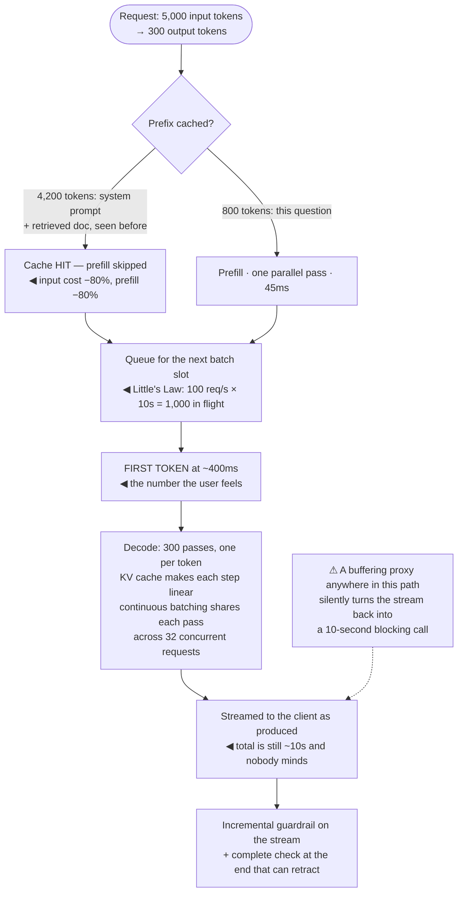

## The model

A model request has two phases with completely different characteristics. **Prefill** processes the
whole input in one parallel pass. **Decode** produces the output one token at a time, each token
requiring its own pass.

Prefill is compute-bound and fast. Decode is memory-bandwidth-bound and slow, and it is where
almost all of your latency lives. Every serving technique — batching, the KV cache, streaming,
speculative decoding — is an attempt to make decode less punishing.

## When to use it

You are responsible for how fast a model-backed feature feels, or what it costs to run.

1. **Is the problem time-to-first-token or total time?** They have different causes and different
   fixes, and conflating them wastes weeks.
2. **Are you serving the model or calling an API?** If you call a provider, batching and the KV
   cache are theirs — your levers are prompt structure, output length and concurrency.
3. **What is the concurrency?** [[Little's Law]] converts a request rate and a latency into
   in-flight requests, which is what capacity is actually about.

## Speedrun

**What** — two phases, and the techniques that make each one cheaper:

| | Prefill | Decode |
|---|---|---|
| Processes | the whole input at once | one output token per pass |
| Bound by | compute | memory bandwidth |
| Scales with | input tokens | **output** tokens |
| Typical | 50–300 ms | 10–50 tokens/second |
| Made cheaper by | prompt caching | batching, KV cache, speculation |

**How to make it faster**

1. **Stream.** The single largest perceived-latency win, and it changes nothing about the total.
2. **Cap output length.** It is the dominant term in both cost and total latency.
3. **Keep the stable part of the prompt first**, so it can be cached across requests and prefill
   is skipped for the repeated portion.
4. **Batch, if you serve the model.** **Continuous batching** raises throughput several-fold
   because decode leaves the GPU mostly idle otherwise.
5. **Parallelise independent calls.** Sequential model calls add; concurrent ones do not.
6. **Measure p95 per phase.** A slow p95 caused by queueing needs capacity; one caused by long
   outputs needs a shorter prompt. The aggregate number cannot tell you which.

**Why it works** — decode is dominated by moving model weights through memory rather than by
arithmetic, so a single request uses a fraction of the hardware. Everything above is a way of
getting more work out of the same memory traffic.

**The one thing to do first** — stream the output. Ten seconds of generation becomes half a second
to first word, and users describe the same system as fast instead of broken.

## Going deeper

### Prefill and decode, and why the asymmetry matters

**Prefill** runs the input through the model once. Every token attends to every earlier token, and
because they are all present, the whole thing parallelises — a 5,000-token prompt takes a couple of
hundred milliseconds, not 5,000 steps.

**Decode** cannot parallelise, by construction. Token *n+1* depends on token *n*, so each one is a
separate forward pass over the entire model. Thirty tokens per second is a typical rate, and a
300-token answer is therefore about ten seconds.

The bottleneck in decode is not arithmetic. Generating one token reads the whole weight matrix from
memory and does very little maths with it, so the GPU spends its time waiting on memory rather than
computing. That is why a single request uses a small fraction of the available hardware, and why
batching helps so much.

The practical consequence to carry around: **input length affects cost much more than latency;
output length affects both.** Doubling a prompt adds perhaps 100 ms. Doubling the answer adds
whole seconds.

### The KV cache

During decode, each new token attends to all previous tokens, which requires their key and value
vectors. Recomputing them every step would make generation quadratic. The **KV cache** stores them
instead, making each step linear.

It works, and it consumes an enormous amount of memory. The cache grows with sequence length times
batch size, and for a long context it can exceed the size of the model weights — which makes it, not
the model, the thing that limits how many concurrent requests a GPU can hold.

That is the real reason long contexts are expensive to serve. A 100k-token conversation carries a
100k-token KV cache, and its memory footprint reduces how many other users the same hardware can
serve.

Two mitigations are worth knowing by name. **Paged attention** allocates the cache in fixed blocks
rather than contiguous slabs, which removes the fragmentation that otherwise wastes most of the
memory. And **prefix sharing** lets requests with a common prefix — the same system prompt, the same
retrieved document — share those cache entries instead of duplicating them, which is the serving-side
mechanism underneath provider prompt caching.

### Batching, and why it is not what you expect

Because decode is memory-bound, running one request leaves the hardware mostly idle. Processing
sixteen requests together reads the weights once and applies them to sixteen token positions — the
same memory traffic doing sixteen times the work.

Naive static batching wastes most of that. Requests are grouped, and the batch runs until the
*longest* one finishes, so short requests sit completed and idle while a long one finishes
generating.

**Continuous batching** fixes it by working at the token level: a finished sequence leaves the batch
immediately and a waiting request takes its slot. Throughput improvements of several times over
static batching are typical, which is why every serious inference server does it.

The tradeoff is individual latency. A request in a batch of thirty-two generates slightly more
slowly than one running alone, so batching trades a little per-user latency for a lot of aggregate
throughput. That is almost always the right trade, and the knob is the maximum batch size.

**Speculative decoding** attacks the same bottleneck differently. A small draft model proposes
several tokens, and the large model verifies them in one pass — accepting the ones it agrees with.
Because verification is parallel, accepting three tokens costs roughly one decode step, and a
typical acceptance rate produces a two- to three-times speedup with identical output.

### Streaming, and perceived latency

**Streaming** returns tokens as they are generated rather than waiting for the complete response.
The total time is unchanged; the experience is transformed.

**Time to first token** becomes the number that matters. Ten seconds of blocking wait feels broken;
400 ms to the first word followed by a steady stream reads as fast, because a user reads at roughly
the rate a model generates.

It also changes what else you can do. Guardrails that must run on the complete output either block
the stream or run on the way past — and that is a real design decision, because a policy check that
requires the whole answer cannot be applied to a stream without buffering it. The common resolution
is streaming with a fast incremental check and a slower complete check that can retract.

Two things make streaming worse than it should be. Buffering anywhere in the path — a proxy, a
gateway, a framework's response wrapper — silently converts a stream back into a blocking call, and
it is a common misconfiguration. And a client that renders markdown only when complete throws away
the benefit at the last step.

## See it work

A support answer, traced through the serving path.

The cache hit is doing most of the cost work. Four thousand two hundred of the five thousand input
tokens are the same system prompt and retrieved document as the previous turn, so both the money and
the prefill time collapse to the 800 tokens that are actually new — which is why prompt layout
(stable first, variable last) is a performance decision.

Queueing is where capacity shows up, and it is the term people forget. A hundred requests a second
at ten seconds each means a thousand requests in flight simultaneously; if the server cannot hold a
thousand KV caches, the excess waits, and time-to-first-token grows even though nothing about the
model got slower.

Decode is three hundred separate forward passes and there is no way around that. What batching
changes is that each of those passes is shared across thirty-two users, so the memory traffic that
would serve one request serves thirty-two.

Streaming is what makes ten seconds acceptable, and the warning at the bottom is not hypothetical. A
proxy, gateway or framework that buffers the response reassembles the whole answer before sending
it — and the feature is back to a ten-second blank screen with no error anywhere to explain it.

## Next

Prompt, RAG or fine-tune is the decision that determines how many of these tokens you are serving
in the first place.
