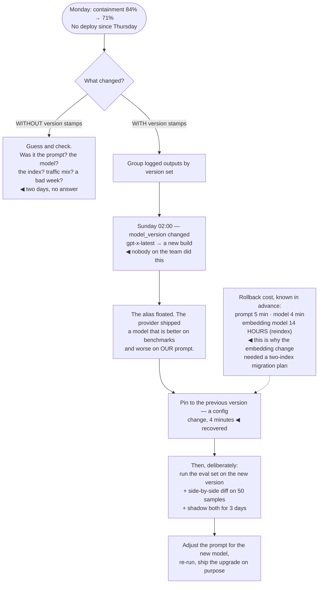

## The model

In ordinary software, output changes when code changes. In an AI system there are at least six
things that alter behaviour, and only one of them is your code.

The prompt, the model version, the embedding model, the index contents, the retrieval parameters,
the tool definitions. Several can change without a deploy — a provider updates a model, someone
edits a document, a config value is tweaked. A **silent change** is one that alters output with no
entry in your change log, and it is the failure mode this page exists to prevent.

## When to use it

Anything model-backed that is in production.

1. **What can change the output?** Enumerate it. If the list is shorter than six items you have
   probably missed the index or the embedding model.
2. **Can you tell which version produced a given output?** If a logged answer cannot be traced to
   the exact prompt, model and index that made it, debugging is guesswork.
3. **What is the rollback?** Reverting a prompt is easy. Reverting an embedding model means
   reindexing everything, and that is a plan you want before you need it.

## Speedrun

**What** — a version for every artifact that affects output, recorded on every request, with a
tested way back.

**How to build it**

1. **Enumerate the artifacts**: prompt, model, embedding model, index snapshot, retrieval
   parameters, tool definitions, guardrail configuration.
2. **Pin the model version explicitly.** A floating alias means the provider can change your
   system without telling you.
3. **Stamp every request** with the full **artifact version** set, and log it alongside the output.
4. **Gate every change on the [[eval]] set**, including changes that are "only" a model upgrade —
   especially those.
5. **Know the rollback cost per artifact.** Prompt: a deploy. Model: a config change. Embedding
   model: a full reindex, which is hours to days.
6. **Track provider deprecations.** A **deprecation window** is a deadline someone else set for
   you, and it arrives whether or not you planned for it.

**Why it works** — recording the version set makes every output explainable, and explainability is
what turns "quality dropped last Tuesday" from a mystery into a diff.

**The asymmetry to plan around** — some rollbacks are a deploy and some are a reindex. Knowing
which before you need one is the difference between ten minutes and two days.

## Going deeper

### Everything that can change the output

The full list, with what it takes to change and what it takes to undo:

| Artifact | Changes when | Rollback |
|---|---|---|
| Prompt | you deploy | a deploy — minutes |
| Model version | you change config, **or the provider does** | config — minutes |
| Model weights (self-hosted) | you deploy a checkpoint | redeploy — minutes |
| Embedding model | you deploy | **full reindex** — hours to days |
| Index contents | documents are edited, at any time | restore a snapshot, if you keep them |
| Retrieval parameters | a config change | config — minutes |
| Tool definitions | you deploy | a deploy |
| Guardrail configuration | a config change, often by someone else | config |

Two rows in that table are the dangerous ones, and both change without a deploy.

**The provider changing a model under a floating alias** means your system behaves differently on
Tuesday than it did on Monday, with no change on your side and nothing in your history to point at.
Pinning the version is the fix, and it is one line.

**Documents being edited** changes retrieval — and therefore answers — continuously, by people who
have no idea they are altering a production system. A support agent correcting a help article at
2pm changes what the assistant says at 2:01. That is usually desirable, and it needs to be visible:
index snapshots with timestamps, so an answer can be traced to what the index contained when it was
produced.

### Model pinning and the upgrade path

**Model pinning** means naming an exact version rather than an alias that tracks the latest. It
trades automatic improvements for the ability to know what you are running, and that trade is
correct for anything in production.

An upgrade then becomes a change you make deliberately, which means it gets the same treatment as
any other change: run the eval set, compare against the pinned version, look at the diffs, and ship
it through the same gates.

Upgrades are not uniformly improvements for *your* task. A newer model is better on average across
benchmarks and can be worse on your specific prompt — because your prompt was tuned against the old
one's quirks, or because a behaviour you depended on shifted. [[Hyrum's Law]] again: you depend on
more than you specified.

The evaluation for an upgrade needs both halves. The scored eval set catches aggregate regressions;
a side-by-side diff on a sample catches the changes a score averages away — different formatting,
different length, a refusal that used to be an answer.

Running both versions side by side for a period is the strongest version of this, and it is
[[shadow deployment]] applied to a model change: send real traffic to both, serve the incumbent,
compare. It costs double inference for a few days and removes essentially all the risk.

### The rollback plan, per artifact

A **rollback plan** that says "revert the deploy" is incomplete, because several of these artifacts
do not roll back with a deploy.

**Prompt, tool definitions, guardrail config** — a deploy or a config change. Minutes. These are the
easy ones and they cover most changes.

**Model version** — a config change if pinned, and effectively impossible if the provider has
retired the version you want to go back to. That is the reason to track deprecations rather than
discovering them.

**Embedding model** — the hard one. Vectors from two embedding models are not comparable, so
changing it means re-embedding the whole corpus, and rolling back means doing it again in reverse.
For a large index that is hours to days, during which retrieval is degraded or unavailable.

The mitigation is to build for it once: maintain two indexes during a migration, switch by config,
and keep the old one until the new one is proven. It costs storage and removes a class of incident
that otherwise takes a day.

**Index contents** — restorable only if you keep snapshots. Keeping them is cheap; discovering you
did not, after a bulk import corrupted the index, is not.

The general rule: **know the rollback cost before you make the change.** A change with a
five-minute rollback can be shipped on evidence that a change with a two-day rollback cannot.

### The version stamp, and why it is the whole trick

The single most valuable piece of infrastructure here is small: log the complete artifact version
set with every request.

```
request_id, timestamp,
prompt_version, model_version, embedding_model_version,
index_snapshot, retrieval_params_version,
tool_defs_version, guardrail_config_version
```

That turns the common production question — "quality dropped last Tuesday, what changed?" — into a
query. Group outputs by version set, compare scores, and the culprit is usually obvious in minutes
rather than after a day of speculation.

It also makes incident reports reproducible. A user's complaint from three weeks ago can be replayed
against the exact configuration that produced it, rather than against today's, which may behave
completely differently.

And it is what makes the [[error budget]] conversation possible at all. Attributing a quality
regression to a specific change requires knowing which changes were live when — without the stamp,
every regression is unattributable, and the budget becomes a number nobody can act on.

## See it work

A quality regression, debugged with and without version stamps.



The unstamped path is the one most teams are actually on, and it does not converge. Nothing was
deployed, so the deploy log is empty; the model, index and traffic mix are all suspects; and two
days of investigation ends in a plausible story rather than an answer.

The stamped path takes minutes because it is a grouping query. Outputs carry their version set, so
sorting by it shows a clean break at 2am Sunday on one field — and that field is the model version,
which nobody on the team touched.

The cause is the floating alias, and it is worth sitting with. The provider shipped a genuinely
better model, and it made this system worse, because the prompt had been tuned against the old
one's behaviour. Better on average is not better for you.

Recovery is a four-minute config change, and then the upgrade happens deliberately: eval set,
side-by-side diff on samples, three days of shadow traffic, prompt adjustments, and a decision. The
same change, made on purpose, is routine.

The cost table in the corner is the part to build before you need it. A four-minute model rollback
and a fourteen-hour embedding rollback are different categories of risk, and knowing which is which
is what determines how much evidence a change needs before it ships.

## Next

Reproducibility closes the group: what it takes to be able to answer "why did it say that" about a
specific output, weeks later.
