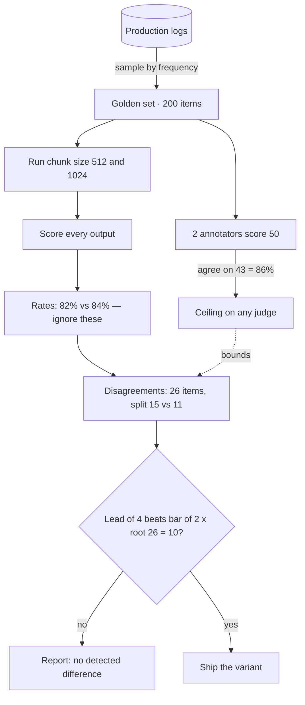

## The model

An eval measures how well a system does a task: you run it over a set of example
inputs and score the outputs. The result is a rate over that set — 82% of answers cited
the right document — not a pass or fail on any one case.

That makes it an estimate, not a fact. Measure the same system on a different 200
examples and the number moves. Everything else about evals follows from that one
property.

## When to use it

You are choosing between four things: eyeballing a few outputs, a deterministic test,
online monitoring, and a real offline eval.

1. **How many times will you change this system?** Once — spot-check a dozen outputs
   and ship. Repeatedly — build the eval, because its cost is paid once and saved on
   every later change.
2. **Is the output right-or-wrong, or better-or-worse?** A fixed correct answer is a
   test, and a test is cheaper. Only better-or-worse needs a rate over a sample.
3. **Would a bad output show up in production, and can you afford to let it?** Visible
   in metrics and cheap to roll back — monitor online instead. Invisible in aggregate,
   or expensive once shipped — catch it before release.

## Speedrun

**What** — a scored run of a system over a fixed set of examples, reported as a rate.

**How to build one**

1. **Sample 100–300 real inputs** from production logs, weighted by how often each kind
   actually occurs.
2. **Define one outcome a person can score in ten seconds.** Narrow beats rich.
3. **Have two people score the same 50 items.** Their agreement is the ceiling on every
   score that follows, automated or not.
4. **Score the full set.** That rate is your baseline, not your target.
5. **Re-run on the same set after each change.** Count only the items where the two
   versions disagree. If they disagree on N items, the winner has to lead by more than
   **2 × √N** — otherwise you saw noise, and you do not ship on it.

**Why it works** — one example proves nothing about a system that behaves differently
on every input. A rate over a representative sample is the smallest thing that
generalizes.

**Numbers that govern** — ignore the two headline rates and count disagreements. Thirty
disagreements splitting 18–12 is a lead of 6 against a bar of 2 × √30 ≈ 11, so it is
not a win. Two annotators who agree 85% of the time cap every downstream score at 85%.

**The one failure everyone hits** — the golden set gets built from examples that were
easy to collect, so it skews toward what somebody already thought of. The system then
gets tuned against a distribution nobody actually sends.

## Going deeper

The same five beats, with room to breathe.

### What it is, precisely

An eval is an estimate with error bars, even when nobody draws them. Run the same
system on a different sample and the number moves, which is why a percentage reported
without a sample size is close to meaningless.

That is also the difference from a test. A test asserts a fixed correct answer and
fails when it is absent. An eval estimates a rate over a population, so it carries
sampling error by construction rather than by accident.

### Building it: the judgment inside each step

**Sampling by frequency** means the set is dominated by common inputs, which is usually
right — you are optimizing for the traffic you actually have. If rare-but-expensive
cases matter too, hold a second small set for them rather than distorting the main one.

**The outcome** has to be cheap to score. "Did the answer come from the right document"
takes seconds. "Was the answer good" does not, and a rubric costing two minutes an item
means the eval is run once and then quietly abandoned.

**Agreement** that comes back low usually means the rubric is underspecified, not that
the annotators were careless. Fix the rubric and re-measure before blaming anyone or
reaching for a model judge.

**The baseline** is a starting point, not a target. Teams that pick a goal before
measuring end up designing an eval that hits the goal.

**Re-running on the same set** matters more than it sounds. Paired comparison removes
most of the sampling noise, because you only care about items where the two variants
disagree — a much smaller and steadier quantity than the two rates.

### Why a rate and not an example

A system that behaves identically on every input can be checked with one example. No
useful model-backed system behaves that way, so a single output tells you about that
output and nothing else.

The rate is what survives that variability. It is also what lets you compare two
versions honestly, because both were asked the same questions.

### Knowing your noise floor

Where 2 × √N comes from: on the items where the two versions agree, neither is
learning anything, so they carry no information about which is better. Only the
disagreements do. If the versions were truly equal, each disagreement is a coin flip,
and a fair coin flipped N times strays from even by about √N.

Two of those is the usual 95% bar. That is the whole derivation, and it is why the
headline rates are the wrong thing to look at — 82% versus 84% hides how many items
actually changed hands.

Comparing on the same set is what makes this work. Score two variants on two different
samples and you inherit the sampling error of both, which needs a far larger set to see
through.

For a single rate rather than a comparison, use the interval instead: 200 items at
around 80% has a 95% interval of roughly ±5.5 points. Report it, and never report a
winner without saying how many items separated them.

### How the golden set goes bad

An unrepresentative sample does not leave you ignorant. It leaves you confident and
wrong, which is strictly worse — with no number at all you would have been more careful.

Then Goodhart. Once the eval becomes the target it stops being a good measure, and
optimizing against a fixed set is exactly what this work looks like. The defense is a
held-out set nobody tunes against, rotated periodically.

## See it work

A retrieval-augmented support assistant, tuned roughly weekly. Run the three questions:
it changes often, its answers are better-or-worse rather than right-or-wrong, and a
wrong-but-plausible answer looks fine in production metrics. All three point the same
way, so build the eval.

Sampling: 200 questions pulled from logs by frequency, so common questions appear about
as often as they truly do. Outcome: did the answer come from the right document — a
binary a person scores in ten seconds.

Two annotators score the same 50 items first. They agree on 43, so 86% is the ceiling;
a judge scoring above that is not more accurate, it is reproducing one annotator's
bias.

Now the eval answers the question it was built for: chunk size 512 versus 1024. The
rates come back 82% and 84%, which looks like a win for 1024 and is not the number that
decides it.

The deciding number is the disagreements. The two versions differ on 26 items, splitting
15 to 11 — a lead of 4 against a bar of 2 × √26 ≈ 10. So the honest report is "no
detected difference," and chunk size gets decided on cost instead. "1024 wins" would
have been true of this sample and false of the system.

## Next

Building a golden set, LLM-as-judge, and calibrating a judge against humans are the
three pages that expand this one — the first on sampling, the second on automating the
score, the third on knowing when to believe it.
