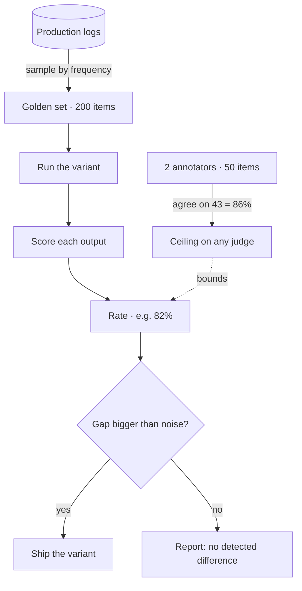

## The model

An eval measures how well a system does a task: you run it over a set of example
inputs and score the outputs. The result is a rate over that set — 82% of answers cited
the right document — not a pass or fail on any one case.

That makes it an estimate, not a fact. Measure the same system on a different 200
examples and the number moves. Everything else about evals follows from that one
property.

## When to use it

You are choosing between four things: eyeballing a few outputs, a deterministic test,
online monitoring, and a real offline eval.

1. **How many times will you change this system?** Once — spot-check a dozen outputs
   and ship. Repeatedly — build the eval, because its cost is paid once and saved on
   every later change.
2. **Is the output right-or-wrong, or better-or-worse?** A fixed correct answer is a
   test, and a test is cheaper. Only better-or-worse needs a rate over a sample.
3. **Would a bad output show up in production, and can you afford to let it?** Visible
   in metrics and cheap to roll back — monitor online instead. Invisible in aggregate,
   or expensive once shipped — catch it before release.

## Speedrun

**What** — a scored run of a system over a fixed set of examples, reported as a rate.

**How** — sample inputs from real traffic, define one outcome you can score, score
every item, report the rate. Re-run it after each change and compare the rates.

**Why it works** — one example proves nothing about a system that behaves differently
on every input. A rate over a representative sample is the smallest thing that does.

**The number that governs everything** — sample size. A 20-item eval moving from 14 to
16 has told you nothing, because that swing is noise. Teams ship on exactly that
evidence constantly.

**Agreement is your ceiling** — if two careful people disagree about whether an answer
was right, no judge can be more right than that disagreement allows. Measure agreement
before trusting any score, automated or not.

**The one failure everyone hits** — the golden set gets built from examples that were
easy to collect, so it skews toward what somebody already thought of. The system then
gets tuned against a distribution nobody actually sends.

## Going deeper

### When it is worth building one

An eval is a fixed cost paid up front — collecting the sample, defining the outcome,
scoring it once by hand — against a variable saving on every change that follows. One
change does not repay it. Twenty do.

The third alternative is not testing less, it is testing later. If a bad output appears
in production metrics within a day and rolling back is cheap, online monitoring catches
the same problem for a fraction of the work.

One filter before any of it: name the decision the number will change. If a move from
78% to 84% would not cause you to do anything differently, you are building a
dashboard, not an eval.

### Why a bad golden set is worse than none

An unrepresentative sample does not leave you ignorant. It leaves you confident and
wrong, which is strictly worse — with no number at all you would have been more careful.

### And then Goodhart

Once the eval becomes the target it stops being a good measure. That is Goodhart's Law,
and it applies here with full force, because optimizing against a fixed set is exactly
what the work looks like. The defense is a held-out set nobody tunes against.

## See it work

A retrieval-augmented support assistant, tuned roughly weekly. Run the three questions:
it changes often, its answers are better-or-worse rather than right-or-wrong, and a
wrong-but-plausible answer looks fine in production metrics. All three point the same
way, so build the eval.

The population is real support questions, so the set is sampled from logs by frequency
rather than hand-picked — 200 items, weighted so common questions appear about as often
as they truly do.

The outcome is deliberately narrow: did the answer come from the right document? A
person can score that in ten seconds, which matters more than it sounds, because an
outcome nobody can afford to score does not get scored.

Two annotators label the same 50 items first. They agree on 43. That 86% is the ceiling
— a judge scoring above it is not more accurate, it is reproducing one annotator's bias.

Only now does the eval answer the question it was built for: chunk size 512 versus
1024. If the gap is three items out of 200, that sits inside the noise, and the honest
report is "no detected difference" rather than "1024 wins."

## Next

Building a golden set, LLM-as-judge, and calibrating a judge against humans are the
three pages that expand this one — the first on sampling, the second on automating the
score, the third on knowing when to believe it.
