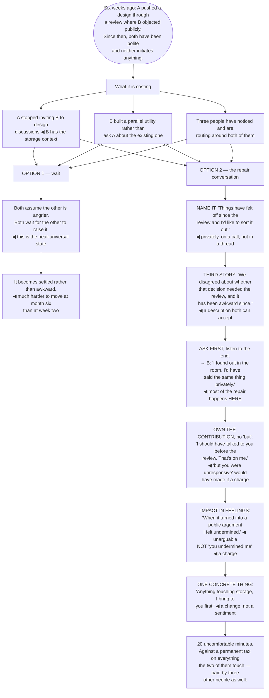

## The model

Technical disagreements resolve. What does not resolve on its own is the state after one — where
two people are now slightly avoiding each other, routing around each other's areas, and each
carrying a private story about what happened.

That state is expensive and it is invisible on any dashboard. **Avoidance cost** shows up as
decisions made without the person who had the context, work duplicated because asking was
uncomfortable, and a quiet drag on everything the two of you touch. Time does not fix it; a specific
conversation does, and almost nobody has that conversation.

## When to use it

You are avoiding someone, or noticing that they are avoiding you.

1. **What is it costing?** Meetings you have both stopped attending, questions not asked,
   information not shared. Naming the cost is what justifies the discomfort of fixing it.
2. **What is my contribution?** Not fault — contribution. There is almost always something, and
   finding it is what makes the conversation possible.
3. **What do they think happened?** Their version is coherent from where they stand, and you have
   almost certainly not heard it.

## Speedrun

**What** — one direct conversation, aimed at understanding rather than at winning.

**How to have it**

1. **Name that you are having it.** "I think things have been awkward since the review, and I would
   like to sort it out" is an opening most people are relieved to receive.
2. **Start from [[the third story]]** — how a neutral observer would describe what happened. Not
   your version, not theirs.
3. **Ask for their account first**, and actually listen to the end. Most of the repair happens
   here, before you say anything about your own view.
4. **Own your [[contribution not blame]].** What you did that contributed, stated plainly, without
   the "but you" clause attached.
5. **Say the impact on you** in feelings rather than accusations. "I felt cut out" is unarguable;
   "you cut me out" is a charge.
6. **Agree one concrete thing** for next time. Not a reconciliation — a specific behaviour, which
   is what actually changes anything.

**Why it works** — the two people are each carrying an incomplete story and assuming intent that
was not there. Exchanging the stories resolves most of it, and there is no way to exchange them
without a conversation.

**The reason it does not happen** — both people are waiting for the other to raise it, and both
assume the other is angrier than they are. Being the one who raises it is almost always well
received.

## Going deeper

### The third story

Stone, Patton and Heen's **third story** is the version a thoughtful observer would tell, and
starting there is what makes the conversation openable.

Your story has you being reasonable and them being difficult. Their story is the mirror image. Both
are coherent, both are honestly held, and opening with either one starts an argument about whose is
right.

The third story describes the difference without adjudicating it. "We have different views about
whether the schema split should have gone to the architecture review, and it has made the last few
weeks awkward" is something both people can accept as a description, which is the precondition for
talking about it.

Getting there requires actually constructing it, and the useful question is what a fair observer
would say who liked both of you. That framing removes most of the loaded language automatically.

The related move is separating impact from intent. You know their impact on you and you do not know
their intent — and the near-universal error is inferring hostile intent from negative impact.
"When the decision went ahead without me, I felt cut out" separates the two correctly; "you
deliberately went around me" merges them and is usually wrong.

### Contribution, not blame

**Contribution not blame** is the shift that makes repair possible, and it is not a euphemism.

Blame asks who is at fault, which is a question about the past that both people will answer in their
own favour. Contribution asks what each of us did that produced this, which is answerable, usually
by both, and points forward.

Your contribution is almost always findable and it is rarely the whole cause — you did not tell them
the design had changed, you raised it in a group rather than privately, you assumed they had read
the document. None of these makes you the villain, and all of them are things you could do
differently.

Naming yours first is what unlocks theirs. A conversation opened with "here is what I think I did
that contributed" is very hard to respond to with escalation, and it usually produces the
equivalent from the other side within a minute.

The clause to delete is "but". "I should have told you earlier, but you were not responsive" is not
an admission — everything before "but" is heard as a preamble, and the sentence is a charge with a
courtesy attached.

And there are genuine cases where the contribution is one-sided, including real misconduct. This
page is about ordinary professional friction; where the situation involves harassment, sustained
undermining, or anything that needs an authority, the correct move is a formal process rather than a
repair conversation.

### Having the conversation

The mechanics matter more than the words, and most of the failure is in never starting.

**Raise it directly, and soon.** Delay converts an awkward exchange into a settled state, and
settled states are much harder to move. Weeks, not months.

**Do it privately and synchronously.** Text strips tone, and this is the exchange where tone carries
most of the meaning. A call or a walk, not a thread.

**Name what you are doing at the start.** "I would like to clear the air about the review" removes
the ambiguity, and most people are relieved rather than defensive, because they have been carrying it
too.

**Ask first, and listen to the end.** Their account is the thing you do not have, and interrupting it
to correct a detail is the most common way this conversation fails. Most repairs happen during
their answer.

**Say the impact on you in feelings**, which are unarguable. Rosenberg's structure — observation,
feeling, need, request — is more useful here than anywhere else, because it removes the accusation
grammar that triggers defence.

**End with one concrete thing.** "Next time I will bring it to you before the review" is a change;
"let's communicate better" is a sentiment, and sentiments do not survive the next disagreement.

### When it does not work, and the cost of not trying

Some conversations do not repair the relationship, and it is worth knowing what to do then.

A professional working arrangement is a legitimate outcome. You do not have to like each other; you
have to be able to exchange information, and agreeing explicitly on how you will work together is
better than an unspoken cold war.

Escalating to a manager is the last resort and it is a real one. Two people who cannot work together
in a way that affects delivery is a management problem, and it is fair to say so — with the caveat
that escalating without having tried the direct conversation reads badly and usually is.

The thing to weigh against all of this is **avoidance cost**, which accumulates quietly. Decisions
made without the one person who had the context. Duplicate work because asking was uncomfortable. A
whole area of the system that nobody wants to touch because it means talking to them.

Edmondson's psychological-safety framing gives the organisational version: teams where people avoid
each other lose information before anything visible goes wrong, and the loss is not detectable in any
metric until it produces an incident.

And the asymmetry is worth naming plainly. The conversation is twenty uncomfortable minutes. The
avoidance is a permanent tax on everything the two of you touch, paid by everyone around you as well.

## See it work

Two engineers after a design review that went badly.

The costs listed at the top are the reason this is worth doing, and none of them appears on any
dashboard. A parallel utility built to avoid a conversation, and three uninvolved people routing
around both of them, is real spend that nobody has attributed to a review six weeks ago.

Waiting is what almost everyone does, and the mechanism is symmetrical: both assume the other is
angrier, both wait to be approached, and the state hardens from awkward into settled — which is much
harder to move.

Asking first is where the repair actually happens. B finding out in the room is the whole grievance,
and it is information A did not have — the technical disagreement was never the problem, and no
amount of relitigating the design would have found that.

"I should have talked to you before the review. That's on me." is one sentence with no "but"
attached. Adding "but you were unresponsive that week" — which may well be true — converts an
admission into a charge, and everything before the "but" stops counting.

And ending on one concrete behaviour is what makes it hold. "Anything touching storage, I bring to
you first" survives the next disagreement; "let's communicate better" does not survive the week.

## Next

The Persuasion group closes the section: constructing an argument, and what makes people change
their minds.
