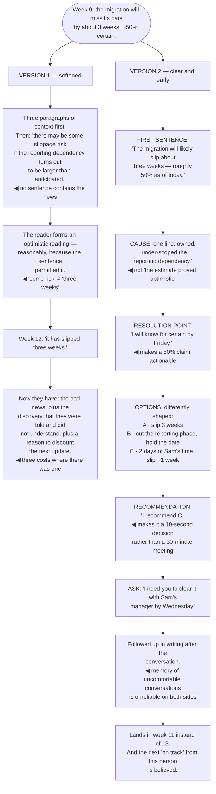

## The model

The instinct when delivering bad news is to soften it, and softening is usually done by making it
less clear. The recipient leaves the conversation not certain what they were told, discovers the
real version later, and now has both the bad news and the sense of having been managed.

**The clear statement** is the alternative: say the thing plainly, early, once, and then spend the
rest of the time on what happens next. Kindness lives in the timing, the preparation and the
follow-up — not in the vagueness of the sentence.

## When to use it

You know something someone does not want to know, and they need to.

1. **Have I said the actual thing?** Read your draft and find the sentence containing the news. If
   there isn't one, you have written around it.
2. **How early can they hear it?** Bad news is worth more the earlier it arrives, because early
   news is a decision and late news is an event.
3. **What is the ask?** Most bad news comes with something you need — a decision, a reprioritisation,
   or an acknowledgement. Say it.

## Speedrun

**What** — a short, plain delivery of an unwelcome fact, followed by options.

**How to do it**

1. **Say it in the first sentence.** "The migration will slip about three weeks." Everything else
   is support, and burying it means they read the support without knowing what it supports.
2. **Say it once, plainly.** Repeating and re-softening reads as anxiety and makes the news
   sound worse than it is.
3. **Deliver it early**, at the point you believe it rather than the point you can prove it. A
   probability with a date beats certainty that arrives too late to act on.
4. **Own your part explicitly** — no passive voice. "I under-scoped the data work" is credible;
   "the timeline was found to be optimistic" is not.
5. **Bring options, not just the problem.** Two or three, with a recommendation, converts a
   complaint into a decision someone can make in a minute.
6. **Say what you are doing about the general case.** For anything that will recur, the fix people
   want is the one that prevents the next one.

**Why it works** — the recipient's real cost is not the news, it is finding out late or finding out
twice. Clarity and earliness remove both, and neither requires the news to be less bad.

**The failure to watch for in yourself** — writing three paragraphs of context before the sentence
that matters. It feels considerate and it is you delaying the moment.

## Going deeper

### Softening into ambiguity

**Softening into ambiguity** is the specific failure, and it is worth separating from softening in
general.

Softening the *delivery* is fine and often right: choosing the setting, giving warning, being warm.
Softening the *content* until the recipient cannot tell what happened is the version that causes
damage, and the two feel identical from the inside.

The recognisable forms are all hedges. "There may be some slippage" instead of "we will miss the
date". "There are some concerns about performance" instead of "it is four times slower". "We should
probably think about whether the approach is right" instead of "I think this will not work".

The cost is that the recipient forms an optimistic reading — reasonably, because the sentence
permitted it — and finds out the real version later. Now they have the bad news, plus the discovery
that they were told and did not understand, plus a reason to discount what you say next.

The test is mechanical: read what you wrote and find the sentence containing the news. If you cannot
point at one sentence, the news is not in the document. If you can, check that it is near the top.

Fournier's framing for managers applies to anyone delivering upward: your job is to make sure the
person can act, and a message they have to decode has failed at that regardless of how carefully it
was worded.

### Early, and the probability form

**Bad news early** is worth more than bad news certain, and the instinct runs the other way — people
wait until they are sure, which is exactly when the options run out.

The arithmetic: a slip raised three weeks out is a decision — rescope, get help, reset expectations.
Raised in the final week it is an announcement, and the only available response is disappointment.

What makes early delivery writable is a probability and a resolution date. "There is roughly a 50%
chance we slip two weeks; the risk is the reporting dependency and I will know by Friday" commits to
nothing false, communicates the real state of knowledge, and gives a point where it resolves.

The objection to this is that it might recover and you will have worried people for nothing. That is
occasionally true and much cheaper than the alternative — and "the risk we flagged did not
materialise" is a completely fine outcome to report.

The credibility effect compounds, and it is the same one as in status updates. Someone who raises
risks early and is sometimes wrong is trusted; someone whose problems always arrive fully formed
and late is not, even when they are working just as hard.

### Owning it

**Owning it** is the part that determines how the news is received, and passive voice is the tell
for its absence.

"Mistakes were made", "the estimate turned out to be optimistic", "the timeline was found to be
unrealistic" — every one of these is a sentence written to avoid a subject, and everyone reads them
that way.

The direct version costs less than it feels like it will. "I under-scoped the data work" is a
complete sentence, it ends the question of who is responsible, and it moves the conversation
immediately to what happens next. Defensiveness is what extends these conversations.

Where the cause is genuinely external, say that too — plainly and without emphasis. "The provider
changed their API with two weeks' notice" is a fact, and stating it once is not the same as leading
with it.

The blame-free version applies to other people's parts as well. Naming an individual as the cause in
a written update is rarely necessary and always remembered; the [[blameless postmortem]] discipline
applies to bad news generally, not only to incidents.

And after owning it, stop. Extended apology reads as anxiety and shifts the conversation to
reassuring you, which is the opposite of what was needed.

### Options, and the shape of the conversation

Bad news without options is a complaint. The same news with two or three paths and a recommendation
is a decision someone can make in a minute.

The options should be real and differently shaped: slip the date, cut scope, add people, accept a
lower quality bar. Each has a different cost and the recipient usually knows which cost their side
can bear better than you do.

A recommendation belongs with them. "I recommend cutting the reporting phase" makes you easy to
back; three options with no view makes them redo your analysis, and that is the difference between a
ten-second decision and a thirty-minute meeting.

Sequence the whole conversation deliberately: the news, the cause in one line, the options, the
recommendation, the ask. Five parts, and it fits in a paragraph for most things.

Then follow up in writing, even if it was delivered in person. Memory of an uncomfortable
conversation is unreliable on both sides, and a short written summary of what was decided prevents
the second conversation about what the first one concluded.

## See it work

A slipping migration, told two ways.

Version one contains the information and does not deliver it. "Some slippage risk if the dependency
turns out to be larger" permits an optimistic reading, and a busy reader will take it — which means
the writer has technically told them and functionally has not.

The three costs at week twelve are the real damage. The slip itself was always going to happen; what
the softening added was the discovery of having been told, and the discount applied to everything
this person says afterwards.

The fifty-percent form is what makes week nine writable at all. Waiting for certainty means waiting
until week twelve, and the whole value of the news is in the three weeks where options still exist.

"I under-scoped the reporting dependency" is four words longer than the passive version and it ends
the question of responsibility immediately. Every conversation that starts with the passive version
spends its first few minutes establishing what the active version would have said.

And the recommendation is what converts the message from a problem into a decision. Three options
with a stated preference takes ten seconds to approve; three options with no view sends the reader
back to redo the analysis you already did.

## Next

Conflict and repair closes the group: what to do when a working relationship has actually broken
rather than merely been uncomfortable.
