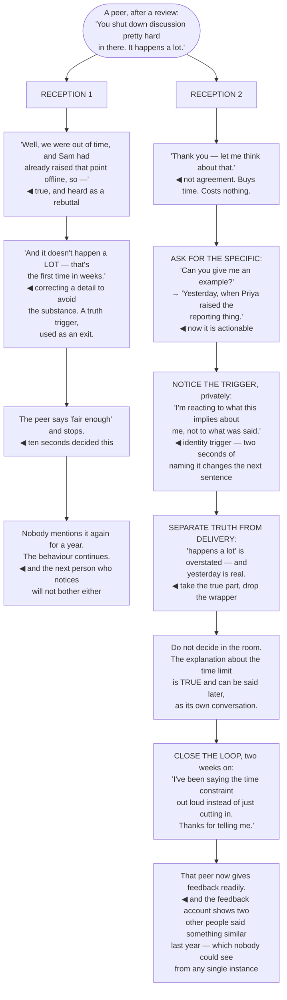

## The model

Feedback arrives as a small threat, and the reaction it produces is faster than the thinking about
whether it is true. That reaction — a flicker of defence, an explanation, a correction of a detail
— is what the giver remembers, and it is what determines whether they bother next time.

Stone and Heen's finding is that the difficulty is not the content, it is the collision between
wanting to improve and wanting to be accepted as you are. Both are real, both are simultaneous, and
the practical skill is buying enough time to think before the first reaction has already answered
for you.

## When to use it

Someone is telling you something about your work or how you operate.

1. **What is my first reaction doing?** Defending, explaining, or correcting a detail. All three
   are normal and all three read as "do not do this again".
2. **Which trigger is this?** Truth, relationship, or identity. Knowing which one fired tells you
   what you are actually reacting to.
3. **What is the smallest true part?** There almost always is one, and finding it is more useful
   than evaluating the whole.

## Speedrun

**What** — a short set of habits that keep the channel open while you work out whether the feedback
is right.

**How to receive it**

1. **Say thank you, and nothing else, first.** It buys time, it costs nothing, and it is the single
   most reliable way to keep the channel open.
2. **Ask for the specific.** "Can you give me an example?" Vague feedback is usually a compressed
   observation, and the example is the actionable part.
3. **Separate the truth from the delivery.** Badly delivered feedback can be entirely accurate, and
   rejecting it because of the wrapping loses the content.
4. **Do not decide in the room.** "Let me think about that" is a complete response and much better
   than an immediate agreement or defence.
5. **Notice which of [[the three triggers]] fired** — truth, relationship, or identity — because
   each has a different correction.
6. **Close the loop.** Come back later and say what you did with it. Nothing makes someone more
   willing to give you feedback again.

**Why it works** — the giver is deciding, in the first ten seconds, whether this was worth doing.
Everything here is about making that answer yes, independent of whether you end up agreeing.

**The response that costs the most** — the immediate explanation. It is usually accurate, it is
almost always heard as a rebuttal, and it teaches the other person that feedback is a debate.

## Going deeper

### The three triggers

Stone and Heen's model is that feedback fails to land for three distinguishable reasons, and telling
them apart is most of the skill.

**Truth triggers** — "that is just wrong". The reaction is to the content's accuracy, and it is
sometimes correct. The failure is using a wrong detail to dismiss the whole: "it was Tuesday, not
Monday" is a correction that lets you avoid the substance.

**Relationship triggers** — "not from you". The reaction is about who is giving it, their standing,
their motives, or something unresolved between you. The content may be fine and it cannot be heard
through the relationship.

**Identity triggers** — "this means I am not who I thought". The strongest and least visible. Feedback
that contradicts your self-image produces a disproportionate response, and the response feels like
it is about the content.

Naming which one fired is what creates the gap between reaction and response. "This is an identity
trigger, I am reacting to what it implies about me rather than to what was said" is a thought that
takes two seconds and changes the next sentence.

The identity trigger is worth extra attention because it is where the strongest reactions come from
and where the most useful feedback lands. Dweck's distinction is directly relevant: someone who reads
feedback as evidence about fixed ability experiences it as a verdict, while someone who reads it as
information about a current gap experiences it as usable.

### Separating truth from delivery

**Separating truth from delivery** is the discipline that recovers the most value, because badly
delivered feedback is common and frequently accurate.

Feedback arrives wrapped: in poor timing, in public, with an exaggeration, from someone whose motives
you doubt, or with an unfair generalisation attached. Every one of those is a reason to reject it,
and rejecting it loses whatever was true.

The move is mechanical. Ask what the smallest true part is, independent of how it was said. "You
never document anything" is unfair and almost certainly overstated — and the last three services did
ship without READMEs, which is the part worth keeping.

This is not the same as accepting bad delivery. You can take the content now and address the
delivery separately, later, as its own conversation. Doing both at once resolves neither.

The related trap is dismissing feedback because the giver has an imperfect view. They see a slice —
how you land in meetings, how your documents read from outside — and a partial view is not a wrong
one. It is frequently the only view of that slice you will ever get.

### The first ten seconds

The giver is deciding, immediately, whether this was worth doing. Everything in the first ten seconds
is that decision being made.

What signals "do not do this again": explaining, correcting a detail, going quiet and flat, the
visible flinch, or agreeing so fast it is obviously not real. All of them are normal reactions and
all of them are read as cost.

"Thank you" plus a pause is the whole technique. It is not agreement, it buys time, and it says the
attempt was welcome. Adding "let me think about that" makes it a complete response that commits to
nothing.

**Asking for the specific** is the second move and it does double duty. "Can you give me an example?"
gets you the actionable version of vague feedback, and it demonstrates that you are engaging rather
than deflecting.

Explaining is the hardest instinct to suppress because the explanation is usually true. There was a
deadline, you had raised it, the context was different. Say it later if it matters; said now, it is
heard as a rebuttal regardless of intent, and it is the single most common reason people stop giving
feedback.

### Asking for it, and closing the loop

Nobody gives senior people feedback by default, and the more senior you are the less arrives
unprompted — which is exactly when the blind spots get expensive.

Asking generally does not work. "Any feedback for me?" produces "no, you're doing great" almost
every time, because it is a hard question to answer on the spot.

Specific questions work. "What is one thing I could have done better in that review?" "What should I
stop doing?" "If you were me, what would you be worried about?" Each is narrow enough to answer and
gives the person a defined, safe thing to say.

Then close the loop, which is the step almost nobody takes. Coming back two weeks later with "I
thought about what you said and here is what I changed" does more for the relationship than the
change itself — it proves the feedback went somewhere.

Keeping a **feedback account** is worth the small effort. A running note of what people have told
you, revisited quarterly, surfaces the pattern that any single piece of feedback cannot: three
people saying variations of the same thing over a year is a signal, and none of the three
individually looked like one.

## See it work

The same feedback, received two ways.

Reception one is made of true statements. There was a time limit, Sam had raised it offline, and the
frequency claim was overstated — and every one of those, said in the first ten seconds, is heard as
a reason not to have brought it up.

Correcting "a lot" is the specific move worth noticing. It is a truth trigger being used as an exit:
disputing an inaccurate quantifier is much easier than engaging with the accurate observation
underneath it.

The peer saying "fair enough" and stopping is the whole cost, and it is invisible. Nothing appears to
have gone wrong; the feedback simply never comes again, from that person or from the next one who
notices and hears about it.

"Thank you, let me think about that" commits to nothing. It is not agreement, it does not concede
the frequency claim, and it keeps every option open — while signalling that the attempt was welcome,
which is the only thing being decided in that moment.

And the loop closed two weeks later is what converts one exchange into a channel. Saying what you did
with it proves the feedback went somewhere, and the feedback account is what reveals the pattern —
three people over a year, none of whom individually looked like a signal.

## Next

Delivering bad news covers the case where you are the one with information nobody wants, and the
temptation is to soften it into uselessness.
