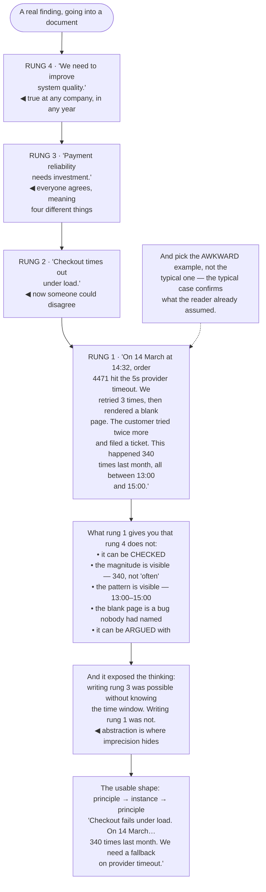

## The model

"We should improve our error handling" produces agreement and no action. "When the payment provider
times out, we retry three times and then show the user a blank screen" produces a fix.

**Concreteness** is the difference, and it is not a style preference. Abstract statements are
harder to understand, easier to agree with without understanding, and impossible to disagree with
usefully — because there is nothing specific to disagree about. Concrete statements can be checked,
argued with, and acted on, which is why they are what changes anything.

## When to use it

Whenever you notice yourself writing a sentence nobody could object to.

1. **Could someone disagree with this?** If not, it is too abstract to be useful. Unfalsifiable
   sentences feel safe and carry nothing.
2. **Can the reader picture it?** A specific scene — a user, a screen, a timestamp — is understood
   in a way a category never is.
3. **Is there a number?** Most abstract claims have a number hiding behind them, and the number is
   almost always the more persuasive form.

## Speedrun

**What** — replacing categories with instances, and adjectives with measurements.

**How to do it**

1. **Name the number.** "Slow" becomes "4.2 seconds at p95". "Often" becomes "eleven times last
   month". The number is usually already in your head.
2. **Use one real example rather than describing the class.** One traced request beats a paragraph
   about request handling.
3. **Put a person in it.** "A customer clicking Refund at 2pm on Friday" is processed differently
   by a reader than "refund requests".
4. **Replace adjectives with the evidence for them.** If something is "fragile", say what broke
   and when — the adjective was your conclusion, and the reader wants the input.
5. **Descend the [[abstraction ladder]] one rung when stuck.** Every abstract sentence has a more
   specific version underneath it, and it is usually better.
6. **Keep the abstraction, then illustrate it.** The principle plus one concrete instance beats
   either alone.

**Why it works** — comprehension and memory both run on specifics. Abstractions are compressed
summaries of specifics, and a reader who has not seen the specifics cannot decompress them.

**The tell that you are too abstract** — the sentence would be true at any company, in any year.
That is not a general insight; it is a sentence with the content removed.

## Going deeper

### Why abstract sentences fail

Three separate failures, and they compound.

**They are harder to understand.** A concrete statement connects to something the reader can
picture; an abstract one has to be decompressed into an example before it means anything, and
readers frequently do not do that work.

**They are agreed with rather than understood.** "We should invest in reliability" gets nods from
everyone, including people who mean completely different things by it. The agreement is real and it
is agreement on a word, which is why the plan falls apart at the first specific decision.

**They cannot be argued with.** Disagreement is where communication does its work — it surfaces
the assumption nobody stated. A sentence nobody can object to has removed that mechanism, and the
objection surfaces later, during implementation, at much higher cost.

There is a fourth, subtler cost: abstraction is where imprecise thinking hides. Writing "we need
better observability" is possible without knowing what you need; writing "we cannot tell which of
the three services dropped the request" requires knowing it.

Which makes this a thinking tool as much as a writing one. Forcing a sentence to become concrete
frequently reveals that you did not actually know what you meant — and that is the moment worth
having, before the reader has it for you.

### The abstraction ladder

Hayakawa's **abstraction ladder** is the useful mental image: any subject can be described at many
levels, from a specific instance up to an increasingly general category.

Bessie the cow → cow → livestock → farm asset → asset. The engineering version: the 14:32 timeout
on order 4471 → checkout timeouts → payment reliability → system reliability → quality.

Higher rungs cover more and say less. Each step up loses information, and by the top the sentence
is true of everything and useful for nothing.

Good writing moves between rungs deliberately: state the principle, then descend to an instance,
then come back up. The instance is what makes the principle mean something, and the principle is
what makes the instance more than an anecdote.

The failure mode is writing entirely at the top, which is what most institutional prose does. The
correction is mechanical — for each abstract sentence, ask "such as?" and put the answer in.

The opposite failure exists and is rarer: an unstructured pile of specifics with no organising
claim. Detail with no thesis is a log file, and the reader has to do the abstraction themselves.

### Numbers

**Name the number** is the highest-return single habit in technical communication, because most
abstract engineering claims have a number behind them that the writer already knows.

"The queries are slow" → "the median query takes 4.2 seconds; last quarter it was 900 ms."
"It fails sometimes" → "eleven times last month, all during the nightly batch."
"This will take a while" → "about three weeks, and the risk is the schema migration."

Three things happen when the number appears. The claim becomes checkable. The magnitude becomes
visible — "slow" covers everything from 200 ms to four minutes, and the response differs
enormously. And the reader can weigh it against other things, which is what they were going to have
to do anyway.

Comparisons make numbers land harder than the numbers alone. "4.2 seconds" is a fact; "4.2 seconds,
where the rest of the page renders in 300 ms" is an argument. An unanchored number is only slightly
better than an adjective.

Honesty about precision matters and is easy. "Roughly three weeks" and "between two and five weeks,
depending on the schema" are both more credible than a confident single number nobody believes —
and the range communicates the uncertainty that the point estimate was hiding.

### Examples, and how to choose them

**The specific example** is the workhorse, and which one you pick decides how much work it does.

Pick the case that is awkward rather than the case that is typical. A typical example confirms what
the reader already assumed; the awkward one is where the reader's model and yours diverge, which is
the thing you are actually trying to fix.

Make it real where you can. An actual traced request, an actual customer complaint, an actual
timestamp — real examples carry details that invented ones do not, and those details are usually
where the insight is.

One good example beats three adequate ones. Three examples of the same point cost three times the
attention and add almost nothing, and the reader stops reading examples after the first.

Put a person in it. "A customer clicking Refund at 2pm on Friday, who sees a spinner for forty
seconds and then a blank page" is processed differently from "refund request failures" — concrete
scenes engage more of the reader's machinery than categories do.

And the pairing is what makes it durable: state the general point, give the one specific instance,
then state the general point again in one line. The example makes it understood; the restatement
makes it portable.

## See it work

The same finding, at four rungs of the ladder.

Rung four is the sentence most likely to be written and least likely to change anything. Nobody
disagrees with improving quality, which means it produces no discussion, no objection, and no
decision — the agreement is total and empty.

Rung three is where most engineering advocacy sits, and it is worse than it looks. "Payment
reliability needs investment" gets unanimous support from people who mean retry logic, a different
provider, better monitoring and more headcount respectively — and the plan collapses at the first
specific choice.

Rung one carries four things the higher rungs cannot: the number, which makes magnitude visible;
the time window, which is a diagnostic nobody had noticed; the blank page, which turns out to be a
separate bug; and falsifiability, since someone can now check the claim and say it is wrong.

The diagnostic note is the part worth internalising. Rung three was writable without knowing the
13:00–15:00 pattern; rung one was not. Forcing the sentence to become concrete forced the
investigation, and the investigation found the actual cause.

And the usable shape is not rung one alone. Principle, instance, principle — the general claim
makes it portable, the instance makes it real, and the restatement is what the reader repeats to
someone else.

## Next

Cutting covers what to do with the draft this produces, since concrete writing is longer before it
is edited.
