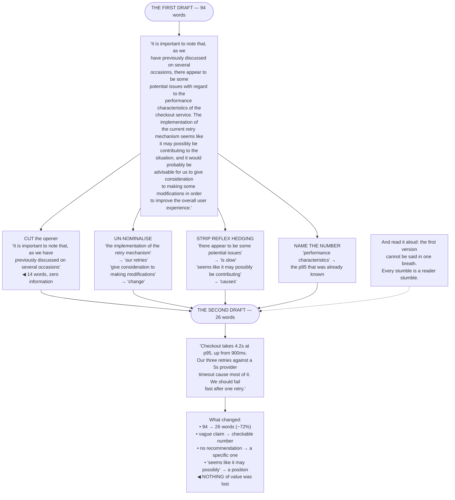

## The model

A first draft records how you worked something out. A second draft delivers the result. They are
different documents, and the gap between them is mostly deletion.

Zinsser's claim is the strongest version: the secret of good writing is stripping every sentence to
its cleanest components. Most of what you cut is not wrong — it is throat-clearing, hedging,
repetition, and the scaffolding you needed while thinking. All of it was useful to write and none
of it is useful to read.

## When to use it

You have a draft and are about to send it.

1. **Where does the document actually start?** Usually two or three paragraphs in. The opening is
   frequently you warming up.
2. **What does each paragraph do?** If you cannot say, it is a candidate for deletion rather than
   for rewriting.
3. **Which hedges are real?** Some mark genuine uncertainty and belong. The rest are reflex, and
   they cost you credibility while adding words.

## Speedrun

**What** — a pass over the draft aimed at removal, done separately from writing it.

**How to cut**

1. **Delete the first two paragraphs** and see if anything is lost. **Throat-clearing** —
   background, context-setting, "as we all know" — is where drafts start and documents should not.
2. **Cut every word that does not change the meaning.** "In order to" → "to". "Due to the fact
   that" → "because". "It is important to note that" → nothing.
3. **Un-nominalise.** **Zombie nouns** — "the implementation of", "the utilisation of" — hide the
   verb. "We implemented" is shorter and says who did it.
4. **One idea per sentence.** Sentences carrying two ideas make the reader hold one while parsing
   the other, and the second one is usually lost.
5. **Strip reflex hedging.** "It seems like there may possibly be an issue" is "this is broken"
   with four words of anxiety attached.
6. **Read it aloud.** Every place you stumble is a place the reader stumbles, and it is the most
   reliable defect detector available.

**Why it works** — reading is effortful, and every unnecessary word spends effort that was needed
for the next sentence. Cutting does not make the document shorter so much as it makes the remaining
sentences easier to get through.

**The target** — most first drafts lose 20–40% with nothing of value gone. If yours never does, you
are editing rather than cutting.

## Going deeper

### Where the document starts

Almost every draft opens with material the writer needed and the reader does not.

The pattern is consistent — background nobody asked for, a restatement of the problem everyone
already knows, an apology for the length, a summary of what the document is about to do. All of it
is the writer getting into position.

The test is mechanical: delete the first paragraph and read it again, then delete the next one. You
will usually find the document starts two or three paragraphs in, at the first sentence that
carries actual content — which is where it should have opened.

This compounds with leading with the answer. If the conclusion is in the first sentence, everything
that would have preceded it is by definition throat-clearing, and the structure does the cutting for
you.

The counterexample worth respecting: sometimes a sentence of context is genuinely required, because
the reader will not otherwise know what you are talking about. One sentence. If it takes a
paragraph, the audience model is wrong rather than the opening.

### The sentence-level cuts

Williams' and Zinsser's specific targets, in rough order of frequency.

**Zombie nouns** — verbs turned into nouns, which then need a weak verb to prop them up:
"performed an analysis of" → "analysed", "made a decision" → "decided", "the implementation of the
feature was completed" → "we shipped the feature". The nominalised version is longer, vaguer, and
usually hides who did it.

**Empty openers.** "It is important to note that", "It should be pointed out that", "As previously
mentioned". These carry no information and are pure delay — delete and the sentence begins where it
should.

**Redundant pairs.** "Each and every", "first and foremost", "plan and prepare". Pick one.

**Prepositional pile-ups.** "The reduction of the latency of the response of the service" →
"reducing service response latency", or better, "making the service respond faster".

**Reflex hedging.** "It seems like there might possibly be some issues with" is eight words of
throat-clearing around "this is broken". Genuine uncertainty deserves a hedge; reflexive uncertainty
costs credibility and words simultaneously.

**Adverbs propping up weak verbs.** "Ran very quickly" → "sprinted". "Significantly reduced" →
give the number. An adverb is often a signal that the verb, or the missing measurement, is doing
too little work.

### Sentences and paragraphs

**One idea per sentence** is the structural rule underneath most of the above.

A sentence carrying two ideas forces the reader to hold the first while parsing the second, and
short-term memory is small enough that the first one is frequently dropped. Splitting costs a full
stop and recovers the idea.

Length is a proxy rather than the rule. A forty-word sentence with one idea and clear structure is
fine; a twenty-word sentence with three clauses and two ideas is not. What matters is how many
things the reader has to hold at once.

Varying length is what makes prose readable rather than mechanical. All-short reads as staccato and
condescending; all-long is exhausting. A short sentence after several long ones lands hard, which
is useful when you want something to land.

Paragraphs need the same discipline: one point each, stated in the first sentence. A paragraph
whose point arrives at the end is a small version of building to the conclusion, and skimmers —
which is most readers — miss it.

Williams' cohesion principle is worth knowing because it explains why some correct prose still
reads badly: sentences should start with the familiar and end with the new. Old information first
gives the reader a hook; new information last gives it emphasis. Prose that violates this is
grammatical and feels like wading.

### Reading aloud, and knowing when to stop

Reading aloud is the highest-yield editing technique and almost nobody does it.

It catches things silent reading cannot:

- sentences too long to say in one breath
- awkward clause order that the eye skips and the mouth cannot
- repeated words in adjacent sentences
- rhythm that lands flat where you wanted emphasis

Every stumble marks a place the reader will also stumble, without knowing why.

Time between drafts helps for the same reason: distance restores some of what the curse of
knowledge removed. Even an hour is enough to read your own sentences closer to how a stranger would.

Knowing when to stop matters too. Cutting has diminishing returns and eventually starts removing
things the reader needs — the example that made the point land, the sentence that acknowledged the
counterargument. The signal is when you are trading clarity for brevity rather than gaining both.

Orwell's last rule remains the correct final check: break any of these rules sooner than say
anything outright barbarous. The rules are heuristics for the usual case, and a sentence that
follows all of them and reads badly is still a bad sentence.

## See it work

One paragraph, cut.

The original is not badly written by the standards most engineering prose is held to. It is polite,
hedged, and accurate — and it takes ninety-four words to say something that fits in twenty-six,
while committing to nothing.

The opener is fourteen words of pure delay. "It is important to note that, as we have previously
discussed on several occasions" tells the reader nothing except that the writer is warming up, and
deleting it loses no information at all.

The hedging is where the credibility goes. "There appear to be some potential issues" and "seems
like it may possibly be contributing" are not caution — they are a writer avoiding a position, and
a reader who cannot tell what you think cannot act on it.

Naming the number is what turns the paragraph from an impression into an argument. The p95 was
already known when the first draft was written; "performance characteristics" is what that number
looks like after it has been abstracted away.

And the second draft ends with a recommendation, which the first one never reached. Seventy-two
percent shorter, checkable, and it says what to do — the cuts did not compress the meaning, they
uncovered it.

## Next

Structure and signposting covers the level above the sentence: how a reader navigates a document
they are not going to read in order.
