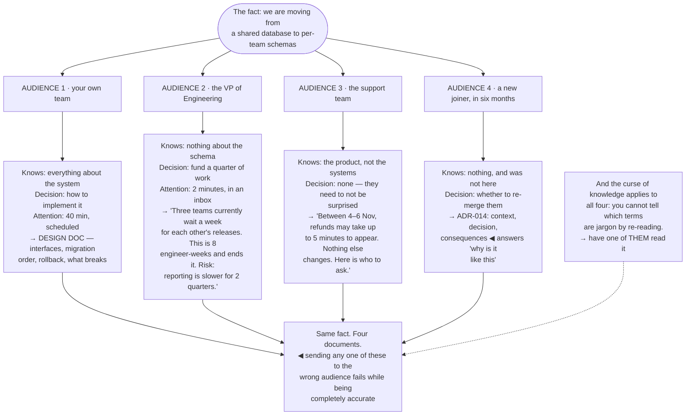

## The model

There is no such thing as clear writing in the abstract. There is writing that is clear *to a
particular reader*, and the same paragraph can be perfect for one and useless for another.

An **audience model** is the small set of things you have to know before you can write anything:
what they already know, what they have to do with this, and how much attention they will give it.
Getting those three wrong is the cause of most communication that fails while being technically
accurate — which is the most frustrating kind, because nothing in the text looks wrong.

## When to use it

Before writing or presenting anything to someone who is not on your team.

1. **What do they already know?** Every term you use that they do not have is a stall. Every term
   you explain that they already have is condescension.
2. **What decision do they face?** Most communication exists to help someone act. If you cannot
   name the decision, you are writing for yourself.
3. **How much attention will they give it?** Two minutes in a crowded inbox and forty minutes in a
   review are different documents, not different lengths of the same one.

## Speedrun

**What** — three facts about the reader, decided before the first sentence.

**How to build the model**

1. **Name one specific person**, not a category. "Engineers" is too broad to write for; "the
   platform lead who has not seen this system" is writable.
2. **List what they know and do not know.** The unfamiliar terms are your explanation budget, and
   it is smaller than you think.
3. **Name [[the decision they face]]**, in their words. Approve it, fund it, use it, stop
   worrying about it, do nothing differently.
4. **Estimate the attention.** Then write to that, and put the most important thing where a
   skimmer will hit it.
5. **Pick the [[register]] deliberately** — how formal, how hedged, how technical. It signals who
   you think you are talking to as much as the content does.
6. **Check against the curse of knowledge.** You cannot un-know what you know, so the only
   reliable test is having someone from the audience read it.

**Why it works** — comprehension depends on connecting new information to what someone already
has. Writing that does not know what they already have is guessing at the connection point.

**The habit that catches the most** — write the reader's name at the top of the draft, and delete
it before sending. Everything you write under it is aimed at a person rather than at nobody.

## Going deeper

### The curse of knowledge

The Heaths' term names the single biggest obstacle: once you know something, you cannot reconstruct
what it was like not to know it, and you systematically overestimate what is obvious.

It produces specific, recognisable damage:

- jargon that feels like normal vocabulary
- steps omitted because they are automatic to you
- context assumed because you have been living in it for six weeks
- abbreviations nobody outside your team has met

You cannot introspect your way out of it — that is what makes it a curse rather than an oversight.
The knowledge is not available for inspection, so re-reading your own draft feels fine no matter
how much is missing.

The only reliable defences are external. Have someone from the actual audience read it and mark
where they stopped. Watch someone use the document rather than asking whether it was clear. Or read
it aloud to someone unfamiliar and notice where you find yourself adding an explanation — that
explanation belongs in the text.

The cheapest partial defence is a written list of assumed knowledge. Naming the five things you are
taking for granted makes at least some of them visible, and usually one of them is not safe.

### What they know, and the explanation budget

The knowledge question splits into three groups and each needs a different treatment.

**What they know as well as you** — do not explain it. Explaining something a reader already knows
is not merely wasteful; it signals you have not thought about who they are, and it costs attention
you need later.

**What they do not know and need** — this is your **explanation budget**, and it is small. A reader
absorbs a couple of genuinely new concepts in a short document. If your list has seven, either the
document is longer than you planned or some of them have to be cut.

**What they do not know and do not need** — leave it out. The most common failure in engineering
writing is including detail because it was hard-won rather than because the reader needs it.

The budget is what forces the useful decisions. When three concepts have to become one, you find
the framing that makes the other two unnecessary — and that framing is usually the best thing in
the document.

A related discipline: introduce terms at the point of use rather than in a glossary at the front.
Definitions read in advance do not stick; definitions read at the moment they are needed do.

### The decision they face

Almost every piece of workplace communication exists so that someone can act, and **the decision
they face** is the organising fact.

Naming it changes what belongs in the document. If they are approving a budget, they need cost,
risk and alternatives — not the architecture. If they are going to use the thing, they need how to
start and what to do when it breaks — not why it was built that way.

The question is worth asking literally: what do I want them to do differently after reading this?
"Nothing, I want them to know" is a legitimate answer occasionally and is usually a sign that the
document has no purpose and will not be read.

Minto's framing is that the structure should answer the reader's question, and their question is
determined by their decision. A document structured around how you did the work answers a question
nobody asked.

The failure this prevents is the comprehensive document. Written for no specific decision, it
includes everything, satisfies nobody, and gets skimmed — which means the part that mattered was
read at the same depth as the part that did not.

### Attention and register

Attention is a budget you are spending, and misjudging it wastes the whole document.

Two minutes in a crowded inbox is a different artifact from forty minutes in a scheduled review. The
short one needs the conclusion first, one supporting paragraph, and a link; the long one can build.
Writing the long one and sending it into the short slot means the first paragraph is all that is
read — which is fine if you led with the answer and fatal if you did not.

**Register** is the other dimension: how formal, how hedged, how technical, how much you assume.
It is read as a signal about the relationship, not only about the content — over-formality reads as
distance, and excessive casualness in a serious document reads as not taking it seriously.

Hedging deserves specific attention because engineers over-hedge. "It seems like there might
possibly be an issue with" says less than "this is broken" and reads as either uncertainty or
evasion. Hedge where you are genuinely uncertain, state plainly where you are not, and make the
difference visible.

Pinker's argument for the classic style is useful here: write as though showing the reader
something you can both see. It produces a register that is confident without being pompous, and it
is a much better default than the passive institutional voice most technical writing drifts toward.

## See it work

One technical decision, four audiences.

The four documents share a fact and nothing else — not the structure, not the length, not the
vocabulary. Treating the fact as the content, and the audience as a formatting question, is what
produces one document sent to everyone that works for nobody.

The VP version is two sentences because two minutes is the honest attention estimate. It contains
no architecture at all, because the decision is funding — and the risk is stated explicitly, which
is what makes it a decision rather than a request.

The support version has no decision attached, which changes its job entirely. They need to not be
surprised and to know who to ask; a paragraph about schemas would be accurate, unread, and would
train them to skip the next one.

The new joiner in six months is the audience people forget and the one the [[architecture decision
record]] exists for. They are deciding whether the split can be undone, and the only useful document
is the one that records why it was made.

And the curse-of-knowledge note applies to every branch. Re-reading your own draft cannot tell you
which words are jargon, because they are not jargon to you — the only test that works is watching
someone from that audience read it.

## Next

Concrete over abstract covers the sentence-level version of the same problem: why a specific example
lands and a general principle does not.
