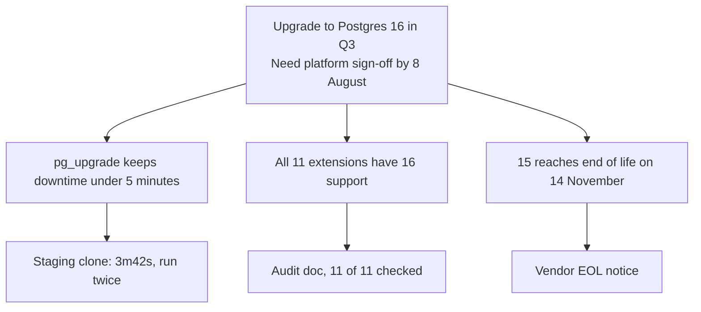

## The model

Most engineering writing is organised the way the thinking happened: background, then
investigation, then conclusion. Readers need the opposite order, because they are
deciding at every line whether to keep going.

Leading with the answer means the first sentence carries the conclusion and the ask.
Everything after it exists to support that sentence, and anything that supports nothing
is cut.

## When to use it

You are choosing between three openings: lead with the answer, build to it, or open
with the question.

1. **Does the reader have to decide something?** Then lead with the answer, and say
   what you need from them in the same sentence.
2. **Is the sequence itself the lesson?** A postmortem or a debugging write-up should
   build chronologically — the reader needs to feel the wrong turns to learn anything
   from them.
3. **Are you asking for the framing rather than the decision?** Then open with the
   question. An answer you have not committed to reads as false confidence.

## Speedrun

**What** — the conclusion in the first sentence, then its support. Military staff
writing calls it **BLUF**, bottom line up front; newspapers call the same shape the
**inverted pyramid**; Barbara Minto formalised it at McKinsey as the **pyramid
principle**.

**How to restructure anything**

1. **Write the last paragraph first** — the recommendation, in one sentence, with the
   ask attached.
2. **Move it to the top and delete everything above it.** Background, "as you know",
   and the story of how you got here all go.
3. **Give it three supporting points**, one sentence each, each independently true.
4. **Put the evidence directly under its point**, not in a separate section.
5. **Cut anything that supports no point above it.** If it supports nothing it is not
   context, it is noise.

**SCQA, when the answer needs a run-up** — Minto's four-sentence opener: *Situation*
(what we already agree on), *Complication* (what changed), *Question* (what that forces
us to decide), *Answer* (your recommendation). Four sentences and the reader knows
exactly why they are reading.

**Why it works** — a reader can stop and a listener mostly cannot, so the first
sentence is the only one you are guaranteed. A reader who already knows the conclusion
also processes the evidence as verification, which is fast, rather than as a mystery,
which is slow.

**Numbers that govern** — three supporting points, occasionally four. Working memory
holds roughly four chunks at once (Cowan, 2001 — the familiar "seven plus or minus two"
is an overestimate), so a fifth point pushes the first one out.

**The one failure everyone hits** — burying the ask. Eight hundred words ending in
"thoughts?" hands the reader the job of working out what you want, and they will not do
it.

## Going deeper

### What leading with the answer actually means

Three names for one idea, arrived at separately by three fields. **BLUF** is US military
staff-writing doctrine, where a reader may act on the first line and never reach the
second. The **inverted pyramid** is newspaper practice: a story written so an editor can
cut from the bottom without losing anything essential.

**Minto's pyramid principle** is the version with the most structure behind it. She
taught it at McKinsey in the 1970s, and the shape is literal — one governing claim on
top, a few supporting arguments beneath, evidence beneath those, with every level
summarising the level below it.

One rule makes it a pyramid rather than a list. Each point must independently support
the claim above it, and together they must be sufficient. If you can delete a point and
the conclusion stands equally well, it was decoration.

### The procedure, and the judgment inside each step

**Writing the last paragraph first** works because the conclusion is usually the only
part you actually know. Engineers write chronologically because that is how the
investigation felt, and the result is a document whose most important sentence is the
one most likely to go unread.

**Deleting everything above it** is the step people resist hardest, and the reason has a
name. The background feels necessary because it was necessary *to you* — that is the
**curse of knowledge**, the difficulty of modelling not knowing something once you know
it. Context that is load-bearing for the author reads as throat-clearing to a reader who
only needs the decision.

**Three points, one sentence each** is a real test rather than a formatting preference.
If a point takes a paragraph to state, it is not a point — it is a section, and it
usually contains two points wearing one coat.

**Evidence under its own point** keeps the document readable at two depths. A reader who
trusts you stops at the points; a reader who does not drops into the evidence exactly
where their doubt is, without hunting through an appendix.

**Cutting what supports nothing** is where documents lose a third of their length. The
test is mechanical: name the point above it. If you cannot, it goes, however interesting
it was to discover.

### SCQA, in full

Sometimes the answer needs a run-up, because the reader does not yet know there is a
question. Minto's opener does that in four sentences without becoming a preamble.

- **Situation** — something the reader already believes, stated plainly. It must be
  uncontroversial; you are establishing shared ground, not arguing.
- **Complication** — what changed, or what you found. This is the sentence that creates
  the tension.
- **Question** — what the complication forces someone to decide.
- **Answer** — your recommendation, which becomes the top of the pyramid.

Worked, in four lines:

> We run Postgres 15 across every service. **[S]** Fifteen reaches end of life in
> November, and two of our extensions have no 15-compatible successor. **[C]** So we
> have to decide whether to upgrade or replace those extensions first. **[Q]** I
> recommend upgrading to 16 in Q3, which resolves both. **[A]**

By sentence four the reader wants the answer. A recommendation handed over before
someone feels the problem reads as arbitrary; the same recommendation one sentence after
reads as inevitable.

### Why it works: reading is not listening

A listener is captive and a reader is not. Every sentence is a fresh decision to
continue, and the earliest ones are made by someone who does not yet know whether this
concerns them at all.

There is a second, less obvious mechanism. A reader who knows the conclusion checks each
claim against a hypothesis they already hold, which is fast. A reader who does not is
doing search — holding facts in suspension, waiting to find out what they were for. The
identical document is materially harder to read in that order.

This is also why "build the case, then reveal the recommendation" works in a talk and
fails on a page. In a room you control the pacing and can see confusion happening. On a
page the reader controls the pacing, and they will skip to the end to find out what you
want — which is the structure you should have written.

### When to build instead

Three cases where chronology genuinely beats the pyramid.

**Postmortems**, where the sequence is the lesson. The value lies in what was known at
each moment, and stating the root cause first destroys the reader's ability to feel how
reasonable the wrong turn was at the time.

**Teaching**, where a conclusion handed over before the reader has the vocabulary is
just a sentence they cannot evaluate.

**Genuinely open questions**, where you want input on the framing itself. Opening with
an answer you have not committed to invites people to argue with a position you do not
hold.

None of these is "my audience is hostile." A hostile reader is the strongest case *for*
leading with the answer — they will hunt for it regardless, and finding it buried reads
as evasion.

### The failure modes

**The buried ask.** The document explains thoroughly and never says what it wants. Fix:
the first sentence names the decision and who has to make it.

**The false pyramid.** Three points that restate the conclusion instead of supporting it
from different directions. Fix: check that removing any one weakens the case. If it does
not, you have one point written three ways.

**Context creep.** Background reintroduced under each point "for clarity." Fix:
background belongs in one place or in none.

**An answer with no ask.** "I recommend X" with nothing about what happens next or who
does it. A recommendation nobody is asked to act on is an opinion.

## See it work

The version most people send:

> Hi all — over the past few weeks I've been looking into our Postgres situation. As you
> know we're on 15 across all services. I started by auditing our extensions, which took
> a while because the docs are inconsistent… *(400 words)* … Anyway, I think we should
> probably upgrade to 16. Thoughts?

The same message, led with the answer:

> I'm recommending we upgrade to Postgres 16 in Q3, and I need platform sign-off by
> 8 August. Three reasons: pg_upgrade keeps downtime under five minutes, all eleven of
> our extensions support 16, and 15 reaches end of life on 14 November. Detail on each
> below.

The second version is not shorter because information was removed. The audit, the
timings and the EOL date are all still there, one level down in the pyramid. It is
shorter *at the top*, which means a reader can stop after two sentences and still act
correctly — and the person who needs to check the extension audit knows exactly where to
find it.

Notice what the first version costs. It is not that it is badly written; it is that the
only sentence containing a decision is the last one, so every reader pays four hundred
words to reach it, and the busiest ones never do.

## Next

The audience model and what to cut are the two pages that follow this one — the first on
working out what a reader already knows, the second on the discipline of deleting
material you were fond of.
