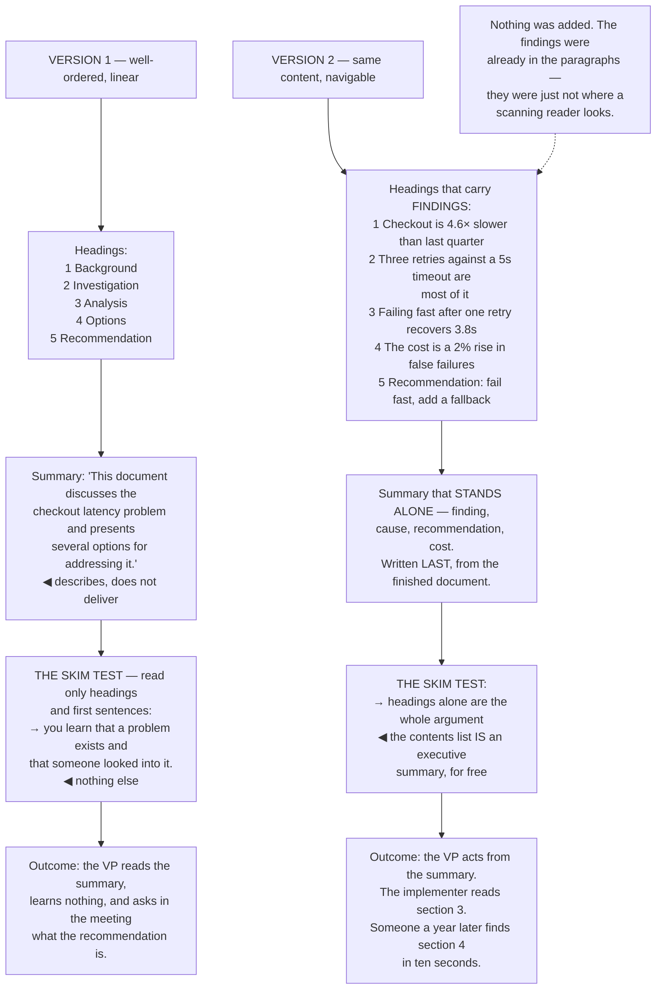

## The model

Nobody reads a work document the way you wrote it. They skim the headings, read the first sentence
of a few paragraphs, jump to the part that concerns them, and come back a week later having
forgotten the context.

**Signposting** is the machinery that makes that survivable: headings that say what is under them,
first sentences that carry the paragraph's point, and a summary that works alone. A well-ordered
document that assumes linear reading is a document that fails for most of its readers, and none of
them will tell you.

## When to use it

Anything longer than a few paragraphs, or anything that will be read more than once.

1. **Can someone find their section in ten seconds?** Headings are navigation, not decoration, and
   most engineering documents use them as decoration.
2. **Does the summary work alone?** Many readers will read only that. If it does not stand on its
   own, they have read nothing.
3. **What does a skimmer get?** Read only the headings and the first sentence of each paragraph.
   If that is not a coherent, useful document, the structure is not doing its job.

## Speedrun

**What** — the visible structure that lets someone navigate rather than read.

**How to build it**

1. **Write headings that state the point**, not the topic. "Why the retry loop causes the timeouts"
   beats "Retry behaviour".
2. **Put each paragraph's point in its first sentence.** Skimmers read first sentences; a point
   that arrives at the end of a paragraph is invisible to most of your readers.
3. **Make the summary stand alone.** Someone who reads only the first paragraph should have the
   conclusion, the reason, and the ask.
4. **Use lists for things that are lists.** Three or more parallel items in a sentence want to be
   bullets, and prose that enumerates is harder to read than a list that enumerates.
5. **Keep [[parallel structure]].** Items in a list should share a grammatical shape; breaking it
   makes the reader re-parse each one.
6. **Run [[the skim test]].** Read only the headings and first sentences. What is missing from
   that version is what is badly placed.

**Why it works** — readers navigate before they read, and they decide what to read from the
structure. A document that is only readable in full has made that decision impossible.

**The single highest-return change** — headings that carry the finding rather than the topic. A
table of contents made of findings *is* an executive summary, for free.

## Going deeper

### How people actually read

Nielsen's eye-tracking work established the pattern that most writing advice ignores: readers scan
in an F-shape — across the top, down the left, across again partway — and read in full only when
scanning has convinced them it is worth it.

The consequences are structural rather than stylistic:

- the first two paragraphs get read; the rest gets scanned
- first words of paragraphs get read more than the rest of the sentence
- headings get read almost always
- anything in the middle of a long paragraph is close to invisible

That means placement decides whether something is read at all. A crucial caveat buried in the fourth
sentence of a middle paragraph has been written and not communicated, and the writer has no way to
tell the difference.

The second reading pattern matters as much: people return to documents. A design doc gets read
during review, again during implementation, and again a year later by someone deciding whether to
change it. Re-entry needs headings that say where things are, because nobody re-reads from the top.

Doumont's framing is that a document should work at three depths — the title and summary, the
headings, and the full text — each of which is coherent alone. Writing one that only works at the
third depth is writing for a reader who does not exist.

### Headings that carry findings

The single highest-return change available in most technical documents is turning topic headings
into finding headings.

"Retry behaviour" tells a reader where they are. "Why the retry loop causes the timeouts" tells
them what they will learn, and lets them decide whether they need to read it. The second one costs
four extra words.

The compounding effect is that the headings become a summary. A document whose contents list reads
"Checkout is 4.6× slower than last quarter · Three retries against a 5s timeout account for most of
it · Failing fast after one retry recovers 3.8s · The tradeoff is a 2% increase in false failures"
has already communicated the whole argument to a skimmer.

The test is to read the headings alone. If they form a coherent argument, the structure is working.
If they read as a list of topics — "Background · Investigation · Analysis · Options ·
Recommendation" — the document requires linear reading and most readers will not do it.

The one place topic headings are correct is reference material, where people arrive knowing what
they are looking for. A runbook wants "Restarting the service", not a finding — because the reader
is navigating rather than being persuaded.

### Paragraphs, lists and parallel structure

The paragraph rule follows from the scanning pattern: **the point goes in the first sentence.**
Everything after it supports, qualifies or illustrates.

This is the same move as leading with the answer, applied at paragraph scale, and it has the same
justification — a reader who stops after the first sentence should still have the point.

Lists are underused in engineering prose and misused when they appear. Use one when the content is
genuinely a set of parallel items, three or more, that a reader may want to compare or count. Do not
use one for a sequence of connected reasoning, where prose carries the connections that bullets
throw away.

**Parallel structure** is what makes a list readable. Every item should share a grammatical shape:
all noun phrases, or all imperative verbs, or all full sentences. Mixing them forces the reader to
re-parse at each item, which is a small cost repeated many times.

Tables beat prose for anything with two dimensions — options against criteria, before against
after, this approach against that one. A paragraph comparing three options on four dimensions is
twelve facts in linear order, and the reader has to build the table themselves.

And white space is functional. Dense text is scanned less carefully and abandoned sooner, so
paragraph breaks, headings and lists are not decoration — they are what makes the page legible
before a single word is read.

### The summary that stands alone

**The summary that stands alone** is the part most readers will read and many will read only.
Writing it as a preview of the document rather than as a compressed version of it is the common
mistake.

The failing form describes: "This document discusses the checkout latency problem and presents
several options." The working form delivers: "Checkout is 4.6× slower than last quarter because we
retry three times against a 5s provider timeout. Failing fast after one retry recovers 3.8s, at the
cost of a 2% increase in false failures. I recommend we do it."

Everything the reader needs to act is in the second version — the finding, the cause, the
recommendation, and the cost. The rest of the document exists to support it for the people who need
support.

Write it last, from the finished document. A summary written first is a plan, and it will describe
what you intended rather than what you concluded.

And keep it short enough to be read in the preview pane. If the summary needs its own summary, the
document has more than one point, and it should probably be two documents.

## See it work

The same document, restructured.

Version one is not badly written. The order is logical, the analysis is sound, and it fails for
every reader who does not read it start to finish — which, per Nielsen, is nearly all of them.

The skim test makes the failure visible in about thirty seconds. Reading only headings and first
sentences yields "a problem exists and someone investigated it", which is a document that has
communicated nothing while being entirely accurate.

The finding-headings change costs a few words per heading and converts the contents list into an
executive summary. That is the same information, moved to where scanning readers actually look —
and it is free, because the findings were already in the paragraphs.

The stand-alone summary is what serves the reader who reads nothing else. Finding, cause,
recommendation, cost, in four sentences — and written last, from the finished document, so it
reports what was concluded rather than what was planned.

And the three readers at the bottom are the point of the whole exercise. The VP acts from the
summary, the implementer goes straight to section three, and someone a year later finds the
tradeoff in ten seconds — three different reading patterns served by one document, because it was
built to be navigated rather than read.

## Next

The Writing group applies these foundations to the specific artifacts: explanations, status
updates, documentation, and review comments.
