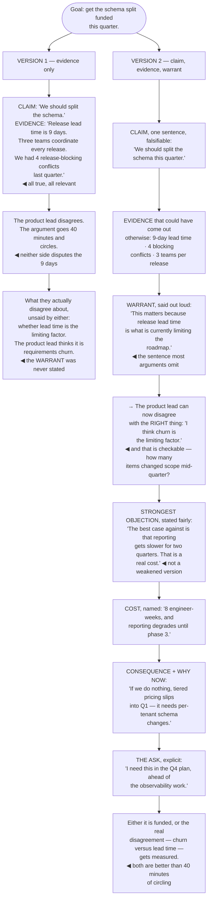

## The model

An argument has three parts, and only two of them are usually said out loud. The **claim** is what
you want believed. The **evidence** is what you offer for it. The **warrant** is the assumption
that makes the evidence relevant to the claim — and it is almost always left implicit.

Toulmin's insight is that disagreement usually lives in the warrant. Two people looking at the same
number and reaching opposite conclusions are not disputing the number; they are disputing the
unstated bridge from it, and neither has noticed. Surfacing that bridge is what converts an
unproductive argument into a resolvable one.

## When to use it

You are trying to change what someone believes or does.

1. **What exactly is the claim?** If it takes a paragraph, it is several claims and they need
   separating.
2. **What is the warrant?** Say the assumption out loud: "this matters because…". Most weak
   arguments are weak there rather than in the evidence.
3. **What is the strongest objection?** Not the easiest one. Answering the weak objection while
   ignoring the strong one is visible and costs the argument.

## Speedrun

**What** — a claim, evidence, and the stated assumption connecting them.

**How to build one**

1. **State the claim in one sentence.** Specific enough to be wrong. "We should split the schema
   this quarter" is a claim; "we should improve our architecture" is a mood.
2. **Give evidence that could have come out differently.** Measurements, incidents, comparisons.
   Evidence that could not have contradicted you is not evidence.
3. **Say the warrant.** "This matters because release lead time is what is blocking the roadmap" is
   the sentence most arguments omit and most disagreements are about.
4. **Address [[the strongest objection]] explicitly**, in its strongest form. Doing it yourself is
   far more persuasive than being made to.
5. **Say what it costs.** An argument claiming no downside gets audited for the downside, and the
   audit finds one.
6. **Use [[argument from consequence]] where you can.** "If we do nothing, X happens by Q3" is
   harder to defer than "this would be better".

**Why it works** — people are persuaded by arguments whose structure they can inspect. A conclusion
with hidden reasoning can only be accepted or rejected on trust, and trust is a smaller resource
than evidence.

**The single highest-return sentence** — the warrant. Say why the evidence matters, and most
disagreements either resolve or become specific.

## Going deeper

### The warrant, and why disagreements hide there

Toulmin's structure — claim, evidence, warrant — earns its keep because the third element is where
almost all real disagreement lives.

Take a concrete case. Claim: we should split the schema. Evidence: release lead time is nine days.
Warrant, unstated: lead time is what is currently limiting the roadmap.

Someone who disagrees is usually not disputing the nine days. They believe the limiting factor is
requirements churn, or hiring, or something else entirely — and until the warrant is said out loud,
the two of you will argue about the schema while actually disagreeing about the bottleneck.

Which makes the diagnostic question worth asking early: *what would have to be true for this
evidence to support this claim?* Answering it out loud produces the warrant, and stating the warrant
is what lets someone disagree with the thing they actually disagree with.

The related failure is evidence that could not have come out otherwise. "Users want a better
experience" is not evidence for anything, because no possible observation would have contradicted
it. Evidence has to be the kind of thing that could have gone the other way.

Minto's version of the same discipline is that every level of an argument should answer the question
the level above it raises. If your reader's next question after the claim is "why?", the evidence
answers it; if their next question is "so what?", you have given evidence and skipped the warrant.

### The strongest objection

Addressing **the strongest objection** yourself is the most reliable credibility move available, and
almost nobody does it.

The instinct is to anticipate the easy objections, because they are easy to answer. An audience
notices, and the effect is the reverse of what was intended: an argument that answers three weak
objections and ignores the obvious strong one reads as either unaware or evasive.

Doing it explicitly costs a paragraph. "The strongest case against this is that reporting gets
slower for two quarters, and that is a real cost — here is why I think it is worth paying." Now the
objection has been named accurately, taken seriously, and answered, and the person who was going to
raise it has been pre-empted rather than ambushed.

This is the [[steelman]] discipline applied to your own argument. Stating the opposing case better
than its holders would is what makes your answer to it worth anything.

The version to avoid is the strawman-with-a-fair-face: naming the objection in a weakened form and
answering the weakened version. It is transparent to anyone who holds the real one, and it costs
more than ignoring it would have.

And where the objection is genuinely unanswered, say so. "I do not have a good answer to this yet"
is more persuasive than a bad answer, and it is the sentence that makes the rest of your argument
credible.

### Cost, consequence, and what actually moves people

Three additions do more than any amount of additional evidence.

**Naming the cost.** Every real proposal makes something worse. Stating it — specifically, in the
same units as the benefit — removes the reader's suspicion that you have hidden one, and that
suspicion is what most arguments actually die of.

**Argument from consequence.** "If we do nothing, the release train stays at nine days and the
tiered-pricing work slips into Q1" is much harder to defer than "this would be an improvement". The
first has a date and a casualty; the second competes with everything else that would also be an
improvement.

**Why now.** Most organisations have a long list of things that are genuinely wrong and are not
being fixed. The distinguishing feature of the ones that get fixed is a forcing reason: a contract
renewal, a scaling limit, a dependency that unblocks.

The Heaths' observation about concreteness applies with force here. A specific scenario — a named
team, a date, a number — is processed differently from a general claim, and an argument built
entirely from abstractions is agreed with and not acted on.

The thing that does not work, despite feeling rigorous, is volume of evidence. Five supporting facts
where two would do dilutes rather than strengthens, and it signals that you were not sure which ones
were load-bearing.

### Structuring it for the reader

The order that works is the order the reader's questions arrive in, which is not the order you
discovered it:

1. the claim
2. the evidence, strongest first
3. the warrant, if it is not obvious
4. the strongest objection, and your answer to it
5. the cost
6. the ask

That shape survives being cut short, which matters because most readers stop early. Someone who
reads only the first two sentences has the claim and the best evidence — which is a defensible
summary of your position.

The failing order is chronological: how you came to investigate, what you tried, what you found, and
finally what you think. It is the order of the work and it puts the conclusion where the fewest
people will reach it.

Length is a signal. A one-page argument reads as confident; a twelve-page one reads as either
uncertain or as covering something. If it needs twelve pages, the argument is probably several
arguments and should be separated.

And the ask has to be explicit. An argument that establishes a position and does not say what you
want someone to do gets agreed with and produces nothing, which is the most common way a correct
argument fails.

## See it work

Arguing for the schema split, two ways.

Version one is a good argument that cannot be engaged with. Every fact is true, relevant and
verifiable, and the disagreement it produces is unresolvable because the thing being disputed was
never on the table.

Forty minutes of circling is the characteristic signature of an unstated warrant. Neither person
disputes the nine days; both keep restating evidence, because evidence is the only part of the
argument that has been made explicit.

Saying the warrant out loud is one sentence and it converts the disagreement into something
checkable. "Is lead time the limiting factor, or is it requirements churn?" has an answer — count
how many items changed scope mid-quarter — and someone can go and find it.

Stating the strongest objection in its strongest form is what makes the rest credible. Reporting
degrading for two quarters is a genuine cost, and naming it accurately pre-empts the person who was
going to raise it rather than ambushing them with it.

And the explicit ask is what stops a correct argument from producing nothing. "I need this in the Q4
plan, ahead of the observability work" is a decision someone can make; a well-supported position
with no ask gets agreed with and left where it is.

## Next

Narrative and story covers the other half — why the same argument lands differently depending on
whether there is a person in it.
