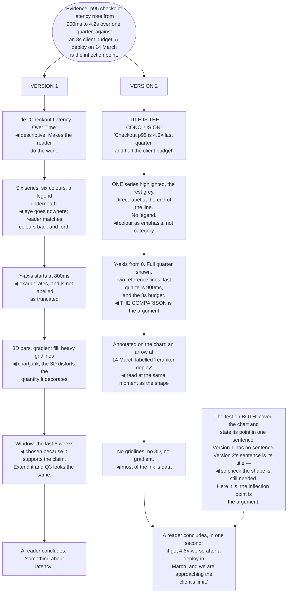

## The model

A chart earns its place when the *shape* of the data is the argument — a trend, a distribution, a
comparison, an outlier. If the point is a single number, a sentence carries it better and costs the
reader less.

Most charts in engineering documents fail this test. They show one number decorated, or five series
where one was relevant, or a trend the axis has quietly exaggerated. **One chart, one point** is the
discipline: know what the reader should conclude, and remove everything that does not help them
conclude it.

## When to use it

You have evidence and are deciding how to show it.

1. **Is the shape the point?** Trends, distributions, comparisons and outliers are shapes. One
   number is not, and neither is "here is our data".
2. **What should they conclude?** Say it in a sentence first. If you cannot, the chart will not say
   it either.
3. **Compared to what?** A number with no comparison is close to meaningless. 4.2 seconds is
   nothing until you know it was 900 ms last quarter.

## Speedrun

**What** — a chart with one point, stated in the title, with everything else removed.

**How to make one**

1. **Put the conclusion in the title.** "Checkout latency is 4.6× last quarter" beats "Checkout
   latency over time". The title is the only part everyone reads.
2. **Show [[the comparison]].** Against last quarter, against the target, against the other option.
   A single series with no reference point cannot support a claim.
3. **Strip the decoration.** Gridlines, 3D effects, gradients, borders, legends that could be direct
   labels. Tufte's **data-ink** ratio: most of the ink should be data.
4. **Use position, not area or colour, for quantity.** Cleveland and McGill measured this — people
   read position along a common scale far more accurately than angle, area or shade.
5. **Keep [[honest axes]].** Truncated y-axes exaggerate, dual axes imply relationships that are
   not there, and both are the most common accidental deceptions.
6. **Highlight the one thing.** Grey everything, colour the series that matters. The reader should
   not have to search.

**Why it works** — visual perception reads shape and position far faster than it reads numbers, so a
chart that shows a shape transmits in a second what a table transmits in a minute. A chart that
shows no shape has spent the second and transmitted nothing.

**The test** — cover the chart and state its point in one sentence. If the sentence alone is
sufficient, delete the chart.

## Going deeper

### What a chart is for

The useful distinction is between showing a shape and displaying numbers, and only the first
justifies the space.

**Shapes worth showing**: a trend over time, a distribution's spread and tail, a comparison across
categories, a relationship between two variables, an outlier against a background.

**Not worth showing**: one number, two numbers, or a table of values people need to look up.
Sentences carry the first two better and a table carries the third better — a chart of lookup values
is a table someone has made harder to read.

The **comparison** is what makes a number mean anything, and it is the most common omission. "p95 is
4.2 seconds" is a fact with no valence; "4.2 seconds, up from 900 ms last quarter, against an 8s
client budget" is an argument, and the chart should show all three.

Tufte's framing is that graphical excellence is giving the viewer the greatest number of ideas in the
shortest time with the least ink in the smallest space. Every element that is not doing that is
costing something.

The corollary worth acting on: many charts in technical documents should be deleted rather than
improved. If the point is one number, say the number.

### Perception, and what people read accurately

Cleveland and McGill's work is the empirical basis for most good chart advice, and it produces a
ranking of how accurately people decode different encodings.

Position along a common scale is read most accurately — which is why bar charts and dot plots
outperform almost everything else. Length is next, then angle, then area, then colour saturation,
which is read very poorly.

The practical consequences are direct. Bar charts beat pie charts, because comparing angles is
harder than comparing lengths. Bubble sizes are read badly, and doubling a radius quadruples the
area, which readers systematically misjudge. Heat maps look precise and communicate rank at best.

Line charts are right for continuous change over time and wrong for categories, where the connecting
line implies an ordering that does not exist.

**Chartjunk** — Tufte's term for decoration that carries no information — is worth removing
aggressively. Gridlines that could be lighter or absent, 3D effects that distort the very quantities
they decorate, gradients, drop shadows, and heavy borders. None of it helps and the 3D versions
actively mislead.

Direct labelling beats a legend nearly always. A legend forces the reader to look back and forth
matching colours; a label at the end of the line is read once.

### Honest axes

**Honest axes** is where most accidental deception happens, and the failures are well known enough
to be avoidable.

**Truncated y-axes** exaggerate change. A bar chart starting at 95 rather than 0 turns a two-percent
difference into a visual doubling. For bar charts, where length encodes the quantity, this is
straightforwardly misleading; for line charts showing change over time it is sometimes legitimate,
and it should be labelled clearly either way.

**Dual axes** imply a relationship between two series by scaling them until they appear to move
together. The apparent correlation is an artifact of the two scales you chose, and there is almost
always a better option — two stacked charts sharing an x-axis.

**Cherry-picked ranges** are the timeline equivalent. A trend that reverses when you extend the
window by three months is not a trend, and choosing the window that supports the claim is the most
common intentional deception in engineering charts.

**Percentages without denominators** hide small samples. "Failure rate doubled" is alarming until
you learn it went from one to two out of ten thousand.

Huff's book is sixty years old and every technique in it still appears weekly. The useful stance is
to run these checks on your own charts before someone else does — being caught having exaggerated
costs far more than the exaggeration bought.

### Making one chart do one job

**One chart, one point** is the design rule, and the process that produces it is subtractive.

Start by writing the sentence the chart should make the reader think. Then build the simplest thing
that makes that sentence obvious, and remove anything that does not contribute.

Put the sentence in the title. "Checkout latency is 4.6× last quarter" tells a skimmer the
conclusion without decoding anything, and skimmers are most of your readers. A descriptive title —
"Latency over time" — makes them do work you could have done.

Highlight the one series that matters and grey the rest. Knaflic's approach is to use colour as
emphasis rather than as categorisation: the eye goes where the colour is, and using six colours for
six equally-weighted series means it goes nowhere.

Annotate directly on the chart. An arrow with "deploy" at the point where the line jumps is worth
more than a paragraph beneath it, because it is read at the same moment as the shape.

And where several points genuinely need making, use several charts. Two simple charts are read; one
chart carrying two arguments is decoded by nobody, and the reader picks whichever one they were
already inclined to believe.

## See it work

The same latency evidence, presented two ways.

Version one is not incompetent — it is the default output of plotting the data and adding a title.
Every individual choice is one a chart tool makes for you, and the accumulation is a chart that
transmits an impression rather than a conclusion.

The truncated axis is the most consequential single defect, and it is usually accidental. Starting
at 800 ms rather than zero makes a real 4.6× increase look like something even larger, which means
that once someone notices, the genuine finding is now under suspicion too.

The six-week window is the one that would actually damage credibility. It was chosen because it
supports the claim, extending it changes the story, and being caught doing that costs more than the
chart was ever going to win.

Version two's title is doing most of the work. "Checkout p95 is 4.6× last quarter, and half the
client budget" is read by everyone including the people who never look at the chart — and it is the
conclusion rather than a label for the axes.

And the two reference lines are what make it an argument rather than a series. Last quarter's 900 ms
and the 8-second client budget are the comparisons that give the number meaning; without them, 4.2
seconds is a fact with no valence attached.

## Next

Writing for executives closes the section: the audience with the least time, the most context
missing, and the most authority over what happens next.
