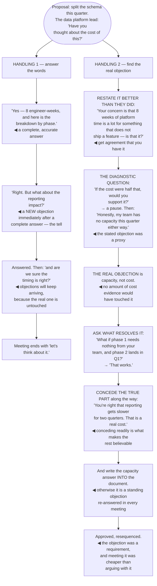

## The model

An objection sounds like resistance and is usually a requirement. The person is telling you what
they need resolved before they can say yes, which is more useful than agreement would have been at
that moment.

Treating it as opposition wastes it. **The real objection** is frequently not the one stated —
"have you considered the cost?" can mean "I do not trust the estimate", "my budget is already
committed", or "I was not consulted". Answering the stated version leaves the real one intact, which
is why a well-answered objection is often followed by another one.

## When to use it

Someone has raised a concern about a proposal you are making.

1. **What would resolve this?** Ask. "What would you need to see?" converts a vague objection into
   a specific condition, and conditions can be met.
2. **Is this the real one?** The first objection is often a proxy. The tell is a complete answer
   that produces a new objection rather than agreement.
3. **Is it right?** Some objections are correct, and conceding is faster and cheaper than
   defending. The proposal is usually better afterwards.

## Speedrun

**What** — a way of using objections as input rather than absorbing them as attack.

**How to handle them**

1. **Surface them before you need to.** Ask "what would make this a bad idea?" while the proposal
   can still change. Objections found early improve it; found late they block it.
2. **Restate it in their words**, better than they said it, and get agreement that you have it.
   This is the [[steelman]] move and it does most of the work.
3. **Ask what would resolve it.** A named condition — a number, a test, a guarantee — is something
   you can go and produce.
4. **Concede fast when they are right.** "You are right, that is a real problem, and I do not have
   an answer yet" buys more than any defence.
5. **Distinguish the objection from the objector.** Some concerns are about the proposal and some
   are about having been left out. The second is fixed by including them, not by evidence.
6. **Handle [[the standing objection]] once and in writing.** The concern that recurs in every
   discussion should be answered in the document, not re-answered in every meeting.

**Why it works** — an objection is a stated precondition for agreement. Meeting the precondition
produces agreement; arguing with it produces a defended position.

**The question that finds the real one** — "if that were solved, would you support it?" A yes tells
you what to work on. A no tells you the stated objection was not the real one, at no cost.

## Going deeper

### Surfacing before answering

**Surfacing before answering** is the highest-return practice here, and it inverts the usual
sequence.

Objections raised after a proposal is finished are expensive. The proposal is complete, changing it
is costly, and the objector is now committed to a public position — so what could have been input
becomes opposition.

The same concern raised while the proposal is forming is free. It shapes the design, the objector
sees their contribution in the result, and they frequently become an advocate for the thing they
would otherwise have blocked.

Which is why the practical move is asking early and asking adversarially. "What would make this a
bad idea?" and "what am I not seeing?" produce better information than "does this look right?",
which produces agreement people have not thought about.

Go to the likely objectors first, individually. A design review is a bad place to discover the
reporting team's nightly job; a fifteen-minute conversation two weeks earlier is a good one, and it
is the [[pre-wiring]] argument applied to the content rather than to the politics.

The thing to internalise: an unsurfaced objection does not go away. It arrives later, at higher
cost, usually during implementation, and usually as a surprise.

### Finding the real objection

**The real objection** is what actually stands between the person and agreement, and it is often
not what they said.

The stated version is frequently a socially acceptable proxy. "Have you considered the cost?" is
easier to say than "I do not trust your estimates", "my team has no capacity and I do not want to
say so", or "I found out about this in the meeting".

The diagnostic is one question: *"if that were solved, would you support it?"* A yes gives you a
condition to meet. A no — or a hesitation — tells you the stated objection was not the operative
one, and it costs nothing to have asked.

Asking directly works more often than people expect. "What is the concern?" or "what would you need
to see?" asked genuinely, without defensiveness, converts a vague resistance into a specific
requirement, and specific requirements can be satisfied.

The category worth recognising separately is the process objection. Someone who was not consulted
will find a technical reason to object, and no amount of technical answering resolves it — the fix
is including them, and often acknowledging the omission out loud.

Reilly's version of this is that an objection in a design review is usually someone protecting
something they own. Knowing what they are protecting answers the objection faster than any evidence
would.

### Conceding well

**Conceding well** is the most underrated move available, and engineers systematically
under-concede because it feels like losing.

Some objections are correct. When one is, saying so immediately and completely — "you are right,
that is a real problem, and I do not have an answer yet" — ends the exchange, buys credibility, and
usually improves the proposal.

The alternative is worse in every direction. Defending a position you privately know is weak is
visible, it costs credibility with everyone watching, and the objection remains true.

Partial concession is a real tool and should be honest rather than tactical. "You are right that
reporting gets slower; I think it is worth it and here is why" concedes the fact and holds the
conclusion, which is a stronger position than disputing the fact.

The general effect is that a person who concedes readily is believed when they do not. Cialdini's
observation about credibility applies directly: acknowledging a genuine weakness early makes the
rest of the case more persuasive, not less.

And where the objection kills the proposal, say so and withdraw it. "That is decisive — I withdraw
the suggestion" is a sentence people remember, and it costs far less than defending a dead proposal
for two more weeks.

### The standing objection

**The standing objection** is the concern that recurs in every discussion, and re-answering it each
time is a slow leak.

It usually means the answer is not written down, or it is written somewhere nobody reads. The fix is
to put it in the document — in the alternatives-considered section, or as an explicit "the main
concern people raise is X, and here is the answer" — so it is answered once.

Where it keeps recurring despite being answered in writing, the answer is not landing. Either it is
not convincing, or the real objection is different, and both are worth finding out rather than
repeating.

The other pattern is the objection that recurs because the person raising it does not feel heard.
Answering it a fourth time does not help; acknowledging that they have raised it repeatedly and
asking what would actually resolve it does.

And some objections should end the discussion by being accepted. A recurring concern that keeps
being answered and keeps returning is sometimes the organisation telling you the proposal is wrong,
and the willingness to hear that is what makes your other proposals credible.

## See it work

An objection in a design review, handled two ways.

Handling one is a good answer to the question asked. Eight engineer-weeks with a breakdown by phase
is exactly what "have you thought about the cost" requests, and it resolves nothing.

The new objection arriving immediately after a complete answer is the diagnostic signal. When
someone accepts your answer and produces a different concern, the first one was a proxy — and
answering the second will produce a third.

The question that finds it costs five seconds. "If the cost were half that, would you support it?"
is not confrontational, and the pause before the answer is itself the information.

Capacity was never going to surface on its own, because "my team has no room and I do not want to
say that publicly" is a hard sentence. It was reachable through a direct question and unreachable
through any amount of evidence about cost.

And conceding the reporting point along the way is what makes the rest of the exchange work. Agreeing
readily that reporting gets slower for two quarters costs nothing — it was true — and it is why the
proposal's other claims were taken at face value.

## Next

Writing for executives closes the section: the shortest attention, the least context, and the most
authority over what happens next.
