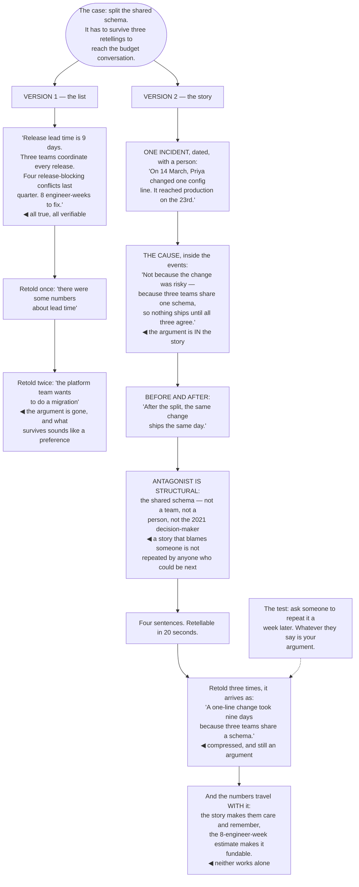

## The model

Two people hear the same case for a migration. One hears "release lead time is nine days, three
teams coordinate every release, we had four blocking conflicts last quarter". The other hears "on
14 March a one-line config change took nine days to reach production, because three teams have to
agree before anything ships."

Both are true and only one gets repeated in a meeting you are not in. **Narrative structure** is
what makes an argument portable — it survives compression, it is retold accurately, and it carries
the reason along with the fact. Which matters because most of the decisions about your work are made
in rooms where the only version present is someone else's summary.

## When to use it

The argument has to travel: through several retellings, into rooms you are not in, over months.

1. **Will this be repeated?** If yes, build the version someone can repeat. A list of four numbers
   compresses into "there were some numbers".
2. **Is there a person in it?** A concrete someone, doing something, at a time. Abstractions do not
   survive retelling.
3. **What is the gap?** Duarte's shape: what is, against what could be. The gap is what creates the
   interest, and a story with no gap is a description.

## Speedrun

**What** — a short, concrete, repeatable account that carries the argument inside it.

**How to build one**

1. **Find the one incident.** A real moment, dated, with a person in it. Not a summary of many
   incidents — one that happened.
2. **Use [[before and after]].** What it was like, what changed or could change. The contrast is
   what makes it a story rather than a report.
3. **Keep it to four sentences.** If it cannot be told in four, it will not be retold at all.
4. **Put the argument inside the events**, not after them. A story followed by "and therefore we
   should…" is two things; a story where the conclusion is obvious is one.
5. **Avoid making a person the villain.** A story that blames someone will not be repeated by
   anyone who might be blamed next, which is everyone.
6. **Test it by having someone retell it.** What survives is what you actually built; the rest was
   yours, not theirs.

**Why it works** — narrative is how people remember and transmit information, and both the memory
and the transmission are worse for lists. A story compresses into a story; a list compresses into
nothing.

**The test that matters** — ask someone to repeat it a week later. Whatever they say is your
argument, and it is usually shorter and less accurate than you hoped.

## Going deeper

### Why stories survive compression

Bruner's argument is that narrative is a distinct mode of thought, not a decorated version of
propositional reasoning, and the practical consequence is about what survives retelling.

A list of four statistics compresses badly. Retold once, it becomes "there were some numbers about
lead time". Retold twice, it is gone. Nothing about a list gives the retelling person a structure to
hold it in.

A story compresses into a shorter story. "A one-line config change took nine days because three
teams have to agree" survives three retellings largely intact, because causality is the structure —
each element implies the next, so dropping one is noticeable.

That matters more than it sounds, because you are rarely in the room where it counts. A promotion
committee, a planning meeting, a budget conversation — the version present is someone else's
compression, and you are choosing how compressible your argument is.

The **repeatable story** is therefore the design target rather than the complete one — short enough
to retell in twenty seconds, concrete enough that the details are memorable, and causal enough that
the conclusion travels with the events.

The Heaths' finding about concreteness applies directly: specific details are retained where
abstractions are not. "14 March" and "one-line config change" are retained; "release velocity
issues" is not, and it was never going to be.

### Structure: what is, what could be

Duarte's observation about effective persuasive talks is that they oscillate between what is and
what could be, and the gap between them is what creates interest.

The engineering version is straightforward: what it is like now, concretely and with a real
example; what it could be like; and what stands between the two. That third part is where the
argument sits, and the first two are what make anyone care about it.

**Before and after** is the compressed form and it is usually enough. "A config change took nine
days. After the split, the same change shipped in four hours." Two sentences, and the argument for
the split is inside them rather than appended to them.

The failure mode is a story with no gap. A description of how the system works, however clear, is
not a narrative and does not persuade — there is nothing at stake in it, so there is nothing to
follow.

The other failure is the gap without the concrete. "Our deploys are slow, they could be fast" has
the shape and none of the substance, and it compresses immediately into nothing.

Rumelt's caution is worth carrying alongside this: a narrative is not a substitute for a diagnosis.
A compelling story about a problem you have misdiagnosed is worse than a dry accurate one, because
it travels further.

### The villain problem

**The villain problem** is that a story needs an antagonist and the obvious candidate is usually a
person, which makes the story unusable.

A narrative in which a named team was careless, or a specific engineer made a bad call, will not be
repeated by anyone who could be next. It also converts everyone in that team into an opponent of
your argument, which is the opposite of what a story is for.

The available antagonists that work are structural. The constraint — three teams sharing a schema.
The historical accident — a decision that was right in 2021 and is not now. The absent thing — no
test coverage on the path everyone is afraid of.

That framing is more accurate as well as more usable, which is the same argument the
[[blameless postmortem]] makes. Most organisational problems genuinely are structural, and naming a
person is usually a diagnostic failure rather than a rhetorical one.

Where a decision was genuinely wrong, describe the decision rather than the decider. "The 2021 choice
to share a schema made sense with two teams and does not with six" is honest, complete, and does not
require anyone to have been foolish.

And the strongest version makes the audience the protagonist rather than you. A story where the team
solves something is repeated by the team; a story where you solved something is repeated by nobody.

### Honesty, and the limits

A story is a compression, and every compression drops something. Which parts you drop is where the
ethics live.

The legitimate simplifications are omission and focus: one incident standing for a pattern, a
detail left out because it does not change the conclusion, a timeline tightened. The reader would not
change their mind if they knew.

The illegitimate ones are the same moves applied to the load-bearing parts — the unrepresentative
incident presented as typical, the complicating factor dropped because it weakens the case, the
detail invented for effect. All three are detectable, and being caught once costs more than the
argument was worth.

The check is simple: would you be comfortable if the audience knew everything you left out? If not,
the omission is doing work it should not be.

The other limit is that stories are persuasive out of proportion to their evidential weight. One
vivid incident can outweigh a dataset in an audience's mind, which is a bias rather than a feature —
so a story should illustrate a claim that the numbers already support, not replace them.

Which gives the pairing that works: the story makes them care and remember, the numbers make it
true. Either alone is weaker, and the numbers alone are the version that does not travel.

## See it work

The same case for a migration, delivered two ways.

The list is not a worse argument — it is a more complete one, and every item in it is checkable. It
loses because none of it is holdable: there is no structure for a retelling person to compress it
into, so it degrades into a vague impression in one hop.

"The platform team wants to do a migration" is what survives two retellings, and it is a
catastrophic compression. The evidence is gone, the cause is gone, and what reaches the budget
conversation sounds like a preference competing with other preferences.

Putting the cause inside the events is what makes the story an argument rather than an anecdote.
"Not because the change was risky — because three teams share one schema" carries the diagnosis in
the same breath as the incident, so the two cannot be separated by retelling.

Keeping the antagonist structural is what makes it repeatable. If the story implied that Priya's
team was slow, or that whoever chose the shared schema in 2021 was careless, nobody in either group
would repeat it — and those are precisely the people whose agreement the migration needs.

And the pairing at the end is the honest version. The story is what travels; the eight-engineer-week
estimate is what makes it fundable. A story with no numbers is a feeling, and numbers with no story
do not reach the room.

## Next

Data and visuals covers the numbers half — how to present evidence so that the shape of it is
visible rather than merely stated.
