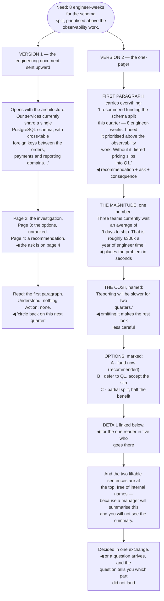

## The model

An executive audience has three properties that determine everything: very little time, almost none
of your context, and the authority to decide. Each one changes what belongs on the page.

**Decision-ready** is the target. They should be able to act after the first paragraph, and
everything below it exists for the ones who want to check. Writing that builds toward a conclusion,
explains the architecture, or demonstrates how much work was done is optimised for the wrong reader
— and the cost is not a bad impression, it is a decision made without your input.

## When to use it

You need something from someone several levels up, or your work is being summarised for them.

1. **What is the decision?** Name it, and say what you want. A document with no ask gets read as
   information and produces nothing.
2. **What do they care about?** Money, risk, time, customers, headcount. Not architecture — and
   translating into their terms is your job rather than theirs.
3. **What is the number?** Executives think in magnitudes. "Roughly £300k a year" places the
   problem in seconds; "significant cost" does not.

## Speedrun

**What** — a short document whose first paragraph contains the recommendation, the reason, and the
ask.

**How to write one**

1. **Lead with the recommendation and the ask.** "I recommend we fund the schema split this
   quarter — eight engineer-weeks. I need it prioritised above the observability work."
2. **Translate into their units.** Engineer-weeks, money, risk, customer impact, dates. Architecture
   nouns do not survive the trip upward.
3. **Give one number that sets the magnitude.** They are deciding how much attention this deserves,
   and the number is how they decide.
4. **Name the risk and the cost.** A proposal with no downside is read as incomplete, and they will
   ask for it anyway.
5. **Keep it to one page**, with detail linked below or appended. Anything longer is skimmed, and
   the skim starts at the top.
6. **Say what happens if the answer is no.** The consequence is frequently the most persuasive
   element and the most commonly omitted.

**Why it works** — an executive reading twenty documents a day is deciding, in the first ten
seconds, whether this needs their attention and what it needs from them. Both answers should be in
the first paragraph.

**The most common failure** — burying the ask. A well-argued document that never says what you want
produces agreement and no action, which is indistinguishable from having sent nothing.

## Going deeper

### Translating up

**Translating up** is the actual skill, and it is more mechanical than it sounds: restate the work
in the units the reader already thinks in.

The substitution is consistent. Architecture becomes consequence. "We share a database schema
across three teams" becomes "three teams cannot ship independently, which is why the tiered-pricing
work is at risk for Q4".

The units that travel: money, engineer-time, calendar time, risk, customer impact, headcount, and
revenue. Everything else has to be converted into one of those before it means anything at that
level.

The conversion is your job and it is the part most engineers skip. Sending a technically accurate
document upward and expecting the reader to derive the business consequence is asking someone with
less context and less time to do the harder half of the work.

Larson's framing is that the same fact needs a different sentence at each level of the organisation,
and the version that reaches the top is two sentences long. Writing those two sentences yourself is
the difference between being represented accurately and being summarised by someone who was
guessing.

The check: read your first paragraph and count the words that would need explaining. If there is
more than one, it has not been translated.

### The shape of the page

**The one-pager** is the standard artifact and its structure is close to fixed.

**The recommendation and the ask**, first paragraph. What you think should happen and what you need
from them. This is the part that gets read.

**The reason**, in two or three sentences with the number in it. Why this, why now, what it costs
if nothing changes.

**The cost and the risk.** What gets worse, stated plainly. Omitting it does not hide it — it makes
the rest of the document look less careful.

**The options**, where there are real ones, with your recommendation marked. Two or three, briefly.

**The detail**, below the fold or linked. This is where the architecture, the analysis and the
alternatives live, and it exists for the one reader in five who goes there.

Amazon's six-page memo is a different shape for a different purpose — it is read in the room, in
full, for a substantial decision. The one-pager is for the asynchronous case, which is most of them,
and the two should not be confused: sending a six-pager into an inbox produces a skimmed first page.

### What they actually need

Executives are optimising for a small number of things, and knowing which one your document touches
changes how to frame it.

**Risk** is usually the strongest. "If we do nothing, the tiered-pricing launch slips into Q1" is a
sentence that gets attention, because their job is largely the avoidance of surprises.

**Money and time**, in magnitudes rather than precision. "Roughly £300k a year" is more useful than
£297,400, and a range with a stated basis is more credible than a false point estimate.

**Customers**, where there is a real connection. "Support handles about 200 tickets a month that
this removes" converts an internal problem into an external one.

**Their own commitments.** The thing they told the board, the date they committed to, the metric
they own. A proposal connected to one of those is a different conversation from one connected to
engineering quality.

What they do not need: how the system works, how much work the investigation was, the history of
the decision, or the technical alternatives. All of it belongs in the linked detail, and none of it
belongs above the fold.

The trap on the other side is over-simplifying into vagueness. "This is a big risk" is not a
translation, it is a removal — the translated version keeps the specifics and changes the units.

### Being summarised, and what to do about it

Most of the time you are not writing for the executive directly. Your manager is, or their manager
is, and your document is the raw material for a summary you will not see.

Which means writing the summary yourself is the highest-leverage thing available. If the two
sentences that will reach the top are already in your document, in a form someone can copy, they are
the two sentences that reach the top. If not, someone with less context invents them.

Make those sentences easy to lift. Put them first, keep them free of internal names and acronyms,
and make sure they survive being read alone — which is the [[the summary that stands alone|standalone
summary]] discipline applied to an audience you cannot reach directly.

Follow-up is worth planning for. A short document invites questions, and having the detail ready —
linked, organised, and answering the obvious next question — is what converts interest into a
decision rather than a delay.

And read the response for what it tells you. A question about cost means the magnitude did not land.
A question about why now means the urgency was missing. A decision made without asking anything
means the first paragraph did its job.

## See it work

The same request, written for two audiences.

Version one is a good engineering document sent to the wrong reader. Nothing in it is wrong; it is
organised around how the system works and how the investigation went, which is what an engineering
audience needs and what an executive audience will never reach.

Putting the ask on page four is the decisive error. The reader stops after the first paragraph — not
from impatience, but because twenty documents a day makes that the only sustainable behaviour — and
the first paragraph contained a schema description.

The consequence clause in version two's opening does most of the persuasive work. "Without it,
tiered pricing slips into Q1" connects the request to something they already own, which is a
different conversation from one about engineering quality.

Three hundred thousand a year is the magnitude, and magnitude is what they are deciding on. Whether
the true figure is £280k or £340k does not change the decision; whether it is £30k or £300k changes
it entirely, and the number is how they find out which.

And the liftable sentences at the top are the part written for a reader you will never meet. Someone
will compress this into two sentences for the room where it gets decided — and the only way to
control what those two sentences say is to have written them yourself.

## Next

That completes Communication. The razor catalog is where these arguments are compressed into the
heuristics they came from.
