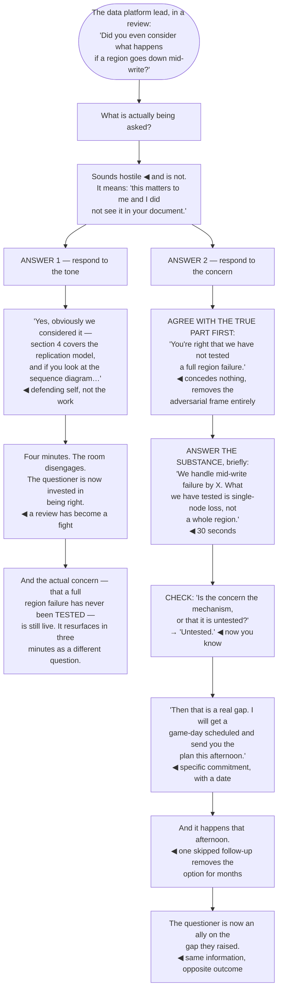

## The model

"How does this handle a region outage?" might be a request for information. More often it is
"I am not convinced this is ready", asked in the only form available in a public room.

**The question under the question** is what the person actually needs resolved, and it is
frequently a concern rather than a gap. Answering the literal words leaves it intact — which is why
a technically complete answer can be followed by the same person asking something similar three
minutes later.

## When to use it

Any time you are taking questions: after a talk, in a review, in a planning session, from
leadership.

1. **What is the concern behind this?** Information, doubt about the approach, doubt about you, or
   an unstated constraint. Each needs a different response.
2. **Are they asking or telling?** Some questions are objections in question form, and treating
   them as requests for information reads as evasion.
3. **Is this the right room?** Some questions deserve a real answer and not here — and saying so
   plainly is better than a compressed answer nobody can use.

## Speedrun

**What** — a short answer to the actual concern, in the room it belongs in.

**How to answer**

1. **Listen to the end.** Answering the question you predicted at word six is the most common
   failure, and it is visible.
2. **Restate it if it is complex.** "So the concern is what happens if a region goes down mid-write
   — is that it?" catches the misread before you spend two minutes on it.
3. **Answer the concern, not only the words.** If the concern is readiness, address readiness.
4. **Be brief.** Thirty seconds, then check. A four-minute answer to a thirty-second question reads
   as defensiveness.
5. **Say when you do not know**, and what you would do to find out. Same rule as everywhere else,
   more visible here.
6. **[[Taking it offline]] is a real answer** when the question deserves depth the room does not
   need — as long as you actually follow up.

**Why it works** — questions in a group are rarely only about information. Addressing the concern
resolves it; addressing the words leaves it live, and it comes back.

**The move that defuses the most** — agreeing with the part that is right before answering. "You are
right that we have not tested a full region failure — here is what we have tested" concedes nothing
and removes the adversarial framing entirely.

## Going deeper

### Reading what is actually being asked

Four kinds of question arrive, and they look identical in transcript.

**A genuine information request.** They want to know. Answer it, briefly, and move on. This is the
easiest case and the least common in a room with any stakes.

**A concern in question form.** "How does this handle a region outage?" meaning "I do not think this
is ready." The information answer does not resolve it, because the person is not short of
information.

**A challenge to you rather than the work.** Rarer than it feels, and it usually comes from someone
who was not consulted and should have been. The content is not the point; the omission is.

**A question with an unstated constraint behind it.** "Have you considered doing it the other way?"
sometimes means "there is a contract that requires the other way and you do not know about it."
Asking what prompted the question is what surfaces it.

The diagnostic is asking rather than guessing. "What is the concern?" or "what makes you ask?" is
neither defensive nor evasive when asked genuinely, and it converts a guess about their meaning into
their actual words.

Reilly's framing is useful here: a question in a design review is usually someone trying to protect
something they own, and knowing what they are protecting answers the question faster than any
technical detail would.

### The hostile-sounding question

**The hostile-sounding question** is rarely hostile and it reliably feels that way, which is what
makes it dangerous.

"Did you even consider X?" is aggressive in form and usually means "X matters to me and I did not
see it in your document". The tone is about their investment, not about you — and responding to the
tone rather than the content is how a review becomes a fight.

Three moves defuse almost all of it. **Agree with the true part** — "you are right that we have not
tested a full region failure" — which concedes nothing and immediately removes the adversarial
frame. **Answer the substance**, calmly and briefly. And **thank them if the point is good**,
publicly, which costs nothing and is usually accurate.

What escalates it: defending yourself rather than the work, matching the tone, dismissing the
premise, or answering at length in a way that signals you were rattled. All four are natural and all
four are visible to the room.

There is a small category of genuinely hostile questions, and the answer is the same. A calm short
answer and moving on wins the room every time; the questioner is the only person who wanted a fight,
and denying it is more effective than winning it.

And when you are wrong, say so immediately and completely. "That is a good catch — this does not
handle it, and I need to go and think about it" ends the exchange, and it buys more credibility than
any recovery attempt.

### Length, and the room

Brevity matters more in questions than anywhere else, because length is read as anxiety.

The pattern to hold: thirty seconds, then check. "Does that answer it?" If yes, move on. If no, they
will say what is still missing, which is more useful than your guess at what to add.

A long answer to a short question has three costs. It suggests defensiveness, it consumes the time
of everyone who did not ask, and it buries the answer — the person asked one thing and now has to
find it inside four minutes of related material.

The room-management job is real and it is yours. One person asking a fourth follow-up is spending
everyone else's time, and "let's take the rest of this after — who else has a question?" is the
correct move and reads as competent rather than dismissive.

**Bridging** is worth knowing and worth using sparingly. Answering the question and then connecting
back to your main point — "and that is why the fallback matters" — keeps the thread. Used to avoid
the question entirely it is transparent and it costs trust immediately.

The last question is the one people remember, so ending on a good one matters. If it is weak,
closing with "the thing I would leave you with is…" recovers the ending deliberately.

### Taking it offline, honestly

**Taking it offline** is a legitimate answer and a widely abused one, and the difference is entirely
in whether the follow-up happens.

The honest uses are specific: the question needs depth the room does not need, it needs information
you do not have, it is a disagreement that will not resolve publicly, or it belongs to two people
rather than twelve.

The dishonest use is avoidance, and everyone can tell. A question deferred because it is
uncomfortable, with no follow-up, is worse than a bad answer — it confirms the concern and adds
evasion to it.

What makes it credible is specificity. "Let's take that after — I will send you the numbers this
afternoon" is a commitment with a shape; "let's discuss that offline" is where questions go to die,
and people have learned that.

And then do it, same day. The follow-up is the entire thing that makes the phrase usable next time,
and one skipped follow-up removes the option for months.

## See it work

One question after a design review, answered two ways.

The question sounds like an attack and is not. "Did you even consider" is what someone says when
something they own is at stake and they cannot see it addressed — the tone is about their
investment, and reading it as aggression is what starts the fight.

Answer one is defensible and it is defending the wrong thing. Citing section four is technically
responsive, and it answers "did you consider it" rather than the concern underneath, which is that
nobody has tested it.

The four-minute length is its own signal. Long answers to short questions read as rattled, they
consume the time of the eleven people who did not ask, and they bury whatever the answer was.

Agreeing with the true part first is the highest-return sentence available. "You are right that we
have not tested a full region failure" costs nothing — it was true — and it converts an adversarial
exchange into a shared problem in one clause.

And the check is what finds the actual question. Mechanism or testing are different concerns with
different answers, and asking takes three seconds versus guessing and spending two minutes on the
wrong one. The commitment with a date, kept the same day, is what turns the objector into the person
who now cares that the gap gets closed.

## Next

The Difficult conversations group takes this further, into the exchanges where the content is about
a person rather than a system.
