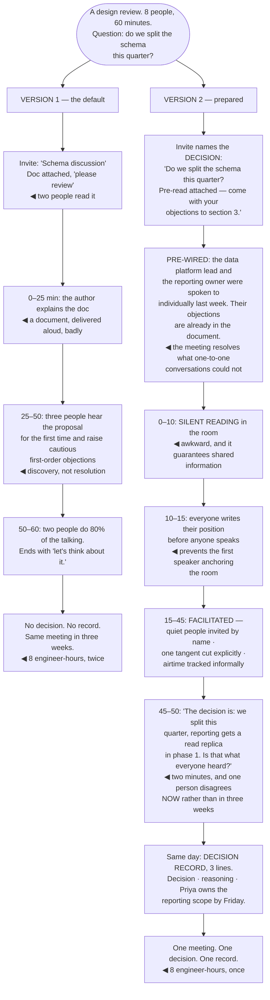

## The model

A meeting is the most expensive communication format available — eight people for an hour is an
engineer-day — and most of them are used to transfer information, which is the one thing writing
does better.

**The meeting's job** is the things that only happen synchronously: making a decision that needs
several people, resolving a disagreement text could not, and the kind of thinking that only happens
out loud. Everything else is a document. Getting that right before anyone is invited decides most
of whether the hour was worth it.

## When to use it

You are about to schedule something, or you are in a recurring meeting that has stopped producing
anything.

1. **What decision comes out of this?** If there is none, it is a status update and it should be
   written.
2. **Who genuinely needs to be here?** Everyone else costs their hour and adds to the coordination
   overhead of the room.
3. **What do people need to have read?** A meeting that starts by explaining the material has spent
   half its time on something a **pre-read** would have done better.

## Speedrun

**What** — a short, prepared, facilitated session that produces a decision and a record of it.

**How to run one**

1. **Name the decision in the invite.** Not a topic — the actual question being settled. "Do we
   split the schema this quarter?" beats "Schema discussion".
2. **Send a pre-read, or read in the room.** Amazon's practice of silent reading at the start is
   ugly and it works, because the alternative is people arriving unprepared and pretending not to
   be.
3. **Pre-wire the contentious parts.** A meeting is where disagreements that survived individual
   conversations get resolved, not where they are discovered.
4. **Facilitate deliberately.** Track who has spoken, invite the quiet people by name, and cut off
   the tangent — nobody else in the room can do this.
5. **State the decision out loud before ending**, and who owns the follow-up. Ambiguity here is why
   the same meeting recurs.
6. **Write the [[decision record]] within the day.** Decision, reasoning, owner, date. Three lines,
   in a place people will find it.

**Why it works** — most meeting failure is preparation failure. A well-prepared thirty minutes
outperforms an unprepared ninety, and the preparation is where the leverage sits.

**The question that ends most recurring meetings** — what did this decide in the last six weeks? If
the answer is nothing, it is status, and status is more accurate written.

## Going deeper

### What only happens synchronously

Three things justify the cost, and everything else is cheaper in writing.

**A decision needing several people at once.** Where the tradeoffs interact, where each person holds
part of the picture, and where a written exchange would take two weeks of round trips. This is the
strongest case and the rarest.

**A disagreement that text has failed at.** After two rounds of comments restating the same
positions, the exchange is not converging — five minutes of talking resolves what another three
comments will not.

**Thinking that happens out loud.** Design exploration, brainstorming, working through a problem
nobody has framed yet. The unstructured, generative kind, which genuinely benefits from several
people in a room.

What does not justify it: status, information transfer, announcements, and demonstrations. All four
are better written or recorded, and all four are what most recurring meetings actually contain.

Grove's distinction is worth carrying: he separates process-oriented meetings, which are regular and
about ongoing work, from mission-oriented meetings, which exist to produce a specific decision. The
second kind should be rare, well-prepared and ad hoc — and confusing the two produces a standing
meeting that decides nothing.

### Preparation, which is most of it

The pre-read is the single highest-return practice available, and the reason it fails is not
laziness — it is that people do not read it.

Amazon's response is the one that actually works: everyone reads the memo in the room, in silence,
for the first fifteen minutes. It feels awkward, it is not a productivity theatre, and it guarantees
the discussion starts from shared information rather than from a summary the author has to deliver
badly.

Where a pre-read genuinely is read in advance, say what to do with it. "Come with your objections
to section 3" produces a different meeting from "please review the attached", which produces a
meeting where two people have read it.

Pre-wiring the contentious parts is the other half. A design review where three people are hearing
the proposal for the first time will produce cautious objections rather than useful ones — the
individual conversation beforehand is where those objections get raised, answered and incorporated,
as the [[pre-wiring]] argument covers.

The invite itself is a preparation artifact. Naming the decision, listing what people should have
read, and saying what each person is there for takes three minutes and changes what everyone brings.

### Facilitation

**Facilitation** is a real role and is usually nobody's, which is why meetings drift.

The mechanics are simple and require attention rather than skill:

- track who has spoken and who has not
- invite the quiet people by name, because "does anyone else have thoughts?" reliably produces
  nothing
- cut off the tangent explicitly — "let's take that offline" works when someone actually says it
- watch the time against the agenda rather than discovering it at the end

**Airtime** is worth measuring, informally. Woolley's research on collective intelligence found
that groups perform better when conversational turn-taking is more evenly distributed — not because
fairness is nice, but because a group where two people do all the talking is using two people's
information.

The specific interventions that shift it: asking a named person directly, going round the room
deliberately on a key question, and asking people to write their view before discussing it. The last
one is the most effective and the least used — silent written input first prevents the first speaker
from anchoring everyone else.

Remote meetings need more facilitation, not less. Turn-taking cues are weaker, interruption is
harder to recover from, and the person on a poor connection drops out of the conversation entirely
unless someone actively brings them back.

### Ending, and the record

Most meetings end by running out of time, which means the decision is left implicit and everyone
leaves with a slightly different version of it.

The fix costs two minutes: before ending, state the decision out loud, in one sentence, and ask
whether that is what everyone heard. Disagreement surfaces immediately and is much cheaper here than
in three weeks.

Then name the owner and the date. "We will look into it" is not an action item; "Priya will scope
the reporting dependency by Friday" is.

The **decision record** is what makes it durable. Three lines — what was decided, why, who owns the
next step — written the same day, in a place people will find it later. Without it the same
discussion recurs in six weeks, because nobody can point to the conclusion.

And the meta-move is worth doing periodically: cancel the meeting and see who complains. It is the
cheapest way to find out which recurring meetings are load-bearing, and the answer is usually fewer
than exist. The caution from the [[meeting cost]] argument applies — some meetings look like
overhead and are the only place two teams talk, and the test is what replaces them rather than
whether anyone notices immediately.

## See it work

A design review, run two ways.

Version one spends twenty-five of sixty minutes on a document being read aloud. That is not a
facilitation failure — it is the inevitable consequence of a pre-read that two people read, and the
author has no better option once the room is assembled unprepared.

The middle section is discovery rather than resolution, and it is where the hour is actually lost.
Three people hearing a proposal for the first time produce cautious first-order objections, which is
the correct response to unfamiliar work and is not what the meeting was for.

Silent reading in the room is the intervention people resist hardest and it does the most work. Ten
awkward minutes buys a discussion that starts from shared information — versus twenty-five minutes
of the author summarising and half the room still not having the detail.

Writing positions before speaking is the cheapest way to fix airtime. It costs five minutes and it
removes the anchoring effect of whoever speaks first, which is otherwise the single largest
determinant of where the discussion goes.

And the two minutes at the end are what make the hour count. Stating the decision aloud surfaces the
one person who heard something different — immediately, while everyone is present, instead of in
three weeks when the implementation diverges.

## Next

Thinking out loud covers the unrehearsed case: explaining something at a whiteboard, or answering a
question you have not prepared for.
