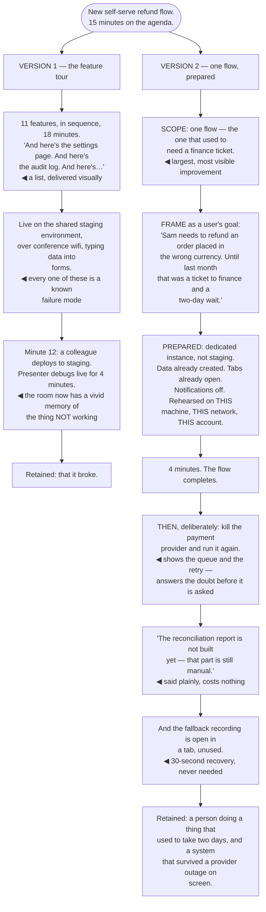

## The model

A demo is the only format where the audience sees the thing rather than a description of it, and
that is worth more than any argument you could make about it.

It is also the format most likely to fail in public. **The demo** trades persuasive power for
operational risk, and almost all of the craft is in managing that trade: scoping to what reliably
works, rehearsing on the real setup, and having a fallback ready so a failure costs thirty seconds
rather than the room.

## When to use it

You have something working and want people to believe it, or to react to it.

1. **Is it real enough to show?** A demo of something half-built teaches the audience it is
   half-built, whatever you say over it.
2. **What is the one thing they should see?** A demo showing eleven features shows none of them.
3. **What happens when it breaks?** Not if. Decide in advance, because deciding live costs the
   room.

## Speedrun

**What** — a short, narrow, rehearsed showing of something working, with a fallback.

**How to run one**

1. **Scope to one thing.** One flow, done well, from a user's perspective. Feature tours are
   forgettable and long.
2. **Narrate the user's goal, not the interface.** "Sam needs to refund an order placed in the
   wrong currency" beats "here is the refund screen".
3. **Rehearse on the exact setup you will use** — same machine, same network, same data, same
   account. Most demo failures are environmental.
4. **Prepare the data in advance.** Typing into forms live is slow, error-prone, and spends
   attention on nothing.
5. **Have [[the fallback recording]].** A screen recording of the working flow, ready to play.
   Thirty seconds of recovery instead of five minutes of debugging.
6. **Show one real failure deliberately**, where it is relevant. A demo that only shows the happy
   path invites the question of what happens when it does not.

**Why it works** — seeing something work is qualitatively different from being told it works.
Objections that survive any argument dissolve when the thing does the thing.

**The rule that saves the most demos** — never demo on a live system you do not control, and never
on conference wifi. Both fail, and both fail in front of the people you most wanted to persuade.

## Going deeper

### Scope, and the feature tour

**Demo scope** is the decision that determines whether anyone remembers it, and the default —
show everything we built — is the wrong one.

A feature tour is a list delivered visually. Eleven features shown in sequence produce the same
retention as eleven bullet points, which is close to none, and it takes twenty minutes.

One flow, followed from a user's actual goal to its completion, does the opposite. The audience
follows a person doing something, which is a story, and stories are retained. The other ten features
can be mentioned in a sentence.

Choosing the flow is worth thinking about. The best one is where the improvement is largest and most
visible — the thing that used to take four screens and now takes one, or the thing that used to be
impossible. Showing an unchanged flow beautifully wastes the format.

The framing that makes it land is the user's goal rather than the interface. "Sam needs to refund an
order placed in the wrong currency, and until last month that meant a ticket to finance" gives the
audience someone to follow and a reason to care about the next thirty seconds.

Length follows from scope: three to five minutes for most demos. Anything longer is a feature tour
wearing a demo's clothes.

### Preparation, because demos fail environmentally

Almost all demo failures are environmental rather than functional, and almost all of them are
preventable by rehearsing on the actual setup.

The list is boringly consistent: wifi, a VPN that dropped, an expired token, a stale cache, a
different screen resolution, a notification popping up, a colleague deploying to the shared
environment, a database that was reset overnight.

Which means rehearsal has to be on the same machine, same network, same account, same data — not a
functionally equivalent setup. "It works on my laptop" is precisely the class of statement that a
demo is supposed to be immune to.

Prepared data is the other half. Typing into forms live is slow, generates typos in front of an
audience, and spends attention on data entry rather than on the thing you are showing. Have the
records already created, the tabs already open, and the starting state already loaded.

And control the environment where you can. A local or dedicated instance beats production, no
notifications, one browser profile with nothing else in it, and a screen resolution you have
actually checked on a projector.

### The fallback

**The fallback recording** is a screen capture of the flow working, made in advance, ready to play.
It is the difference between a thirty-second recovery and a five-minute one.

The failure mode it prevents is specific and familiar: something breaks, the presenter starts
debugging, the room watches someone type for four minutes, and the demo's persuasive value inverts
completely — the audience now has a vivid memory of the thing not working.

The move is to switch immediately and without ceremony. "That environment is being difficult — here
is the recording" costs nothing, and audiences are entirely forgiving of it. What they are not
forgiving of is watching someone flail.

Do not debug in front of the room. The instinct is strong, the fix always feels one step away, and
the cost is the audience's attention and your credibility at the same time. Note it, move on, and
find it afterwards.

And if the thing genuinely does not work yet, do not demo it. A demo of something that fails is much
worse than a description of something that is not ready — the audience remembers the failure, and no
amount of "it usually works" recovers it.

### Showing failure on purpose

A demo that only shows **the happy path** invites the question everyone is thinking, and answering
it before it is asked is much stronger than answering it afterwards.

Showing one real failure deliberately — a timeout, an invalid input, a downstream service being down
— demonstrates that the system handles reality rather than a rehearsed sequence. It is the single
most credibility-building thing a demo can contain.

It has to be a real failure, triggered live, not a mock. An audience can tell the difference, and a
faked failure is worse than none because it suggests the real ones were not survivable.

Pick one that is relevant to the audience's actual doubt. If the concern is provider reliability,
kill the provider. If the concern is bad input, paste something malformed. Guessing wrong here
wastes the move.

The related discipline is honesty about what is not built. "The retry logic is not in yet, so this
part is manual" said plainly costs nothing and prevents the much worse outcome of someone
discovering it later and wondering what else was implied.

## See it work

Demoing a new refund flow to a mixed audience.

The feature tour is thorough and forgettable. Eleven features in sequence is a bulleted list with
screenshots, and the audience retains it exactly as well as they would retain the list — which is to
say, barely.

Every environmental choice in version one is a known failure mode. Shared staging, conference wifi
and live data entry are each individually survivable and collectively near-certain to produce the
thing that happened at minute twelve.

Debugging live for four minutes is where the persuasive value inverts. The demo existed to make
people believe the system works, and the durable memory it created is of the system not working —
which no description could have produced.

Version two's framing does most of the work before anything is shown. "Until last month that was a
ticket to finance and a two-day wait" gives the audience a person, a goal, and a reason to care about
the four minutes that follow.

And killing the provider on purpose is the strongest thing in the demo. It answers the question
everyone was holding, it proves the system handles reality rather than a rehearsed sequence, and it
is far more credible done live than any claim about resilience.

## Next

The Difficult conversations group covers the exchanges where the subject is a person: giving
feedback, receiving it, and delivering news nobody wants.
