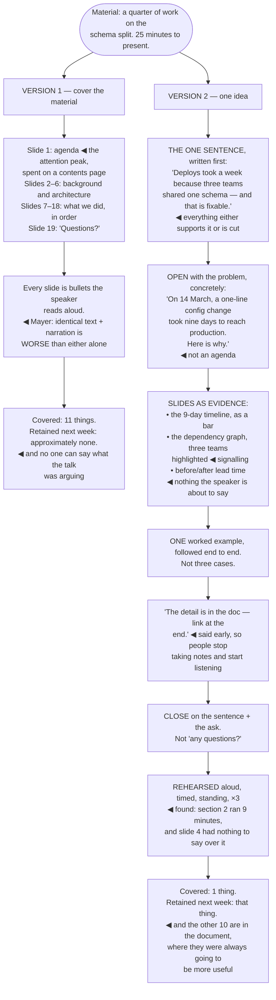

## The model

A talk is worse than a document at almost everything. The audience cannot skim, cannot re-read,
cannot look away and come back, and cannot check a detail. Anything that needs precision or
reference should be written.

What a talk does that a document cannot is make people care, and make a small number of ideas
stick. So the design question is not "how do I cover this material" — it is **one idea per talk**:
what is the single thing they should still have next week, and what is the fastest path to them
wanting it.

## When to use it

You have been asked to present something, and are deciding what the talk is for.

1. **Could this be a document?** If the goal is transferring detail, write it and send it. Reading
   slides aloud is a document delivered badly.
2. **What is the one thing they should remember?** Say it in a sentence. If you have three, you
   have three talks, and the audience will keep none of them.
3. **What do they do differently afterwards?** A talk with no behavioural consequence is
   entertainment, which is a legitimate goal and should be a deliberate one.

## Speedrun

**What** — one idea, made vivid, in a structure the audience can follow without notes.

**How to build one**

1. **Write the one sentence first.** Everything in the talk either supports it or is cut. This is
   the whole design step.
2. **Open with the problem, not the agenda.** Nobody has ever been engaged by "first I'll cover
   the background". Start where the audience already is.
3. **Design slides as evidence, not as notes.** A slide should show something — a graph, a diagram,
   a before and after. Bullet points are a document projected.
4. **Say the words, do not read them.** Mayer's redundancy effect: identical spoken and written
   text is measurably *worse* than either alone, because the two compete.
5. **Use one concrete story.** A single traced example does more than three abstract cases, exactly
   as in writing.
6. **Rehearse aloud, timed, standing.** The [[rehearsal test]] is the only way to find the parts
   that do not work, and reading through the slides silently is not rehearsal.

**Why it works** — the spoken channel is narrow and linear, and it carries emphasis, conviction and
attention in a way text cannot. Playing to that rather than against it is the entire craft.

**The most common failure** — covering everything. The material feels like the obligation; it is
not. The audience's memory next week is a sentence or two, and you are choosing which.

## Going deeper

### One idea, and what it costs

Anderson's central advice for a talk is to build it around a single idea, and the reason is
capacity rather than taste.

An audience listening at speaking pace, unable to pause, retains very little — a sentence, an
image, and a feeling about whether it mattered. Everything else is gone within a day, whatever you
covered.

Which means coverage is the wrong goal and it is the goal most technical talks pursue. A talk that
covers eleven things transfers approximately zero of them; a talk that lands one leaves the audience
with one, which is infinitely more.

The discipline is writing the sentence first and cutting against it. "Our deploys are slow because
three teams share one schema" is a talk. Every section either supports that sentence or goes — and
the material you cut can go in the document, which is where it belonged.

The counterintuitive consequence: a good talk usually feels underfull to the speaker. You know
twenty things about this and you are saying three, and the restraint is exactly what makes the
three survive.

The remaining material has a home. Say at the start that there is a document with the detail, and
the audience relaxes — they stop trying to take notes and start listening, which is what you needed.

### Slides, and what Mayer found

Most slide advice is aesthetic. The useful version is empirical, and Mayer's multimedia research is
the strongest source.

**The redundancy principle** is the important one: presenting identical text and narration produces
*worse* learning than either alone. The audience cannot read and listen simultaneously, so bullet
points that duplicate what you are saying actively cost comprehension.

**The coherence principle** says extraneous material — decorative images, background music,
tangential detail — reduces learning even when it is enjoyable. The slide template with the company
logo and a stock photo is measurably costing you.

**The signalling principle** says highlighting the relevant part helps. A diagram with the current
element emphasised, a graph with the relevant region marked — the audience does not have to search.

What follows is a practical rule: a **slide as evidence**. It shows something that could not be
said — a graph, an architecture, a before-and-after, a screenshot, a number. If the slide is
sentences you are about to speak, delete either the slide or the sentences.

Tufte's argument against bullet-point slides goes further and is worth knowing: hierarchical
bullets impose a structure that hides relationships and evidence, and his Columbia case study is
the most cited example of an argument being obscured by the format it was presented in.

### Structure the audience can follow

Listeners cannot skim back, so structure has to be carried in the talk itself rather than in a
contents page.

**Signposting aloud** does that job. "There are three reasons this happens — here is the first"
tells the audience where they are and how much is left, and it costs a sentence.

The opening is the highest-leverage part and the most commonly wasted. An agenda slide, a
self-introduction and a table of contents spend the attention peak on material nobody wanted. Open
with the problem, a concrete moment, or the surprising number — something the audience already cares
about or immediately does.

Duarte's observation about shape is useful: a talk that alternates between what is and what could be
holds attention better than a linear exposition, because the gap between them is what creates
interest. The engineering version is problem, current state, what it costs, what it could be.

The ending matters more than its length suggests. "That's all, any questions?" throws away the last
thing they will remember. Restate the one sentence, say what you want them to do, and stop —
deliberately, on the idea rather than on the logistics.

### Rehearsal, and the parts of delivery that matter

The **rehearsal test** is running the talk aloud, timed, standing, ideally to one person. Reading
through the slides in your head is not rehearsal and does not find anything.

What it catches: sections that are twice as long as you thought, transitions you cannot actually
make, jokes that do not work, a slide you have nothing to say about, and the point where you run out
of time. All of these are invisible until spoken.

Two or three run-throughs is the difference between a talk that works and one that nearly does.
More than that and it starts to sound recited, which is its own problem — the aim is knowing the
structure well enough to speak it freshly, not memorising the words.

On delivery, only a few things genuinely matter, and none of them is polish:

- **Pace** — nervousness accelerates everyone, so consciously slow down.
- **Pauses**, which feel enormously long to you and normal to the audience, and which are how
  emphasis works.
- **Volume, and looking at people**, which is how conviction is read.
- **Not apologising.** "Sorry, this slide is a bit busy" tells the audience to disengage from
  something you chose to show them.

Nervousness is not the problem it feels like. It is invisible at a fraction of the intensity you
experience it, and the only reliable reducer is knowing the material and having rehearsed the first
two minutes until they are automatic.

## See it work

The same content, as a talk designed two ways.

Version one is the default and it is not lazy — it is thorough. Eleven things genuinely worth
knowing, presented in a defensible order, by someone who did the work. And an audience listening at
speaking pace keeps almost none of it.

The agenda slide is the clearest waste. The first thirty seconds are the highest-attention moment of
the entire talk, and spending them on a table of contents is spending the peak on the one slide
nobody has ever wanted.

Reading bullets aloud is worse than either channel alone, which is the finding people find hardest
to believe. It feels like reinforcement and it is competition — the audience reads faster than you
speak, finishes, and then waits.

Saying early that the detail lives in a document is a small move with a large effect. It gives
people permission to stop transcribing, which is the behaviour that most reliably prevents them from
following the argument.

And the rehearsal found two defects that no amount of reviewing slides would have. A section running
nine minutes instead of four, and a slide the speaker had nothing to say about — both invisible
silently, both obvious the first time the talk is spoken out loud.

## Next

Running a meeting covers the format where you are not the only one talking, and where the design
work happens before anyone arrives.
