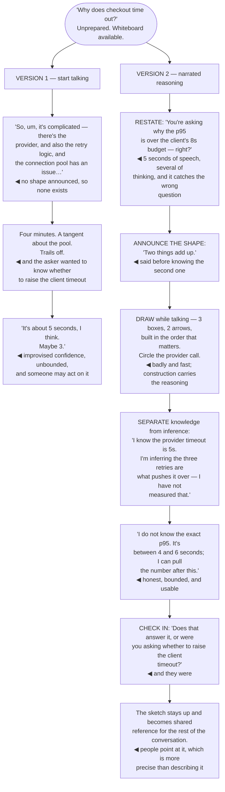

## The model

Someone asks how the system works, or why you chose that approach, and you have not prepared
anything. This is the most common speaking situation in engineering and the one nobody practises.

It is not a small presentation. **Narrated reasoning** — saying what you are thinking as you think
it — is what the situation actually calls for, and the audience is evaluating your process as much
as your conclusion. Which means the useful skills are structuring on the fly, drawing badly and
fast, and saying "I do not know" without it costing anything.

## When to use it

Any unrehearsed technical explanation: a whiteboard, a design discussion, an interview, a question
after a talk.

1. **What is the question actually asking?** Restating it before answering costs five seconds and
   prevents answering the wrong one.
2. **What is the shape of the answer?** Say how many parts there are before starting. It gives both
   of you a structure to hang the rest on.
3. **Do you actually know?** If not, saying so and reasoning from what you do know is stronger than
   improvising confidence.

## Speedrun

**What** — an explanation built live, with the structure announced before the content.

**How to do it**

1. **Restate the question.** "So you are asking why we retry rather than fail fast — is that
   right?" It buys thinking time and catches the misunderstanding.
2. **Announce the shape.** "There are two reasons." Now the listener has a frame, and so do you.
3. **Draw while you talk.** A bad diagram drawn live beats a good one shown, because the audience
   watches it being built and follows the construction.
4. **Say the reasoning, not just the answer.** "I would start with X because Y" is more useful and
   more credible than the conclusion alone.
5. **[[Checking in]] at boundaries** — "does that match what you were asking?" — catches the
   divergence early rather than at the end of a four-minute answer.
6. **Say "I do not know" and then reason from what you do.** It costs nothing and improvising
   confidence costs a lot.

**Why it works** — an unrehearsed explanation cannot be polished, so the audience judges the
thinking. Making the thinking visible is therefore both the honest option and the one that lands
best.

**The habit that buys the most time** — restating the question. Five seconds of speech, several
seconds of thinking, and it catches the case where you were about to answer something else.

## Going deeper

### Structure invented in real time

Without preparation, the structure has to be produced on the fly, and the trick is announcing it
before you have it.

"There are two reasons" commits you to two and gives the listener a frame immediately. You will
usually find the second one while explaining the first — and if the second turns out to be weak,
saying "actually the second is minor" costs nothing.

The frames that work under pressure are small and reusable:

- two or three reasons
- before and after
- what it does, how it does it, and what it costs
- the happy path, then the failure

Having a handful of these available means you are never starting from nothing.

Chronology is the easiest fallback and it is often the right one. "Here is how a request flows"
carries its own order, requires no invention, and is exactly the [[worked trace]] that makes written
explanations work.

The thing to avoid is starting to speak with no shape at all, which produces the ramble everyone
recognises: three sentences of throat-clearing, a tangent, and an ending that trails off. Two
seconds of silence before answering is invisible to the listener and buys the frame.

Signposting matters more here than in a talk, because there are no slides. "That is the first
reason — the second is about cost" tells the listener where they are, and it is the only navigation
available.

### The whiteboard

A **whiteboard sketch** drawn live is more effective than a prepared diagram, and the reason is that
the audience watches it being constructed.

Construction carries the reasoning. Boxes appearing in the order they matter, an arrow drawn while
you explain what flows along it, a circle around the part that breaks — each addition is a step the
listener follows. A finished diagram has to be decoded all at once.

Draw badly and fast. Legibility matters, aesthetics do not, and time spent making it neat is time
the audience spends waiting. Three boxes and two arrows is usually the whole thing.

Talk while you draw, and say what you are drawing as it appears. Silence while drawing loses the
room, and the narration is where the information actually is — the diagram is the index to it.

Leave it up. A sketch that stays visible becomes shared reference for the rest of the conversation,
and people point at it, which is much more precise than describing which part they mean.

And it works remotely with almost nothing. A shared screen with a text editor, a sequence of
indented lines built as you talk, is close to as good — the property that matters is that it is
built live, not that it is graphical.

### Saying you do not know

**Saying "I do not know"** is the highest-value sentence in unrehearsed technical conversation, and
most people avoid it at real cost.

The alternative is worse in every direction. Improvised confidence is detectable, it is frequently
wrong, and someone may act on it. Once caught, everything else you said becomes suspect — including
the parts that were right.

The form that works is not bare admission. "I do not know the exact number — it is somewhere between
one and five seconds, and I can check after this" is honest, bounded, and gives the asker something
usable. Combining the admission with the reasoning is what makes it strong rather than deflating.

Interviewers and senior colleagues are specifically watching for this. Someone who confidently
asserts a wrong number reads as unreliable; someone who says "I would need to check, but the way I
would find out is X" reads as someone whose confident statements can be trusted.

The related habit is separating knowledge from inference, out loud. "I know the timeout is 5
seconds; I am guessing the retries are what pushes it over" tells the listener exactly how much
weight each half carries, which is information they need and rarely get.

### Checking in, and reading the room

**Checking in** — a short question at a natural boundary — is what prevents a four-minute answer to
the wrong question.

"Does that answer it, or were you asking about something else?" costs three seconds and catches the
divergence. Without it you find out at the end, having spent the audience's attention on the wrong
thing.

Reading the room is the other half, and unrehearsed conversation gives you the signals a talk does
not. Confused expressions, someone starting to speak, people looking at the diagram rather than at
you. All of them are information a prepared presentation would have ignored.

The specific adjustment worth making mid-explanation is depth. If the listener is nodding along
easily, skip a level; if they have stopped, back up and re-anchor. That responsiveness is the main
advantage the format has over a document, and not using it wastes it.

And in a group, watch for who has stopped following. The quiet person who was engaged and is now
looking at their laptop was lost two minutes ago, and asking directly — "am I going too fast?" —
usually recovers them.

## See it work

"Why does checkout time out?" asked at a whiteboard, answered two ways.

Version one is not caused by not knowing the answer — the speaker knows this system well. It is
caused by starting to speak with no shape, which is the specific failure that produces the ramble
everyone recognises in themselves.

Restating the question is the cheapest intervention on the diagram and it does two jobs. It buys
several seconds of thinking behind five seconds of speech, and in this case it would have caught
that the asker had a narrower question than the one being answered.

Announcing "two things" before knowing the second one is the move that feels risky and is not. The
frame is what makes the explanation followable, and the second reason reliably appears while
explaining the first — with "actually the second is minor" available as a costless exit.

Separating what is known from what is inferred is the sentence that builds the most trust. "I know
the timeout is 5s; I am inferring the retries are the cause" tells the listener exactly how much
weight each half carries — and it is information they almost never get.

And the bounded "I do not know" outperforms both alternatives. A confident wrong number is
detectable and contaminates everything else that was said; "between 4 and 6, I will pull the exact
figure" is honest, immediately usable, and costs nothing.

## Next

Answering questions covers the adversarial version: the question after the talk, the challenge in a
review, and the one you suspect is really an objection.
